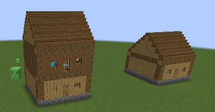

# Alive Workplace

Villagers with real jobs. Hand a **Builder** a blueprint and they build it for you: they clear the
site, fetch materials from your chests, put up the walls and roof, and finish with doors, beds and
torches. **Miners** dig out quarries, **Lumberjacks** cut down and replant trees, **Orchard Keepers** pick berries, cocoa and apricorns, **Farmers** look after
your fields and **Fishermen** fish for you, dropping everything off in your chests. **Postmen** carry mail
between players' mailboxes, **Guards** keep monsters away, **Nurses** heal you (and your Pokémon),
**Shopkeepers** run your shop, **Ferrymen** take you between villages, **Bards** play music and — with Cobblemon —
**Trainers** battle you, **Move Tutors** teach your Pokémon new moves, **Ball Smiths** make Poké Balls and **Pokémon Traders** swap Pokémon with you. Villages grow workshops, guard houses, clinics, post offices, orchard houses and ferry houses on their own — and with Cobblemon,
trainer's houses, Trainer Leader halls, schools, trade halls and ball workshops (Repurposed Structures' villages too).


Fabric · Minecraft 1.21.1 · built for the Cobbleverse (Cobblemon) modpack, but works without it.
Builders understand **Chipped**, **Rechiseled** and **Supplementaries** blocks (tested with the real mods).
Install on the **server and every player's game**.

## Getting started
1. **Hire a builder.** Look for a builder's workshop in a village (newly explored villages often have one), or craft
   a **Builder's Bench** and place it near a villager without a job; they take it like any job block.

   ```
   Brick   Brick          Brick
   Planks  Crafting Table Planks
   Planks  Planks         Planks
   ```
2. **Get a blueprint.** Builders sell the starter blueprints (Starter Cottage first; more as they level up).
   Operators can also use `/workplace blueprint <id>`, including anything saved with a Structure Block.
3. **Place it.** Hold the blueprint and right-click the ground where the front of the building should go.
   It faces you, and while you hold it you see the whole building as see-through blocks, exactly where it
   will stand (the gold edge of the outline is the front). Sneak-right-click the ground to turn it;
   sneak-right-click the air to pick it back up. On uneven ground the builder fills in a foundation, and when the
   building is finished they level the ground two blocks around it (dirt, stone and grass above the floor dug away,
   holes filled with dirt; trees, flowers and anything built are left alone). For a build meant to sit in a
   hillside, right-click the air with its blueprint to switch that off for this build (the tooltip says so).
   Water and lava in a blueprint are poured from buckets in the chests (the empty buckets go back).
   Item frames, paintings and armor stands go up last, empty, each paid for with its item from the chests.
4. **Stock the chests.** Put the materials in any chests or barrels within 8 blocks of the builder's bench
   (hold Shift over the blueprint to see the list). Once the blueprint is placed, its tooltip counts what the chests
   by the nearest bench are still short of — blocks already standing in place don't count — so you know when you're
   ready.
5. **Hand it over.** Right-click the builder with the blueprint. The first player to do that hires the builder;
   after that it takes orders from them and the friends they add (`/workplace friend add <player>`).
   Busy builders take up to 5 more blueprints and build them in order. They start work in the morning, sleep at night,
   and tell you if they run out of something. What they are building, how far along it is and what they are
   waiting for floats above their head; sneak-right-click a builder with an empty hand for the full status.


When they finish, the blueprint goes back into the supply chest so you can build it again.

**Changed your mind?** Place the blueprint over the building and **sneak** while giving it to a builder: they take it
down and put the blocks back in the chests.

**More builders, faster builds.** A builder with nothing to do helps with builds near their bench (up to three helpers
per build), sharing the chests and passing each other materials.

**Builders level up as they work**, like villagers you trade with: every level makes them faster (a Master builds
2.5× as fast as a Novice) and unlocks new blueprints to buy — Market Stall, Lookout Tower, then the
**Healing Center** (with a Nurse Station, and a Cobblemon Healing Machine on the counter when Cobblemon is installed)
and the **Supply Shop** (with a Shop Counter) — build them and a nurse and a shopkeeper move in.




**Upgrades.** A blueprint named like another with `_2` on the end (`_3` after that…) is its upgrade. Every starter
build has one: the **Starter Cottage II** adds a second storey, the **Market Stall II** a second stall with a Shop
Counter, the **Lookout Tower II** a Guard Post, a bell and a pointed roof, the **Healing Center II** a ward with four
beds, and the **Supply Shop II** a storeroom and a bedroom upstairs. Right-click a finished building with its upgrade
and it lines up exactly over it; the builder takes off what changes and builds only what's new, keeping everything
else. Once a builder finishes a building that has an upgrade, **they sell its blueprint** (and tell you). The
upgrades are in the Blueprint Table too. Your own blueprints work the same way (`my_house` → `my_house_2`).

## Miners


Craft a **Miner's Bench** (cobblestone on top, a stone pickaxe in the middle, planks around) and place it near a
villager without a job. Then:
1. Craft a **Quarry Marker** (stick + red dye + paper). Right-click one corner block, then the opposite corner
   (up to 32 × 32). Sneak-right-click the air to choose the depth (4, 8, 16, 32 or 64) or a **strip mine**; a red
   outline shows the area.
2. Put **pickaxes** (and some torches) in a chest within 8 blocks of the Miner's Bench.
3. Give the marker to the miner. They dig the area out from the top down, bring everything back to the chests, and
   leave anything touching lava or water standing so the pit stays dry. When the last pickaxe wears out they wait
   for another.


**Stairs out of the pit.** In a pit at least 3 × 3 and 3 deep, the miner leaves one block per layer standing as a step,
each a block along the wall from the one above, so steps spiral down the walls from the corner nearest the bench.
Sand and gravel steps are swapped for cobblestone, and gaps (caves) are filled in with stone from the chests.

**Strip mines.** The last choice on the marker digs tunnels instead of a pit: 2 high (the marked blocks and the ones
below them, so mark the corners at head height), along the longer side of the area, with 2 blocks of rock between
them and a tunnel across the end nearest the bench. The rock stays, but any ore in it is dug out: about a third of
the digging for all the ore.

**Smelting.** Put a furnace or blast furnace within 8 blocks of the Miner's Bench and some coal or charcoal in the
chests. Every time the miner drops off a haul they take the finished ingots out into the chests, load the raw ores
(and any ore blocks) in, and top up the coal. Anything you put in a furnace yourself is left alone.

## Lumberjacks


Craft a **Chopping Block** (a stone axe on top of any log) and place it near a villager without a job, near some
trees. Put **axes** in a chest within 8 blocks of the Chopping Block. The lumberjack cuts the trees within 16 blocks
one at a time (leaves first, then the trunk), plants a sapling of the same wood where each tree stood, and stores
the logs, sticks and apples in the chests. They only cut real trees: logs with placed leaves (houses, posts),
blueprint builds and quarries are left alone. When the last axe breaks they wait for a new one. Dark oaks (and other
2 × 2 trunks) get four saplings back in a square, and huge crimson and warped fungi standing on nylium count as
trees too (a fungus is planted back).

**Tree farms.** Mark an area with a **Field Marker** (the farmer's marker, up to 32 × 32 and within 48 blocks of the
Chopping Block) and give it to the lumberjack. They keep it planted with saplings from the chests, in a grid three
blocks apart (dark oak in 2 × 2 squares four apart), and fell what grows there, even if it's further out than the
16 blocks they'd look on their own. Sneak-right-click them with an empty hand to see the farm or stop it.

## Orchard Keepers


Craft a **Fruit Basket** (two sticks in the top corners, then sweet berries, a plank, sweet berries) and place it near a villager
without a job, in your orchard. The keeper walks round everything within 16 blocks of the basket and picks whatever
is ripe: **sweet berries**, **glow berries**, **cocoa pods** and — with Cobblemon — **apricorns** and **berry
plants**. The plants are picked, not broken, so they grow again. The harvest goes into the chests within 8 blocks of
the basket. They reach up into trees with a picking pole and never step into a berry bush.

## Farmers


Any **Farmer** villager (the ones with a composter) can look after a field for you. Craft a **Field Marker** (stick +
wheat seeds + paper), right-click one corner block of the field and then the opposite corner (up to 32 × 32), and
give the marker to the farmer. Put **seeds** (and a **hoe**, if there is bare dirt to till) in a chest within 8 blocks
of their composter. They harvest ripe crops and plant them straight back, sow empty farmland, till bare dirt and
grass, cut sugar cane down to its bottom block and pick pumpkins and melons — and Cobblemon's mints, which are
picked for their leaves and planted again. Sweet berry bushes, cocoa pods and glow berries in the field are picked
(the plant stays to grow again). Put **bone meal** in the chest too and, once everything's sown and nothing is ripe,
the farmer uses it on the growing crops. The harvest goes into the chests.
Sneak-right-click the farmer with an empty hand to see how it's going or to stop.

## Fishermen
Hand any **Fisherman** villager (the ones with a barrel) a **fishing rod**. They walk to the nearest water within 16
blocks of their barrel, cast from the shore and reel in fish (and the odd bit of junk), bringing the catch back to
their barrel and any chests within 8 blocks of it. Rods wear out: put spares in the barrel. Put a **smoker** (or
furnace) next to the barrel and some coal or charcoal in it, and the raw cod and salmon go into the smoker instead,
with the cooked fish coming back out at the next drop-off. Sneak-right-click the fisherman with an empty hand to see
how it's going or to stop.

## Mail and postmen


Craft a **Mailbox** (iron nuggets around a chest, on a fence) and place it: it's yours, and mail sent to you arrives
there (the red flag goes up). To send something, open your mailbox, put items in the top row, write a player's name
and press **Send**. Write something in the **Letter** line and it goes along as a letter (a book they can read), or on
its own if the top row is empty. `/workplace mail` (or **[Track]** after sending) shows where your parcels are. A **Postman** picks it up: craft a **Postal Desk** (paper over planks and a chest) and place it
near a villager without a job. Postmen walk their round (64 blocks around the desk), collecting parcels and putting
them in the right mailbox. Parcels for a mailbox outside the round (another village, another dimension) go with the
night mail and arrive at the next dawn. Only you, your friends (`/workplace friend add`) and operators can open your
mailbox.

**Courier routes.** When there's no mail, postmen haul between your chests. Craft a **Delivery Note** (paper, a
feather and an ink sac), right-click the container to take from and then the one to bring to (say, the quarry chest
and the builder's chest), and give the note to a postman. They carry everything except tools, weapons and armor — or,
if you hold an item in your other hand and right-click the air with the note, only the kinds you pick. Up to 4 routes
per postman; sneak-right-click them to see their routes, and give them a blank note to end them. With Cobblemon, a
route can start at a **Pasture Block**: the postman empties every chest and barrel within 8 blocks of it — where
Cobbleworkers' Pokémon put what they gather.

## Guards


Craft a **Guard Post** (an iron sword over planks and a shield) and place it near a villager without a job. Put
weapons and armor in a chest within 8 blocks of the post: the guard takes the best of it. Guards fight monsters that
come within 24 blocks of the post at any hour and never run away. Give them a **bow** or a **crossbow** (in the same
chest; a crossbow hits harder) and they
also shoot creepers from a safe distance — without one they leave creepers alone — and pick off other monsters
before they get close; they never shoot when a player, villager or pet is in the way. They have twice a villager's
health and keep the night watch, sleeping in the late morning instead. Players, villagers, animals, pets and
Pokémon are safe from them. **Ring the village bell** and, while everyone else runs home to hide, the guards head
for the bell and fight anything near it for a minute and a half.

## Nurses
Craft a **Nurse Station** (glass bottles around a glistering melon slice, on white wool) and place it near a villager
without a job. Right-click the nurse with an empty hand to get your health back and bad effects cleared; with
**Cobblemon** installed they heal your whole team too. Once a minute per player (less as they level up). They also
look after hurt villagers and iron golems nearby. Sneak-right-click to trade.

## Shops
Craft a **Shop Counter** (an emerald over planks and a chest) and place it near a villager without a job: the shop is
yours and the villager becomes its **Shopkeeper**. Open the counter to set your prices — in each column, the top slot
is what one sale hands over (for example 16 cobblestone) and the slot below it is the price (for example 1 emerald;
any item works). Put the goods in chests within 8 blocks of the counter. Other players buy by trading with the
shopkeeper as usual; only what's in the chests is for sale, and the payments land in the same chests.

**With CobbleDollars** (the Cobbleverse pack's money), right-clicking the shopkeeper opens the shop's own screen
instead: everything in stock, with emerald prices shown in CobbleDollars (100 per emerald). Click an item, then
click it again to buy. The CobbleDollars go straight to the owner — or, if they're offline, the next time they
join. Items priced in something other than emeralds are paid with those items, as before. Sneak-right-click the
shopkeeper for the usual trade screen. The owner can sneak-right-click the counter to see the latest sales.


## Ferrymen and travel posts
Craft a **Travel Post** (a sign over planks and a boat); name it in an anvil first if you want ("Riverside"), then
place it. Right-click posts to add them to the ones you know. A villager without a job takes a post as its
**Ferryman**, who sells **Travel Tickets** to every other post you know (1 emerald per 256 blocks, 8 to another
dimension). Use a ticket within 16 blocks of any travel post and you arrive at the ticket's post. With CobbleDollars,
right-clicking the ferryman shows your destinations with fares in CobbleDollars (100 per emerald); click one twice
to buy its ticket, or sneak-right-click to pay in emeralds. Many villages have a **ferry house** with a travel post
and a ferryman already: the post joins the network under a village name ("Willowbrook"), so right-click it once and
it's on your list.

## Bards
Craft a **Music Stand** (paper on a note block) and place it near a villager without a job. Put music discs in a
chest within 8 blocks: in the morning and in the evening the bard plays them one after another (the discs stay in the
chest). No discs? They make up a tune on the harp.

## Pokémon Trainers (with Cobblemon)
Craft a **Training Post** (a target block on planks) and place it near a villager without a job: they become a
**Trainer**. Right-click a trainer with an empty hand to battle. Every trainer starts as a Novice with two young
Pokémon and ranks up as people battle them — Apprentice, Journeyman, Expert, Master — until they field six fully
evolved Pokémon at level 80–100 and play smart. From Journeyman their Pokémon have better IVs; Experts and Masters
also bring EVs, a matching nature (Adamant or Modest) and a held item (Life Orb, Leftovers, a Choice item…). Beating one pays **CobbleDollars** (100 for a Novice up to 2,500 for a
Master; emeralds if CobbleDollars isn't installed), once a day per trainer. No badges, no gyms.
With **Radical Cobblemon Trainers** installed (it is in the Cobbleverse pack), a trainer's Pokémon never go above
your level cap by more than their rank allows: a Novice stays 6 levels under your cap, a Journeyman meets it, a
Master goes 5 over. So the village's Master is a real fight whether you're new or far along.

Each village can also have one **Trainer Leader**: craft a **Leader's Podium** (gold ingots either side of a Training
Post, on polished andesite). The leader battles at Expert strength from the start, pays three times the prize, and
takes one challenge a day from each player.

## Move Tutors (with Cobblemon)
Craft a **Tutor's Desk** (a book on planks) and place it near a villager without a job: they become a **Move Tutor**.
Right-click them with an empty hand (sneak to trade instead) to open their lessons: pick one of your Pokémon at the
top, then a move it could learn but won't get from levelling — tutor moves, TM moves and egg moves. Click a lesson
once to choose it and again to pay and teach it. The move goes straight into the Pokémon's moves if it knows fewer
than four, otherwise you can swap it in from the moves page of its summary.


Lessons cost CobbleDollars: 300 for a weak move, up to 2,400 for the strongest (egg moves count as one step harder;
without CobbleDollars installed, 3 to 24 emeralds). A new tutor
only teaches weaker moves; they rank up with every lesson they give, and a Master teaches everything. Tutors also buy
paper and books, if you need emeralds.

## Ball Smiths (with Cobblemon)


Craft a **Ball Workbench** (red dye, a copper ingot and white dye over planks either side of a smithing table) and
place it near a villager without a job: they become a **Ball Smith**. Put apricorns and ball metals in chests within
8 blocks — copper ingots for Poké Balls and the other basic balls, iron for Great Balls and friends, gold for Ultra
Balls, diamonds for the rarest — and the smith turns them into balls with Cobblemon's own recipes, a batch of four at
a time, and puts the balls back in the chests. A new smith only works copper; they learn the harder balls as they
level up (iron at Apprentice, gold at Journeyman, diamonds at Expert). They take turns between the kinds they can
make and stop making a kind once the chests hold 64 of it. They never make Master Balls. Pair them with an Orchard
Keeper (or Cobbleworkers' apricorn pickers) for a steady supply.

## Pokémon Traders (with Cobblemon)
Craft a **Trade Board** (an item frame on planks) and place it near a villager without a job: they become a
**Pokémon Trader**. Right-click them with an empty hand (sneak to buy Poké Balls and candies instead) to see today's
offers — "my Tinkaton, level 62, for any Fighting type, level 55 or higher". Pick an offer, then one of your
Pokémon that fits (the rest are greyed out, with the reason), and click it twice to swap. A held item comes back to
you. Offers change every in-game day and are the same for everyone; each player gets one trade per trader per day.
A new trader has one offer of a young Pokémon; with every trade they rank up, and a Master has three offers at level
50–70, now and then a shiny one. Experts and Masters also make a **special request** each day: a particular Pokémon
(any of its evolutions will do) for one of theirs at the top of their range — shiny one time in four.


## Pokémon partners and Cobbleworkers (with Cobblemon)


Pokémon you keep in a **Pasture Block** within 16 blocks of a villager's workstation help with the job when their
type suits it — each one cuts the time the work takes by 15%, up to three:

| Job | Helpful types |
| --- | --- |
| Builder | Fighting, Rock, Steel |
| Miner | Ground, Rock, Steel |
| Lumberjack | Grass, Bug, Fighting |
| Orchard Keeper | Grass, Bug, Flying |
| Farmer | Grass, Ground, Water |
| Fisherman | Water, Ice |
| Nurse | Fairy, Normal, Psychic |
| Ball Smith | Steel, Fire |

The line above the villager's head says who is helping ("· with Machop"), and sneak-right-clicking a worker shows
how much faster they are. It works with [Cobbleworkers](https://modrinth.com/mod/cobbleworkers) too: the same
Pokémon can work the pasture for Cobbleworkers and help the villager at the same time, and a postman's courier route
from the pasture (see *Courier routes*) takes what they gather to wherever it is needed.

## Blueprint Table: any build from the internet
Craft a **Blueprint Table** (blue dye on top, cartography table in the middle, planks around) and right-click it.


- Every blueprint on the server is listed with its size and **exactly what materials it needs**.
- **Get Blueprint** gives you a copy for one **Blank Blueprint** (paper + blue dye makes two).
- **Upload a File…** lists the build files in your own `blueprints` folder (**Open Folder** takes you there).
  Download builds from sites like Planet Minecraft or Minecraft-Schematics as `.litematic` or `.schem`,
  drop them in, pick one and press **Upload**. It becomes a blueprint everyone on the server can use.
- Anything saved with a Structure Block shows up too.

## Builds that use other mods
- **Chipped / Rechiseled** variants: stock the plain block (oak planks, stone bricks…) and the builder turns it into
  whichever variant the blueprint uses, just as the Chipped workbench or the chisel would for free.
- **Supplementaries**: way signs need the fence and the sign, rope knots the rope and the fence, potted plants a pot and
  the plant. Jars, shelves, safes and other containers are built empty — blueprints never hand out items.
- **Handcrafted, Beautify, CobbleFurnies, Carved Wood, Moar Concrete** (the Cobbleverse pack's building mods): every
  block costs its own item and builds like any other (tested with the real mods).
- **Storage mods**: Sophisticated Storage chests and barrels and Tom's Storage filing cabinets near the bench work as
  supply chests. Storage-network blocks (Tom's connectors and terminals, the Sophisticated controller) are skipped,
  so nothing is counted twice — the builder uses the chests themselves.
- Blocks from mods that aren't installed turn into air and are left out.

## Commands and gamerules
| | |
|---|---|
| `/workplace sites` | your builds in progress, with a cancel button |
| `/workplace mail` | parcels on their way to and from you, and where they are |
| `/workplace cancel <id>` | stop a build (placed blocks stay; you get the blueprint back) |
| `/workplace friend add <player>` | let a friend give orders to your builders (`remove`, `list` too) |
| `/workplace blueprints` (op) | list every blueprint the server knows |
| `/workplace blueprint <id>` (op) | get a blueprint item |
| `/workplace import` (op) | import files from `<world>/aliveworkplace/import/` |
| `/gamerule workplaceAllowUploads false` | only operators can upload blueprint files |
| `/gamerule workplaceFreeMaterials true` | builders need no materials (creative towns) |
| `/gamerule workplaceBuildDelay 8` | ticks per block (lower is faster) |
| `/gamerule workplaceBuildersHelp false` | idle builders stop helping with other builds |
| `/gamerule workplaceBuilderOwnership false` | anyone can give orders to any builder |
| `/gamerule workplaceFoundationDepth 12` | how far down builders fill under a build on uneven ground (0 = never) |
| `/gamerule workplaceLevelGround 0` | builders leave the ground around their builds alone (default 2 blocks, up to 8) |
| `/gamerule workplaceKeepWorkLoaded false` | builds and quarries stop when nobody is nearby (by default they keep going while the player who ordered them is online) |

**Server config** — `config/aliveworkplace.json` is written with the defaults the first time the game starts (edit it
and restart; out-of-range values are clamped):

| Option | Default | What it does |
| --- | --- | --- |
| `supplyRadius` | 8 | chests and barrels this close to a workstation are its supply chests |
| `maxSiteDistance` | 48 | how far from their bench a builder takes a build |
| `guardRadius` | 24 | how far from the Guard Post guards patrol and fight |
| `lumberjackRadius`, `orchardRadius`, `fisherRadius` | 16 | how far lumberjacks cut, orchard keepers pick and fishers look for water |
| `partnerRadius` | 16 | how close to a workstation pastured Pokémon must be to help |
| `postmanRange` | 64 | how far a postman walks to deliver (mail going farther arrives at dawn) |
| `dollarsPerEmerald` | 100 | CobbleDollars per emerald for lessons, shop prices and fares |

## What's next
Next up are Pokémon work partners and Cobblemon jobs (Orchard Keeper, Ball Smith, Chef). See [ROADMAP.md](ROADMAP.md).

## Building from source
```
./gradlew build          # jar in build/libs, runs the in-game test suite
./gradlew runGameTest    # just the tests
```
Every push is built and tested by GitHub Actions; the jar is attached to each run.

## License
GPL-3.0-or-later. See [LICENSE](LICENSE).
