# Alive Workplace

Villagers with real jobs. Hand a **Builder** a blueprint and they build it for you: they clear the
site, fetch materials from your chests, put up the walls and roof, and finish with doors, beds and
torches. **Miners** dig out quarries, **Lumberjacks** cut down and replant trees, **Orchard Keepers** pick berries, cocoa and apricorns, **Farmers** look after
your fields and **Fishermen** fish for you, dropping everything off in your chests. **Porters** gather it all in the village storehouse, **Carpenters** and **Masons** make what the builders are missing, **Armorers** smelt the ore and make the guards' armor, **Toolsmiths** make the workers' tools, **Weaponsmiths** mend the village's gear, **Fletchers** make the guards' bows and arrows, **Shepherds** and **Butchers** look after the sheep and the herd, **Clerics** brew potions for the guards, **Librarians** enchant the village's gear, **Chefs** cook for the village, **Postmen** carry mail
between players' mailboxes, **Guards** keep monsters away, **Nurses** heal you (and your Pokémon),
**Shopkeepers** run your shop, **Ferrymen** take you between villages, **Bards** play music and — with Cobblemon —
**Trainers** battle you, **Move Tutors** teach your Pokémon new moves, **Ball Smiths** make Poké Balls, **Pokémon Traders** swap Pokémon with you and **Fossil Scientists** revive fossils. Villages grow workshops, guard houses, clinics, post offices, orchard houses, ferry houses, storehouses, carpenter's workshops, kitchens, flower shops, ranch houses, schoolhouses, inns and mortuaries on their own — and with Cobblemon,
trainer's houses, Trainer Leader halls, schools, trade halls, ball workshops and fossil labs (Repurposed Structures' villages too).

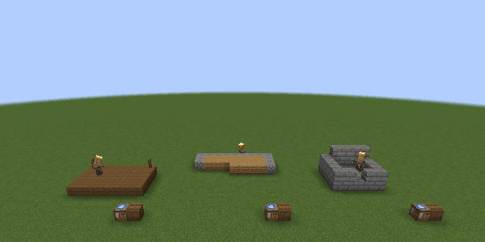

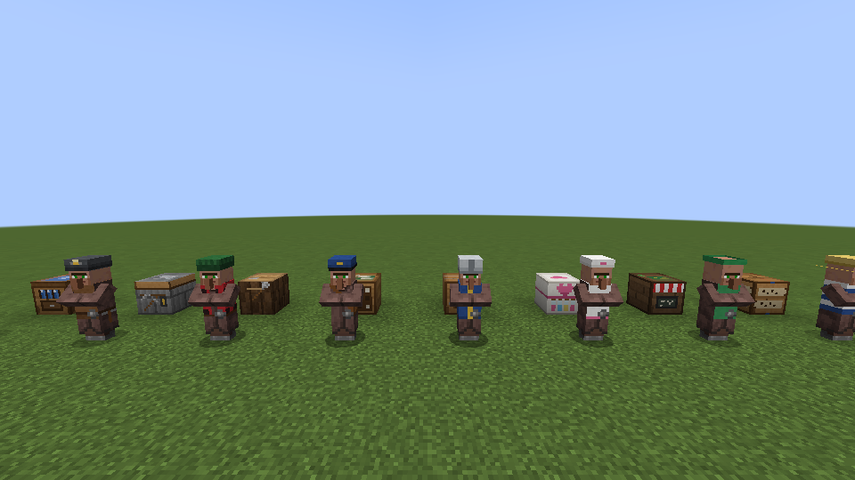

Fabric · Minecraft 1.21.1 · built for the Cobbleverse (Cobblemon) modpack, but works without it.
Builders understand **Chipped**, **Rechiseled** and **Supplementaries** blocks (tested with the real mods).
**Cobblemon:** tested with **1.7.3** (the Cobbleverse pack's) and **1.8.1**; any 1.7.3 to 1.8.x works. Optional: without
Cobblemon the Pokémon jobs simply aren't there.
Install on the **server and every player's game**: put `alive-workplace-<version>+1.21.1.jar` (from the
[Releases](https://github.com/jCondeData/minecraft-alive-workplace/releases); the `+1.21.1` is the Minecraft version it's
for) in the `mods` folder, and take the old Alive Workplace jar out when you update.

## Getting started
**No village nearby?** Craft a **Settler's Wagon** (three white wool over two hay bales and a block of emerald, over a
chest between planks) and right-click open ground: two settlers make camp there — a covered wagon with a chest of
supplies (logs, planks, cobblestone, bread, torches, the Starter Cottage and Storehouse blueprints and a **Village
Hall**), a Blueprint Table, a campfire and two bedrolls. The first settler is your builder from the start; the other
takes whatever job you give them. Put the Village Hall down and you have a village.

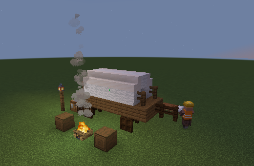

1. **Hire a builder.** Look for a builder's workshop in a village (newly explored villages often have one), or craft
   a **Blueprint Table** and place it near a villager without a job; they take it like any job block.

   ```
           Blue Dye
   Planks  Cartography Table  Planks
   Planks                     Planks
   ```
2. **Get a blueprint.** Builders sell the starter blueprints (Starter Cottage first; more as they level up).
   Operators can also use `/workplace blueprint <id>`, including anything saved with a Structure Block.
3. **Place it.** Hold the blueprint and right-click the ground where the front of the building should go.
   It faces you, and while you hold it you see the whole building as see-through blocks, exactly where it
   will stand (the gold edge of the outline is the front). Sneak-right-click the ground to turn it;
   sneak-right-click the air to pick it back up (before it's placed, that opens its styles instead: see *Styles*). On uneven ground the builder fills in a foundation, and when the
   building is finished they level the ground two blocks around it (dirt, stone and grass above the floor dug away,
   holes filled with dirt; trees, flowers and anything built are left alone). For a build meant to sit in a
   hillside, right-click the air with its blueprint to switch that off for this build (the tooltip says so).
   Water and lava in a blueprint are poured from buckets in the chests (the empty buckets go back).
   Item frames, paintings and armor stands go up last, empty, each paid for with its item from the chests.
4. **Stock the chests.** Put the materials in any chests or barrels within 8 blocks of the builder's Blueprint Table
   (hold Shift over the blueprint to see the list). Once the blueprint is placed, its tooltip counts what the chests by
   the nearest Blueprint Table are still short of — blocks already standing in place don't count — so you know when
   you're ready.
5. **Hand it over.** Right-click the builder with the blueprint. The first player to do that hires the builder;
   after that it takes orders from them and the friends they add (`/workplace friend add <player>`).
   Busy builders take up to 5 more blueprints and build them in order. They start work in the morning, sleep at night,
   and tell you if they run out of something. What they are building, how far along it is and what they are
   waiting for floats above their head; sneak-right-click a builder with an empty hand for the full status.

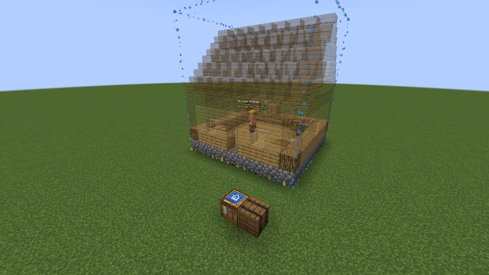

When they finish, the blueprint goes back into the supply chest so you can build it again.

**Changed your mind?** Place the blueprint over the building and **sneak** while giving it to a builder: they take it
down and put the blocks back in the chests.

**Repairs.** Builders look after what they've built: now and then an idle builder walks round the buildings they (or
whoever they work for) finished near their Blueprint Table, and when blocks are missing — a creeper's hole, a raid, a
broken window — they put them back from their chests. Only holes are filled: anything you've put in or changed since
stays as it is. `builderRepairs` in the config turns it off.

**More builders, faster builds.** A builder with nothing to do helps with builds near their Blueprint Table (up to three
helpers per build), sharing the chests and passing each other materials.

**Builders level up as they work**, like villagers you trade with: every level makes them faster (a Master builds
2.5× as fast as a Novice) and unlocks new blueprints to buy — Market Stall, Lookout Tower, then the
**Healing Center** (with a brewing stand behind the counter, and a Cobblemon Healing Machine on the counter when
Cobblemon is installed) and the **Supply Shop** (with a Shop Counter) — build them and a shopkeeper moves in by
themselves; hand the villager at the brewing stand a honey bottle and they become the nurse.

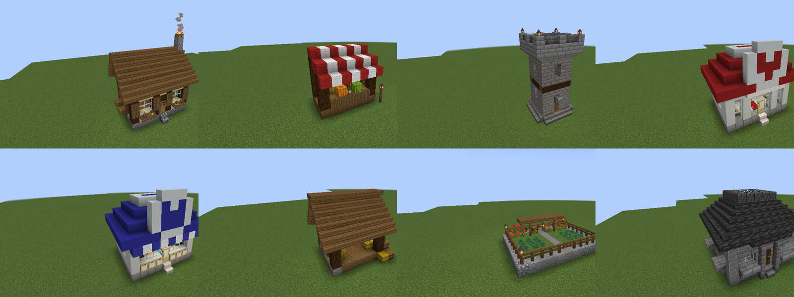
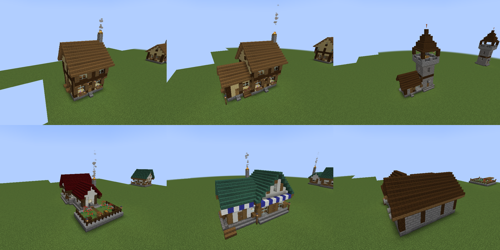

**The builds are built to look good**: stone plinths, timber frames with light infill, shuttered windows with flower
boxes, roofs that overhang on every side, chimneys that smoke, lanterns and benches (how they are drawn:
`tools/blueprints/STYLE.md`).

**Buildings for the new jobs** (in the Blueprint Table, each with an upgrade): the **Schoolhouse** (a lectern before a
blackboard; II adds a fenced schoolyard), the **Library** (a lectern among the shelves; II a study tower with a second
lectern; III an enchanting room behind the hall: an Enchanting Table ringed by fifteen bookshelves and a third
lectern, so a librarian moves in), the **Ranch** (a barn — a hayloft gable over two stable aisles — with a smoker, and a
paddock; II doubles the paddock and adds a stable wing and a brick silo), the **Apiary Garden** (hives on posts in a
meadow and a honey shed with one more; II four more hives), the **Flower Shop** (a composter behind display windows;
II a greenhouse) and the **Graveyard** (a walled churchyard with a mortuary and a brewing stand; II a lych-gate). Each
job's block is a vanilla one, so a villager there takes its vanilla job by themselves (a beehive takes nobody): hand
them the job's item to give them ours — a book at the school's lectern (a teacher), paper at the library's (a
scholar), a saddle at the ranch's smoker (a rancher), a glass bottle or shears by a hive (a beekeeper), a flower at the
shop's composter (a florist), a golden apple at the mortuary's brewing stand (an undertaker).

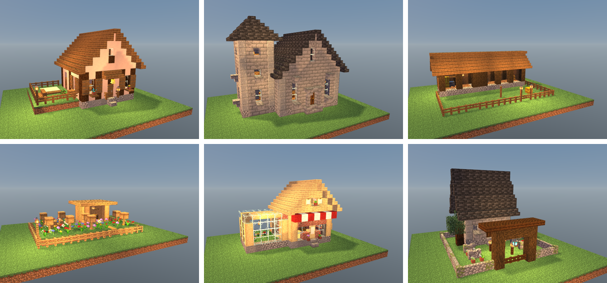

**Paths.** When a builder finishes a building they lay a **dirt path** from its door to the heart of the village — the
meeting bell or the Village Hall within 48 blocks (their Blueprint Table if there's neither) — round water, trees and
other buildings, turning only grass and dirt into path. Turn it off with `builderPaths` in the config.

**Styles.** Any blueprint can be built in another style: **sneak-right-click the air** with it and pick **Stonework**
(stone infill, slate roofs), **Sandstone** (sandstone and jungle wood, for the desert), **Dark Oak** (dark oak,
deepslate and tuff), **Cherry** (cherry wood and pink roofs) or, with Cobblemon, **Apricorn** (apricorn wood and brick
roofs) — or back to the timber it was drawn in. The builder builds it in those blocks, the materials list and the
preview change with it, and its upgrades come in the same style. It works for your own blueprints too. Styles are data:
a data pack can add its own (`data/<namespace>/blueprint_styles/<name>.json`, a list of block swaps — see ours in
`src/main/resources/data/aliveworkplace/blueprint_styles/`). The same screen has a **Mirror** button (top right): the
build comes out flipped left to right, its front still facing you — a house with its chimney on the other side.

**Scan Tool: your own builds as blueprints.** Craft a **Scan Tool** (a Blank Blueprint and a spyglass). Right-click one
corner block of something you've built, then the opposite corner (the box shows in purple while you hold it; up to 48
on a side), and sneak-right-click the air: for a Blank Blueprint from your inventory you get a blueprint of it, and it's
in the Blueprint Table for everyone. Rename the tool in an anvil first to name the build — "Cozy Cabin", and later
"Cozy Cabin 2" for its upgrade. The low-Z (north) side is the front and the lowest layer sits on the ground; turn it any
way you like when you place it.

**Shape Planner: walls, towers and domes.** Craft a **Shape Planner** (a Blank Blueprint and a compass) and right-click
the air with it: pick a **box** (a wall, a floor, a room), a **cylinder** (a tower or a ring wall), a **dome**, a
**sphere**, a **cone**, a **pyramid** or an **arch**, its width, height and depth (1 to 32; shift-click for steps of 5),
solid or hollow, and one of the building blocks you carry. **Draw the blueprint** turns a Blank Blueprint into a
blueprint of it; hand it to a builder like any other. Hollow shapes are cleared inside (a tower's inside is dug out
down to its floor, a dome's down to the ground), and the arch leaves its way through open.

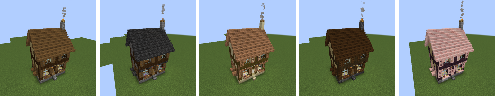

**Decorations.** The Blueprint Table also has the small builds that make a village a place: a **Well** (II puts a
roof over it, benches and lamp posts round it), a **Street Lamp**, a **Park Bench** between bushes, a **Fountain**, a
**Gazebo** and a **Market Square** (a paved square with a fountain, two striped kiosks, benches, lamp posts, flower
beds and the village bell, where the villagers meet) and a **Chapel** (a stone nave with pews and an altar, a bell
tower with a slate spire — the village's weddings are held there). Near a Village Hall they make the village prettier:
each one adds to its **beauty** (a lamp post or a bench 1, a well 2 — 3 with its roof —, a fountain or a gazebo 3, a
chapel 4, a market square 5), and every point is 1% more wellbeing, up to 10%.

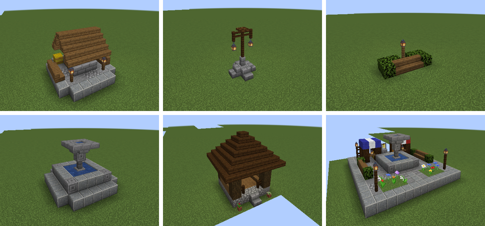

**Market days.** A village with a Village Hall and a Market Square holds a **market** once a week, in the morning:
two travelling traders come to the square with their wares until nightfall, each also selling a blueprint (a starter
building, often in another style, or a decoration) for 6 emeralds. Everyone in the village is told, and the chronicle
remembers it. `marketDays` in the config turns it off.

**Upgrades.** A blueprint named like another with `_2` on the end (`_3` after that…) is its upgrade. Every starter
build has one: the **Starter Cottage II** adds a timber upper storey jettied out over the front and back, the **Market
Stall II** a second stall with a Shop Counter, the **Lookout Tower II** a grindstone, a bell and a steep pointed spire
over the platform, the **Healing Center II** a ward with four beds under a lower roof behind the hall, the **Supply
Shop II** the shopkeeper's house behind the shop (a bed, a chest, more stock, a chimney), the **Storehouse II** an open shed beside the granary, the **Berry Farm II** a pergola of glow berries and the **Research Lab
II** a museum hall with a skeleton under a glass ridge. Most go one step further, each third tier bringing a new
villager or room: the **Starter Cottage III** a kitchen wing with its own door (the builder clears the ground where it
goes first), the **Market Stall III** a storeroom behind the stalls, the **Lookout Tower III** a guardhouse with a
second grindstone and two bunks, the **Healing Center III** a walled berry garden with a composter, the **Supply Shop
III** a post office with a Mailbox (a postman moves in) and the **Storehouse III** a stone warehouse range across the
back with sixteen more chests. The grindstones and the composter take a villager with their vanilla job (a
weaponsmith, a farmer): hand them a sword and they become a guard, sweet berries and they become the orchard keeper.
Right-click a finished building with its upgrade
and it lines up exactly over it; the builder takes off what changes and builds only what's new, keeping everything
else. Once a builder finishes a building that has an upgrade, **they sell its blueprint** (and tell you). The
upgrades are in the Blueprint Table too. Your own blueprints work the same way (`my_house` → `my_house_2`).

## The Village Hall
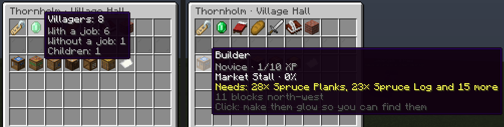

Craft a **Village Hall** (gold, a book and gold over planks with an emerald in the middle) and put it in the middle
of your village — by the bell is a good spot. Right-click it for the village at a glance, everyone within 64 blocks:

- **the numbers**: how many villagers (with a job, without one, children), beds and how many are free, the food in the
  store (in the chests by the Storehouses and the kitchens: smokers, and old Kitchen Stoves), guards, everything the
  workers are waiting for and the buildings going up, with how far along they are;
- **everyone who lives there**, each worker shown as their workstation (stacked as high as their level): their job,
  level and XP, what they're doing right now ("Market Stall · 45%", "needs bone meal to grow flowers"), what they're
  waiting for and where they are ("11 blocks north-west"). **Click one to make them glow** for ten seconds, so you
  can find them.

**Ranks.** A village grows from a **Hamlet** to a **Village** (10 villagers and 5 finished buildings), a **Town** (20
villagers, 12 buildings and 3 levels of research) and a **City** (35, 25 and 7). Each rank pays: quests pay a quarter
more a rank, caravans can go to one more village a rank, from a Town three traders come on market day, and the
village can grow ten villagers bigger a rank. A rank up is celebrated with fireworks over the hall and goes in the
chronicle; the hall's name icon shows the rank and what the next one needs.

**Running the village.** Click a villager without a job on the hall's list to see the village's **free
workstations** (with the job each gives and where it is) and click one to give them that job. The **bell** in the
middle of the screen **calls everyone home**: villagers whose bed or workstation is in the village but who wandered off
are brought back beside the hall.

**Caravans.** Villages with a Village Hall can supply each other. The **minecart** on the hall's screen opens its
**trade routes**: every other village with a hall within 2048 blocks, with what its workers are waiting for. Click one
to send it caravans: once a day a caravan takes that village what it's waiting for from your Storehouses' chests
(keeping 16 of everything for yourselves, four stacks at most) and it arrives in their Storehouses' chests after a trip
as long as the road. Both chronicles note the caravans. A village can send to three others.

**The chronicle.** The book in the middle of the hall's screen opens the village's **chronicle**: what has happened
there, newest first, day by day — the hall founded, babies born, villagers who died (and how) or came back from the
grave, travellers who arrived and who hired them, buildings finished and who built them, quests done, research
finished, villagers who became Masters.

The village gets a made-up name (*Thornholm*, *Ashford*...); use a **Name Tag** with a name on the hall to call it
whatever you like (the tag isn't used up). The hall keeps the name when you break and move it.

**Quests.** Each morning the village puts up a quest at the hall (three at most, each up for three days; players
nearby are told): bring what one of the workers is waiting for, food when the store is low, or something the village
can use; clear out 8 monsters round the village; or, with Cobblemon, beat one of the village's trainers. Open the
**Quests** page from the hall (the map icon) to see them; click a quest to hand in what it asks for (it goes straight
to the worker who asked, or the store). Monsters and battles count wherever they happen in the village. Whoever
finishes a quest gets its reward in emeralds (CobbleDollars with CobbleDollars installed).

**The quest journal** (1.5). The Quests page is a journal with four tabs along the top: **Village** (the hall's daily
quests), **Personal** (requests from villagers who are your friends), **Story** (the tale the village is living
through) and **Bounties** (wanted outlaws); a tab whose part isn't in the game yet says so in grey. Each quest shows
who asked, a line per step with its progress, the reward and the days left. Click a quest to hand in what it asks
for, or to **track** it when there's nothing to hand in; shift-click always tracks or untracks. A tracked quest (one
at a time) is a bar at the top of your screen, for you only: "Slay 6 monsters (2/6)", filling as you go and gone
when the quest ends or you untrack it. `/workplace quests` lists your quests in chat with a clickable **[Track]** or
**[Untrack]**, and the Village Ledger opens the journal from anywhere. Some quests send you somewhere (a village, a
biome, a spot marked by the village's story); the place is found once, when the quest goes up, and a quest may pay a
map to it with the place marked.

**A village with a hall has needs.** Every grown villager eats once a day from the store — the chests by the smokers
first (the chef's cooking), then by the Storehouses; anything plain to eat, never golden food, food that makes you ill,
honey or Pokémon berries. Villagers like a bed of their own, guards (one for every ten villagers) and light by their
beds, and decorations round the village (see *Decorations* above). The hall's **Wellbeing** shows how it's going, and it
sets the pace of all the work in the village: **up to 25% faster** when everyone's fed, housed and safe, the usual pace
at 50%, and **up to 20% slower** when they're hungry and sleep rough. The villagers the hall lists say when they're
hungry or have no bed. Without a hall, work goes at the usual pace.

**People.** In a village with a hall every villager gets a **name** of their own (look at them, or see the hall's
list; a Name Tag's name stays) and every villager has a **trait** or two, which the hall lists: **Diligent** (works 10%
faster), **Lazy** (10% slower), **Nimble** (walks 15% faster), **Clever** (learns a quarter faster), **Strong** (hits 15%
harder — good in a guard), **Cheerful** (makes the village happier, 1% each up to 5%), **Glutton** (eats twice a day)
or **Frugal** (eats every other day). Traits are part of who a villager is and never change. `villagerNames` and
`villagerTraits` in the config turn them off.

**Sickness.** Now and then a villager in a village with a hall falls ill — more often when they're hungry or have no
bed. The ill sneeze, walk slowly and work at half pace; they get well by themselves after three days, or at once when a
**Nurse** gives them a **honey bottle**, a **bucket of milk** or a **potion of healing or regeneration** from the chest
by her brewing stand (she looks for the ill within 32 blocks, and asks on the requests board when she has nothing to
give). The hall's list says who's ill. `villagerSickness` in the config turns it off.

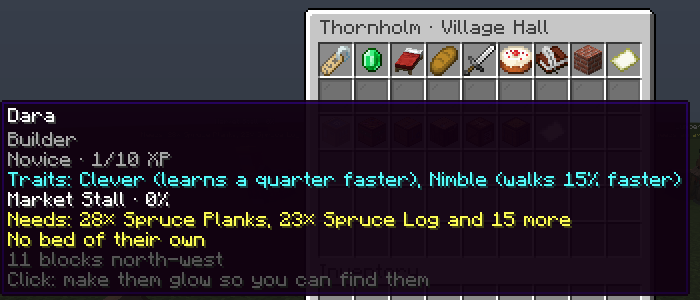

**Moods.** Every grown villager in a village with a hall has a **mood**, 0 to 100, which the hall's list shows with its
reasons: fed or hungry, a bed of their own or not, a job or not, ill, cheerful by nature, decorations near their home,
company, and their **diet**. **Unhappy** villagers (under 30) work 15% slower; **happy** ones (75 and up) 7% faster.
`villagerMoods` in the config turns it off.

**Diet.** Villagers eating from the village store pick something they haven't had lately, and remember their last five
meals: three or more kinds is a **varied diet** (a better mood), the same thing every time is a worse one. A store with
bread, baked potatoes, cooked fish and pies keeps them happier than one full of bread; the hall's food icon says how many
kinds of meal the store has.

**Couples.** Now and then two grown villagers who aren't family start **courting** (the chronicle notes it), and two
days later they **marry**: a wedding at the village's Chapel (or its bell) with fireworks, everyone told, the whole village in a good
mood as after a festival. Couples are happier near each other, a married couple is first in line for a baby when
there's a free bed, and when one dies the other mourns for a few days. The hall's list says who's courting or married
to whom. `villagerCouples` in the config turns it off.

**Chatter.** Walk through a village with a hall and now and then someone off work turns to you and says something over
their head — about their mood ("I haven't eaten all day", "Such a pretty place to live"), the village's news (a
festival tonight, bandits camped to the north, a raid) or just hello, by name. At most a line every twenty seconds near
you. `villagerChatter` in the config turns it off.

**Families.** A baby remembers its parents — the hall's list says whose child they are. When they grow up the chronicle
says so, and a grown child without a job **takes up a parent's trade** if the village has a free workstation for it.

**The village grows.** At most once a day, when there's a **free bed**, **16 meals in the store** and the wellbeing is
at least 50%, the two villagers nearest the free bed have a baby (the family eats 8 meals for it), up to 40 villagers
(`villageGrowthCap`). The hall's villager count says what the village still needs to grow. So build houses: the
**Terrace** (two narrow homes, four beds; the **Terrace II** adds a third home) and the **Inn** (a tavern below, three
guest rooms with six beds above; the **Inn II** adds a stable with a smoker: hand the villager there a saddle and they
become its rancher) are in the
Blueprint Table. The **Stone House** grows in three tiers: a stone cottage with a bed downstairs and one in the attic,
then (**II**) a timber-framed upper storey with two more beds, then (**III**) a stone wing at the back with two more.

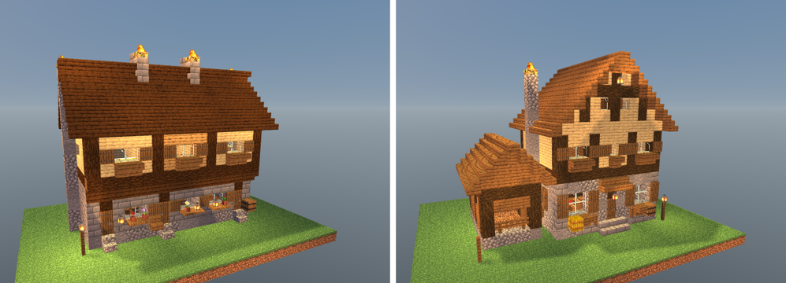
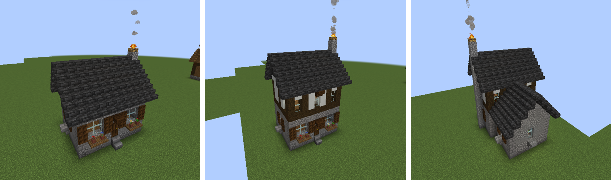

**School.** Stand a villager by a **lectern** and sneak-right-click them with a **book**: they become a **Teacher**. In
the day they call the children within 32 blocks over to the lectern and give them lessons; a child who's had a couple of
minutes of lessons has been to school, and when they grow up and take a job they **start as an Apprentice** (with the
Novice and Apprentice trades) instead of a Novice. The hall's list says who went to school. Pastured Psychic and Normal
Pokémon make the lessons go quicker.

**Innkeepers and travellers.** Stand a villager by a **Shop Counter** (the **Inn** has one at the end of its bar) and
sneak-right-click them with a **bed**: they become an **Innkeeper**. Each morning, while there's a free bed within 32 blocks and fewer than two guests, a **traveller** comes
to stay (you're told in chat). Travellers already know a trade: most are Apprentices or Journeymen, now and then an
Expert (more often at a better innkeeper's inn). Right-click one to **hire them**: 8 emeralds for an Apprentice, 16 for
a Journeyman, 32 for an Expert (CobbleDollars at the usual rate with CobbleDollars installed). They join your village,
take the first free workstation and start at their level, with the trades of every level on the way. Travellers nobody
hires move on after two days. Until they're hired they won't take a job.

**Research.** In a village with a Village Hall, stand a villager by a **lectern** and sneak-right-click them with
**paper**: they become a **Scholar**. Sneak-right-click them with an empty hand for the village's **research tree** and
click a topic to research it next; the scholar takes the cost from the chests by the lectern (paper, books and emeralds
— on the requests board if they're missing) and works it out at the lectern, a couple of minutes a level (quicker with
pastured Psychic Pokémon, and several scholars share the work). Every level is a bonus for the whole village:

| Topic | Levels | Bonus a level | First needs |
| --- | --- | --- | --- |
| Swift Hands | 3 | every job 5% faster | — |
| Hearth | 2 | wellbeing 10% higher | — |
| Drill | 3 | guards hit 10% harder | — |
| Kinship | 2 | one more Pokémon partner per worker | Swift Hands I |
| Lore | 1 | schooled children start as Journeymen | Hearth I |
| Architecture | 1 | the **Town Hall** blueprint (a stone hall with a bell tower and a Village Hall inside) | Swift Hands II, Hearth I |
| Logistics | 2 | porters carry 3 more stacks | Swift Hands I |
| Craftsmanship | 2 | carpenters, masons, tinkerers, chefs and other crafters 15% faster | Swift Hands I |
| Medicine | 2 | villagers a third less likely to fall ill | Hearth I |
| Fortification | 2 | guards turn aside one blow in ten | Drill I |
| Commerce | 2 | one more market trader, mercenaries 3 emeralds cheaper | Hearth I |
| Expeditions | 2 | explorers and netherworkers back 20% sooner | Logistics I |
| Green Thumb | 2 | composters need a layer less compost a bone meal | Hearth I |
| Warding | 1 | explosions (creepers, TNT, fireballs) no longer break blocks in the village | Fortification I |

**Graves and Undertakers.** A grown villager with a job (or a name) who dies leaves a **grave** where they fell —
right-click it to read who lies there. Stand a villager by a **brewing stand** and sneak-right-click them with a
**golden apple** (or an enchanted golden apple or a totem): they become an **Undertaker**. With a **golden apple**, a
**healing potion** or a **totem of undying** in the chest by the brewing stand, they go to the nearest grave within 32
blocks and bring the villager back — job, level, trades and name as they were. Without one they ask for a golden apple
on the Storehouse's requests board. A villager a zombie turns into a zombie villager leaves no grave (cure them
instead). The Village Hall counts the graves.

## Villages that build themselves

*Arrives in 1.1: its switches stay off until then (see the config table).* Draw what you want a village to become on
its **City Plan**, make a seasoned builder its **Steward**, and the village grows into the plan by itself: homes when
beds run short, a workplace for every worker, farms when food is short, roads, lamps, a wall once it's been raided, and
its old vanilla houses rebuilt one at a time.

**The City Plan.** Craft a Map, a Blank Blueprint and a Heart of the Sea (shapeless). Right-click a Village Hall to bind
it (its tooltip names the village), then right-click the air to open the plan: the village map with a grid of 32×32
cells over it (a cell is 4×4 blocks at the default `villageHallRadius`). Paint up to 16 **zones**, each a kind, a
name, a style (one of the blueprint styles, or as drawn) and a "renew old houses" switch:

| Zone | What goes there |
|---|---|
| Homes (white) | cottages, stone houses, terraces, inns; home upgrades |
| Workshops (orange) | the workplace of each job (Smithy, Mason's Yard, Fletcher's Lodge, Map Room, Weaver's Cottage, …) |
| Farms (lime) | Berry Farm, Ranch, Farmstead, Fisher's Hut |
| Market (yellow) | storehouses, market stalls, the Market Square |
| Civic (blue) | school, library, clinic, chapel, graveyard |
| Gardens (light blue) | wells, benches, fountains, gazebos |
| Defences (black) | lookout towers, barracks |
| Keep Clear (red) | nothing is ever built there (roads may cross) |

Besides the brush, rectangle, eraser and undo, two tools draw on the plan: **Road** (click points, double-click to
end; a lane 1 block wide, a street 3 or an avenue 5, in a road style) and **Wall line** (one line round the village,
open or closed). Holding the plan shows its zone edges, roads and wall line on the ground within 24 blocks as coloured
particles. Only the hall's owner, their friends and operators may change a plan.

**The Steward.** Sneak-right-click a Builder of Journeyman level or more, standing by the hall, with its City Plan: he
becomes the village's Steward, one per hall, in a clerk's long coat. Each morning he walks his rounds with the plan in
his hands (his open builds, each zone, the storehouse), then plans at the hall all day; the line over his head says
what and why ("Planning a Stone House: 3 villagers have no bed"). His level sets how many of his builds may be open at
once: 1, 2, 2, 3, 4 from Novice to Master, never more than the village's rank allows (Hamlet 1, Village 2, Town 3,
City 4). `/workplace steward explain` lists every rule for the nearest hall, each condition's number and whether it
held.

**His desk.** With a Steward, the hall's "What next?" page becomes his desk: three modes, **Ask me first**, **Run the
village** and **Rest**; his open builds, each with Cancel; and up to 9 proposals, each saying what, why, where, what it
needs (and how much of it is in store) and which builder will build it, with Approve, Decline, Show me, Another spot and
Another style. In Run the village he approves them himself and tells you in one line a morning. He also gives jobless
villagers jobs (the biggest gap first) and picks the scholars' next research. Unanswered proposals lapse after 3 days;
a declined one stays away 3 days. He never starts a build while two of his builds have waited a whole day for
materials; instead he tells you the shopping list once a day. He never builds over a player's own blocks, never in
Keep Clear, and never on a plot that isn't natural ground and trees.

**Roads.** The roads on the plan are built in segments of up to 24 blocks, each by the nearest free builder, in the
road style of the zone they start in: As drawn (dirt path, coarse dirt and gravel), Stonework, Sandstone, Dark Oak,
Cherry and, with Cobblemon, Apricorn. Every new building's door joins the nearest road with a lane. Streets get a lamp
every 16 blocks and at crossings, lanes a lantern post every 12; water or a drop gets a bridge, a one-block rise
stairs. Villages with a caravan route each build their half of a road to the other village, ending at a milestone sign
if it stops short; caravans on a finished road arrive sooner.

**Walls.** Once the village has been raided in the last 7 days, or a bandit camp is near, the Steward proposes a wall
along the wall line (or a line of his own round the zones): a Palisade up to a Village, Stone from a Town (a Town
replaces its palisade a segment at a time). Towers at the corners and every 28 blocks, a gate wherever a road crosses,
shut at night.

**Renewal.** In zones with "renew old houses" on, he finds the houses no builder built (by their beds and job blocks;
never one with a chest, never one a player changed) and lists them on the desk. One at a time, at most one every 2
days, he renews one in the zone's style: the old house is taken down by the builders (its blocks go to the store) and
the new one built on its plot; its sleepers move in and its worker keeps the job (an old armorer's house becomes a
Smithy).

**For packs: everything is data.** Each of these folders, in any namespace (`data/<namespace>/<folder>/`), holds one
entry per JSON file; a pack adds its own beside ours, and a broken file is skipped with a warning naming it:

| Folder | One file is |
|---|---|
| `city_zones/` | a zone kind: its colour, map tint, icon and whether anything may be built there |
| `steward_rules/` | one of the Steward's rules: `when` (conditions, all must hold), `do` (build, upgrade, assign jobs, research or ask), `priority`, `why`, `cooldown_days`, `max`, `min_rank`, `requires` |
| `road_styles/` | a road style: its middle and edge blocks, steps, bridge blocks, lamp and lantern post |
| `wall_kits/` | a wall kit: its segment, corner tower and gate blueprints, and the ranks it is for |
| `steward_renewal/` | what an old house becomes: by its job (or `home`), the blueprints to try in order |

**Settings** (`config/aliveworkplace.json`, see the table below): `steward`, `stewardMaxOpenBuilds`, `stewardSelfRun`,
`stewardRoads`, `caravanRoads`, `caravanRoadReach`, `stewardWalls`, `stewardRenewal`.

## Classes

*Part of 1.8, Classes and luxuries: off until that expansion is finished.*

Every household in a village with a hall (one villager, or a married couple) lives as a **class**: Peasant, Artisan,
Burgher or Noble. Each class has **needs** (a better home, days fed from the store, a varied diet, services such as a
school or chapel near home, a building like the Market Square, the village's rank, beauty, and luxuries such as Work
Clothes or Berry Wine taken from the village store) and **wants** (extras). A household that meets the next class's
needs two dawns running **rises**: golden sparkles and a chime at their door, a chat line to players within 32 blocks,
a line in the Chronicle and "rose in the world" (+10 mood for 2 days). One that lacks a need of its own class three
dawns running **comes down in the world** (-10). Every villager's mood also has "has what their class needs" (+5), or
-5 for each need lacking (at most -15).

At the Village Hall:
- the **Classes** tab says how many households of each class there are. Its page has a button per class: each need and
  want with how many households have it ("A varied diet: 2 of 4", counted over the class and the one below it), what
  the class gives (its tax, the jobs it opens, its effects), and the households closest to rising into it with what
  they lack;
- the people list says each villager's class and household ("Burgher · married to Tomas") and ticks the needs of their
  class and of the next one;
- the food icon lists the luxuries in store;
- **What next?** gives up to three class tips, most households first ("2 Peasant households want A varied diet to rise
  to Artisan").

What each class gives:
- **Taxes:** each worker pays the treasury's daily share times their class's factor (Peasant 1, Artisan 1.5, Burgher
  2.5, Noble 4), 10% more for each want they have; a Noble without a job pays like a worker. A Peasant pays exactly
  what every worker paid before, so no village takes in less. The hall's name tag shows the day's takings by class.
- **Artisans:** crafters who are Artisans or better (carpenter, mason, tinkerer, chef, leatherworker, toolsmith and the
  luxury trades) work 10% faster, within the usual 2× pace cap.
- **Burghers:** Burgher scholars research 15% faster. With 3 Burgher households (or better) the village may send one
  more caravan route, and market day brings one more trader, who also sells a grand-house blueprint (the Townhouse or
  the Manor, once they're in the Blueprint Table) for 12 emeralds.
- **Nobles:** each Noble household lifts the village's wellbeing 3% (9% at most), and every other festival is a
  **Noble's Ball**: the guests gather at the Manor (or else the hall), wine and the store's best food are served, gold
  fireworks go up at dusk, everyone who came is happier (+15) for 3 days, and players there are Heroes of the Village
  for the night.
- **Legends** live among the Nobles: held to the Noble's needs and counted with them.

**Higher jobs need higher classes.** Some jobs can only be taken by a villager of a class or better (the Class column
in *All the jobs at a glance*): the Tinkerer, Chef, Netherworker, Nurse, Teacher, Shopkeeper, Innkeeper, Printer and,
with Cobblemon, the Ball Smith, Move Tutor, Pokémon Trader and Fossil Scientist need an Artisan; the Scholar,
Undertaker, Jeweller and Trainer Leader a Burgher. Vanilla jobs are open to everyone. The rule counts when a job is
taken: picking it with its item ("Dara is Peasant class; Scholar needs Burgher or better"), the hall's list of free
workstations (greyed, with the class it needs), a grown child taking up a parent's trade and the Steward's morning
jobs. A hired traveller arrives with the class of their level (Apprentice: Peasant, Journeyman: Artisan, Expert:
Burgher). Nobody is ever fired: a worker below their job's class keeps it at the usual pace, and the hall's people
list marks them. Outside a village with a hall, or with `villageClasses` off, no job needs a class.

Classes are data: `data/<namespace>/classes/<id>.json` (a data pack can replace ours, add its own or switch one off).
**Settings:** `villageClasses`, `classRiseDays`, `classFallDays`.

## Edicts

A village's owner proclaims **edicts** at the Village Hall (its **Book of Edicts**, or sneak-right-click with a
**Village Ledger**): laws that each give the village a boost at a cost. A village keeps one edict in force per rank
(Hamlet 1 ... City 4), each for at least 3 days; some exclude each other. Every edict has a **reform**: three steps on
the hall's Quests page that, once done, take its cost away and keep the boost. The villagers talk about the edicts in
force, and about the reformed ones, and the hall's "What next?" page says when a slot is free or a reform step waits.


| Edict | Boost and cost | Reform (three steps) | Once reformed |
|---|---|---|---|
| Long Shifts | Everyone works 20% faster; every grown villager is 10 less happy. | The Shift Bell: 24 clocks, 128 gold ingots, 300 bread | the boost without the unhappiness |
| Free Bread | Everyone fed in the last day is 10 happier; the village eats 30% more. | The Common Granary: 512 wheat, 128 hay bales, 48 barrels | the free bread no longer eats into the store |
| Large Families | Up to two babies a day; a baby needs 24 meals in the store and the family eats 12; villagers fall ill 50% more often. | The Midwives: 48 honey bottles, 192 white wool, 64 golden carrots | no more food needed, no more illness |
| Open Gates | Inns take 4 guests and up to two travellers arrive a morning; one more trader comes on market days; bandits camp nearby twice as often. | The Watchful Gate: 192 iron ingots, 256 arrows, 40 monsters slain | bandits no likelier than usual |
| Festival Season | A festival every 4 days instead of 8; each costs the treasury 3 emeralds and 1 more for every 4 villagers (no money, no festival). | The Festival Fund: 24 cakes, 256 firework rockets, 48 note blocks | festivals every 4 days, free |
| Tithe | A tenth of the emeralds players pay villagers goes into the treasury; their prices are 10% higher. | The Fair Ledger: 24 book and quills, 192 gold ingots, a Pokémon battle (without Cobblemon or a trainer: 32 monsters slain) | prices back to normal |
| Curfew | From dusk to dawn everyone but guards stays in bed and raids are half as likely; no night trading, festivals and markets end at dusk. | The Lamplighters: 192 lanterns, 96 glowstone, 32 monsters slain | safe nights, and trade, festivals and markets go on |
| Conscription | In a raid every grown villager fights beside the guards with a stone sword; but all work stops until noon the next day. | The Militia Drill: 32 iron swords, 32 shields, 48 monsters slain | work stops only near a raider |

The edicts are data files (`data/aliveworkplace/edicts/*.json`: `conscription`, `curfew`, `festival_season`,
`free_bread`, `large_families`, `long_shifts`, `open_gates`, `tithe`); a data pack adds its own or switches one off with
`"enabled": false`. The config switch `villageEdicts` turns edicts off.

## Civic items

| Item | Recipe | What it does |
|---|---|---|
| Village Ledger | book + emerald | Right-click a hall to bind it; then open the hall's screen from anywhere nearby (sneak: the Book of Edicts). |
| Work Horn | goat horn + gold ingot + emerald | Blow it in a village: every grown villager works 50% faster for 5 minutes, once a day, and is worn out (10 less happy) until dawn.  |
| Cradle | 3 white wool, 2 planks, 2 sticks (`W W` / `PWP` / `S S`) | Near a bed it makes a nursery village: children grow up twice as fast, sleep in it at night, and one more baby a day may be born.  |
| Harvest Idol | hay bale, 3 wheat, stick, gold ingot | In harvest season (autumn) the crops within 32 blocks grow a quarter faster.  |
| Village Banner | any banner + gold ingot | Right-click the hall: its design becomes the village's colours.  |
| Guild Charter | 3 paper, emerald, gold ingot, red dye | Sneak-right-click a villager of a guild's trade: they become its master. A village may have one guild per rank above Hamlet; its perks start once a builder finishes a **Guildhall**.  |
| Tonics | see below | Hand one to a villager of its trades (right-click): they work 25% faster for a Minecraft day.  |

**Tonics** (`data/aliveworkplace/tonics/*.json`), made by a Chef or an Alchemist from the ingredients in their chest:

| Tonic (file) | Maker | Ingredients | For | Effect |
|---|---|---|---|---|
| Builder's Tea (`builders_tea`) | Chef | glass bottle, 2 sweet berries, sugar | Builders, Carpenters, Masons, Dyers | 25% faster for 24000 ticks |
| Harvest Cordial (`harvest_cordial`) | Chef | glass bottle, apple, wheat, sugar | Farmers, Orchard Keepers, Florists, Beekeepers, Composters, Shepherds, Butchers, Ranchers, Chefs | 25% faster for 24000 ticks |
| Miner's Brew (`miners_brew`) | Alchemist | glass bottle, glowstone dust, coal, sugar | Miners, Sifters, Netherworkers | 25% faster for 24000 ticks |
| Scholar's Infusion (`scholars_infusion`) | Alchemist | glass bottle, amethyst shard, glow berries | Scholars, Teachers, Librarians, Cartographers, Fossil Scientists | 25% faster for 24000 ticks |
| Smith's Draught (`smiths_draught`) | Alchemist | glass bottle, blaze powder, 2 iron nuggets | Armorers, Toolsmiths, Weaponsmiths, Tinkerers, Ball Smiths | 25% faster for 24000 ticks |
| Woodsman's Broth (`woodsmans_broth`) | Chef | bowl, cooked salmon, carrot, brown mushroom | Lumberjacks, Fletchers, Fishermen, Porters, Postmen | 25% faster for 24000 ticks |

**Guilds** (`data/aliveworkplace/guilds/*.json`):

| Guild (file) | Trades | Perks |
|---|---|---|
| Builders' Guild (`builders`) | Builders, Carpenters, Masons, Dyers | 15% faster; up to 5 idle builders help at a build (not 3) |
| Harvest Guild (`harvest`) | Farmers, Orchard Keepers, Florists, Beekeepers, Composters, Chefs | 15% faster; the village's farms and orchard rounds reach 24 blocks (not 16) |
| Healers' Guild (`healers`) | Nurses, Clerics, Undertakers | 15% faster; the ill get well in two days (not three); nurses and undertakers look 48 blocks out |
| Herders' Guild (`herders`) | Shepherds, Butchers, Ranchers | 15% faster; every herd may be 4 bigger |
| Merchants' Guild (`merchants`) | Shopkeepers, Innkeepers, Ferrymen, Postmen, Porters | 15% faster; travellers a quarter cheaper to hire; porters carry 3 more stacks |
| Miners' Guild (`miners`) | Miners, Sifters, Netherworkers | 15% faster; pickaxes and nether gear wear half as fast |
| Scholars' Guild (`scholars`) | Scholars, Teachers, Librarians, Cartographers | 15% faster; research a quarter cheaper |
| Smiths' Guild (`smiths`) | Armorers, Toolsmiths, Weaponsmiths, Tinkerers, Ball Smiths | 15% faster; a Weaponsmith's ingot mends a third (not a quarter) |
| Trainers' Guild (`trainers`, with Cobblemon) | Trainers, Trainer Leaders, Move Tutors, Pokémon Traders, Fossil Scientists | lessons and revivals a fifth cheaper; trainers rank up a quarter faster |
| Wardens' Guild (`wardens`) | Guards | train up to Master (not Expert); hit 10% harder |
| Woodsmen's Guild (`woodsmen`) | Lumberjacks, Fletchers, Fishermen | 15% faster; axes and fishing rods wear half as fast |

Villagers talk of all this too: a rush, the tonic they drank, their guild and the village's colours. The "What next?"
page reminds you of Festival Season with too little in the treasury, a guild still without its Guildhall, Large
Families without a Cradle, and harvest season without an idol by the fields.

## Legends

Now and then a village that has earned it gains a **Legend**: one named villager, a Master of their trade, with powers
that change what the village can do. A Rare Legend comes once to each village, a Legendary one once to each world, and
a Mythic one as often as the villages' ranks allow (a Town holds one, a City two). Legends wear their own outfit over
their trade's, their name shows in gold over their head, and they give off a soft sparkle every few seconds.

Nothing about them is secret. The Village Hall's **Legends page** (the nether star in the page row) lists the
village's own Legends first, then every other Legend as a card: its rarity, how it comes ("Visits the inn", "Found at
a ruined portal"), each thing the village must have with how far it has got ("Kinds of meal in the store: 5 of 8"),
the luxury it likes, its powers, "lives in Thornholm" for a Legendary already living somewhere else, and the Mythic
line ("Mythic Legends: 0 of 1, as a Town"). On the hall's list a Legend comes first, "Ada Stonewright, Master
Architect" in gold, with their rarity, each power on a line and each of their needs (a home of their own, their
luxury, a happy village) with a tick or a cross; a Legend on strike shows it in red. "What next?" says when a Legend
lacks only one thing, and villagers chat about their Legends and the Legends who visit.

A settled Legend has needs, checked once a day: **a home of their own** (their bed in a finished tier III building that
nobody but their spouse also sleeps in), **their luxury** once a week (wine, jewels, books or fine clothes, which they
take from a chest in their home or else the village store; for now honey bottles, amethyst shards and emeralds, books,
and leather armour, through the `aliveworkplace:luxury/<kind>` item tags; it lifts their mood 10) and **a happy village**
(the grown-ups' average mood 60 or more, or wellbeing 60% with moods off). Three days after settling, a need unmet two
days running starts a **strike**: their powers stop, their trade's work stops, they picket by the Village Hall by day
with "On strike: a home of my own" over their head in red, and the hall and chronicle say so. The day every need is
met they go back to work. Legends never leave, strike or not. `legendNeeds` in the config turns needs and strikes off.

`legends` in the config switches them off: none come, and those already settled stay as ordinary Masters of their
trade. Each Legend that ships adds its paragraph below.

## All the jobs at a glance
**Vanilla jobs work as in vanilla**: place their block near a villager without a job and they take it. Most of our jobs
**share a vanilla block** with a vanilla job, and a jobless villager by it still takes the vanilla job. For one of ours,
stand the villager by the block (within about 4 blocks) and **sneak-right-click them holding the job's item** (shown
after the plus sign in the table). A villager already working there switches the same way, and the block's own job comes
back with its item (wheat for a Farmer, coal for an Armorer, flint for a Fletcher, an emerald for a Shopkeeper...).
Where one item fits two blocks (paper, a book, a glass bottle, an iron ingot, a Poké Ball), the block they work at, or
else the nearest, decides. Picking a job doesn't hire the villager: hiring is as before, the vanilla job's item on a
villager who already has that job. A crafting table, a beehive, a jukebox or a Mailbox never takes a jobless villager by
itself; every block listed without an item does. Hold **Shift** over a workstation in your inventory to see its jobs and
their items.

Chests (or barrels) within 8 blocks of the workstation are where they take tools and supplies from and where their work
goes. The old job blocks (the Builder's Bench, the Fruit Basket...) can't be crafted any more, but the ones already
placed keep working, so old worlds are fine.

| Job | Workstation | In the chests nearby | Then | Class |
| --- | --- | --- | --- | --- |
| Builder | Blueprint Table | the building materials | hand them a placed blueprint | any |
| Miner | Blast Furnace + a pickaxe | pickaxes, torches (ladders for a shaft) | hand them a marked Quarry Marker | any |
| Lumberjack | Fletching Table + an axe | axes (saplings, bone meal) | nothing — or a Field Marker for a tree farm | any |
| Orchard Keeper | Composter + sweet berries, glow berries or an apple | berries and seeds to plant, a hoe | nothing — or a Field Marker for an orchard | any |
| Farmer | Composter (vanilla) | seeds, a hoe, bone meal | a Field Marker (blank: their own farm) | any |
| Beekeeper | Beehive or Bee Nest + a glass bottle or shears | glass bottles or shears, flowers | nothing (beehives within 16 blocks) | any |
| Florist | Composter + a small flower | bone meal (flowers to pot) | nothing (grass round the composter) | any |
| Scholar | Lectern + paper | paper, books, emeralds | sneak-right-click: pick the research | Burgher |
| Sifter | Cauldron + gravel, sand, red sand or soul sand | gravel, sand, dirt or soul sand | nothing | any |
| Tinkerer | Smithing Table + redstone | coal (iron ingots to mend golems) | nothing (uses the builders' ore) | Artisan |
| Composter | Composter + bone meal | scraps: seeds, saplings, leaves, crop waste, rotten flesh | nothing | any |
| Berry Breeder (with Cobblemon) | Composter + any Cobblemon berry | berries, Growth and Surprise Mulch | sneak-right-click: pick a goal in the berry book (a Field Marker for a plot of her own) | any |
| Camp Cook (with Cobblemon) | Campfire Pot (Cobblemon's campfire with a pot on it) + Hearty Grains | the makings of her dishes (Hearty Grains, Vivichoke, apricorns, milk, honey, berries for seasoning) | nothing (a Storehouse's stock orders for the order-only treats) | any |
| Habitat Keeper (with Cobblemon) | Pasture Block (Cobblemon's) + a honey bottle | Poké Snacks (or the Camp Cook's), honey bottles, Saccharine saplings | Field Markers for her lure spots (optional) | any |
| Vintner | Cauldron + sweet berries, glow berries or an apple | apples, sweet or glow berries (with Cobblemon any berry), glass bottles | nothing (keeps the village store in Cider and wines) | any |
| Gem Grower | Stonecutter + an amethyst shard | tumblestones or Type Gem Blocks to plant (with Cobblemon), glass and shards for Blank TMs (1.8) | sneak-right-click: pick which gem beds she keeps | any |
| Daycare Keeper (with Cobblemon) | Pasture Block (Cobblemon's) + an egg | emeralds (or CobbleDollars) to collect eggs | right-click: leave a pair, collect eggs | any |
| Netherworker | Cartography Table + netherrack | food (a pickaxe, an axe, a sword, a chestplate, fire resistance) | nothing (a Nether portal within 32 blocks) | Artisan |
| Undertaker | Brewing Stand + a golden apple, an enchanted golden apple or a totem | golden apples, healing potions or totems | nothing (graves within 32 blocks) | Burgher |
| Innkeeper | Shop Counter + a bed | — | nothing (hire the travellers who come to stay) | Artisan |
| Teacher | Lectern + a book | — | nothing (children within 32 blocks) | Artisan |
| Rancher | Smoker + a saddle or a golden carrot | golden carrots, hay, saddles, horse armor (berries) | nothing (horses within 16 blocks) | any |
| Fisherman | Barrel (vanilla) | spare rods (coal for a smoker) | hand them a fishing rod | any |
| Porter | Storehouse | empty chests: the village's store | nothing | any |
| Carpenter | Crafting Table + planks | — (uses the builders' wood) | nothing | any |
| Mason | Stonecutter (vanilla) | — (uses the builders' stone) | nothing | any |
| Leatherworker (dyer) | Cauldron (vanilla) | — (uses the builders' wool, flowers, powder...) | nothing | any |
| Chef | Smoker + raw beef, pork, chicken, mutton, rabbit, cod, salmon or a potato | the makings: wheat, raw meat and fish, potatoes... | nothing | Artisan |
| Armorer (smelter) | Blast Furnace (vanilla) | ore and coal (or nothing: they fetch it) | nothing — or sneak-right-click with coal to hire them | any |
| Toolsmith | Smithing Table (vanilla) | diamonds, if you want diamond tools | nothing — or sneak-right-click with an iron ingot to hire them | any |
| Weaponsmith | Grindstone (vanilla) | worn gear to mend (and what mends it: ingots, planks...) | nothing — or sneak-right-click with an iron ingot to hire them | any |
| Fletcher | Fletching Table (vanilla) | sticks, string, iron (glowstone for spectral arrows) | nothing — or sneak-right-click with flint to hire them | any |
| Shepherd | Loom (vanilla) | shears, wheat | nothing — or sneak-right-click with shears to hire them | any |
| Butcher (herder) | Smoker (vanilla) | empty buckets, wheat/carrots/seeds (with Cobblemon: bottles, a brush, bone meal) | nothing — or sneak-right-click with a lead to hire them | any |
| Cleric (alchemist) | Brewing Stand (vanilla) | nether wart, glistering melon, ghast tears, blaze powder, bottles | nothing — or sneak-right-click with a glass bottle to hire them | any |
| Librarian (scribe) | Lectern (vanilla), and an Enchanting Table | lapis | nothing — or sneak-right-click with lapis to hire them | any |
| Cartographer (explorer) | Cartography Table (vanilla) | food (bread, cooked meat...), a sword or axe, empty maps | nothing — or sneak-right-click with a compass to hire them | any |
| Postman | Mailbox + paper | — | Mailboxes for mail; Delivery Notes for hauling | any |
| Guard | Grindstone + a sword | weapons, armor, a bow or crossbow and arrows | nothing | any |
| Nurse | Brewing Stand + a honey bottle | — | right-click them to be healed | Artisan |
| Shopkeeper | Shop Counter | the goods to sell | set the prices in the counter | Artisan |
| Ferryman | Travel Post | — | buy a Travel Ticket from them | any |
| Bard | Jukebox + a music disc | music discs | nothing | any |
| Trainer (Cobblemon) | Training Post | — | right-click them to battle | any |
| Trainer Leader (Cobblemon) | Training Post + a block of gold | — | right-click them to battle, once a day | Burgher |
| Move Tutor (Cobblemon) | Training Post + a book | — | right-click them for lessons | Artisan |
| Ball Smith (Cobblemon) | Smithing Table + an apricorn | apricorns and copper, iron, gold or diamonds | sneak-right-click them to choose the balls | Artisan |
| Pokémon Trader (Cobblemon) | Shop Counter + a Poké Ball | — | right-click them to trade | Artisan |
| Fossil Scientist (Cobblemon) | Cobblemon's Fossil Analyzer + a fossil | — | hand them a fossil | Artisan |

Sneak-right-click a builder, miner, lumberjack, orchard keeper, farmer, fisherman or postman with an empty hand to see
what they're doing and how to stop them. Each job's section below says how to start it; the recipes for our own blocks
are in the recipe book.

**Villages work together.** Workers whose workstations are within 48 blocks of each other share their chests: a builder
short of stone takes it from the miner's chests, a lumberjack with a broken axe takes a spare from the builder's. What a
worker makes still goes into its own chests; the others come and get it. No particular building is needed, so it works
in any village (from any mod) and in your own base. Only workers who answer to the same people share: the ones hired by
you or your friends (`/workplace friend add`), and village workers nobody has hired with each other — a friend's
builder won't empty your miner's chests unless you've made them your friend. A **Porter** (see *Porters and the
storehouse*) gathers what everyone makes in one place.

## Miners
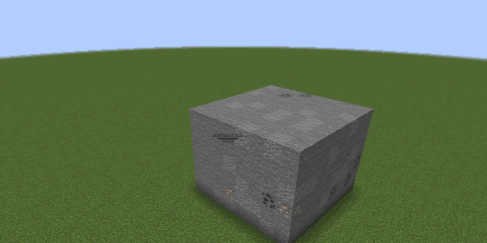

Place a **blast furnace**, stand a villager by it and sneak-right-click them with a **pickaxe**: they become a
**Miner**. Then:
1. Craft a **Quarry Marker** (stick + red dye + paper). Right-click one corner block, then the opposite corner
   (up to 32 × 32). Sneak-right-click the air to choose the depth (4, 8, 16, 32 or 64) or a **strip mine** (here or
   down a shaft); a red
   outline shows the area.
2. Put **pickaxes** (and some torches) in a chest within 8 blocks of the blast furnace.
3. Give the marker to the miner. They dig the area out from the top down, bring everything back to the chests, and
   leave anything touching lava or water standing so the pit stays dry. When the last pickaxe wears out they wait
   for another.

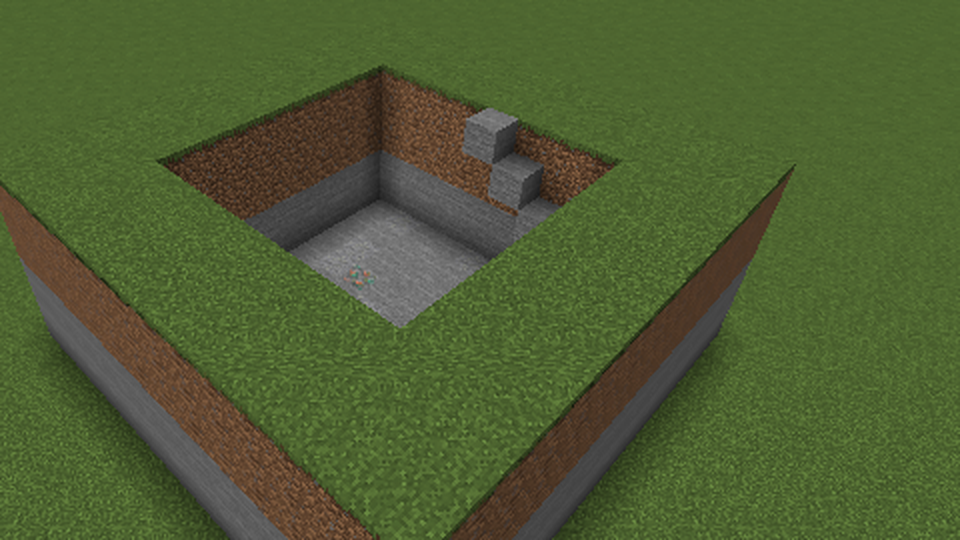

**Stairs out of the pit.** In a pit at least 3 × 3 and 3 deep, the miner leaves one block per layer standing as a step,
each a block along the wall from the one above, so steps spiral down the walls from the corner nearest the blast
furnace. Sand and gravel steps are swapped for cobblestone, and gaps (caves) are filled in with stone from the chests.

**Strip mines.** The last choice on the marker digs tunnels instead of a pit: 2 high (the marked blocks and the ones
below them, so mark the corners at head height), along the longer side of the area, with 2 blocks of rock between them
and a tunnel across the end nearest the blast furnace. The rock stays, but any ore in it is dug out: about a third of
the digging for all the ore. Strip mines can be up to 64 blocks long (and 32 wide).

**Strip mines down a shaft.** After the strip mine, the marker offers strip mines at set heights: **Y=16** (iron, and
ancient debris in the Nether), **Y=-16** (redstone, gold and lapis) and **Y=-53** (diamonds); for any other height, hold
the marker and type `/workplace strip <height>`. Mark the corners on the ground: the miner digs a 1-wide ladder shaft
straight down from the corner nearest the blast furnace, then the tunnels at that height, and puts ladders all the way
up — about one ladder per block of depth, from the chests (they wait for more if they run out). On the way down they
seal off any water or lava beside the shaft with stone and put a block under themselves before digging into a cave, so
they never fall, and every eight blocks they set a torch in a niche in the wall across from the ladders (if there are
torches in the chests).

**Smelting.** Put some coal or charcoal in the chests: the miner's own blast furnace smelts their ore, and so does any
other furnace or blast furnace within 8 blocks of it. Every time the miner drops off a haul they take the finished
ingots out into the chests, load the raw ores (and any ore blocks) in, and top up the coal. Anything you put in a
furnace yourself is left alone.

## Lumberjacks
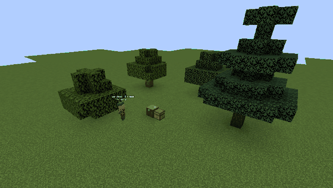

Place a **fletching table** near some trees, stand a villager by it and sneak-right-click them with an **axe**: they
become a **Lumberjack**. Put **axes** in a chest within 8 blocks of the fletching table. The lumberjack cuts the trees
within 16 blocks one at a time (leaves first, then the trunk), plants a sapling of the same wood where each tree stood,
and stores the logs, sticks and apples in the chests. They only cut real trees: logs with placed leaves (houses, posts),
blueprint builds and quarries are left alone. When the last axe breaks they wait for a new one. Dark oaks (and other 2 ×
2 trunks) get four saplings back in a square, and huge crimson and warped fungi standing on nylium count as trees too (a
fungus is planted back). **Mangroves** are felled down to their roots (the roots stay) and a propagule goes in close by,
in the water over the mud; **azalea trees** get an azalea bush back, and **cherry trees** a cherry sapling.

**Stripped logs and charcoal.** When a builder in the village is waiting for stripped logs (or stripped wood), the
lumberjack strips that many of the logs in their chests, and the builder comes to get them. Put a furnace within 8
blocks of the fletching table (with a little coal to start it) and they burn logs into charcoal, keeping 32 in the
chests.

**Bone meal.** Put bone meal in the chests and, whenever there's no grown tree to fell, the lumberjack gives it to the
saplings on their tree farm and the ones they replanted, until they grow (an azalea bush only grows with bone meal).

**Tree farms.** Mark an area with a **Field Marker** (the farmer's marker, up to 32 × 32 and within 48 blocks of the
fletching table) and give it to the lumberjack. They keep it planted with saplings from the chests, in a grid three
blocks apart (dark oak in 2 × 2 squares four apart), and fell what grows there, even if it's further out than the
16 blocks they'd look on their own. Sneak-right-click them with an empty hand to see the farm or stop it.

## Orchard Keepers
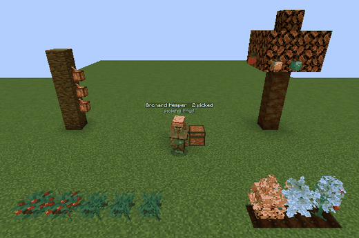

Place a **composter** in your orchard, stand a villager by it and sneak-right-click them with **sweet berries**, **glow
berries** or an **apple**: they become an **Orchard Keeper**. The keeper walks round everything within 16 blocks of the
composter and picks whatever
is ripe: **sweet berries**, **glow berries**, **cocoa pods** and — with Cobblemon — **apricorns** and **berry
plants**. The plants are picked, not broken, so they grow again. The harvest goes into the chests within 8 blocks of
the composter. They reach up into trees with a picking pole and never step into a berry bush.

**Planting an orchard.** Mark an area with a **Field Marker** (within 48 blocks of the composter) and give it to the
keeper. They plant it from the chests: sweet berries as bushes two blocks apart on grass or dirt, and with Cobblemon
berries (on farmland — put a **hoe** in the chests and they till grass and dirt for them) and apricorn seeds (on grass
or dirt, three apart), then pick what grows there too. **Glow berries** are hung from the underside of any solid
ceiling in the orchard (a pergola, a cave roof), two blocks apart like the bushes.
Sneak-right-click the keeper with an empty hand to see the orchard or stop it.

**Berry Farm.** Orchard keepers at Expert level sell the **Berry Farm** blueprint (it's in the Blueprint Table too): a
fenced garden of sweet berry bushes with a composter and a harvest chest (hand the villager there sweet berries and
they become its orchard keeper). The **Berry Farm II** adds a pergola
behind it with glow berries hanging from its roof.

## Farmers
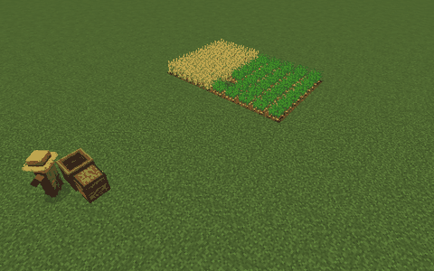

Any **Farmer** villager (the ones with a composter) can look after a field for you. Craft a **Field Marker** (stick +
wheat seeds + paper), right-click one corner block of the field and then the opposite corner (up to 32 × 32), and
give the marker to the farmer. Put **seeds** (and a **hoe**, if there is bare dirt to till) in a chest within 8 blocks
of their composter. They harvest ripe crops and plant them straight back, sow empty farmland, till bare dirt and
grass, cut sugar cane down to its bottom block and pick pumpkins and melons — and Cobblemon's mints, which are
picked for their leaves and planted again. Sweet berry bushes, cocoa pods and glow berries in the field are picked
(the plant stays to grow again). Put **bone meal** in the chest too and, once everything's sown and nothing is ripe,
the farmer uses it on the growing crops. The harvest goes into the chests.
Sneak-right-click the farmer with an empty hand to see how it's going or to stop.

**Plantation crops.** Mark sand, dirt by the water or the bottom of a pond as a field too: the farmer cuts **sugar cane,
cactus, bamboo and kelp** down to their bottom block (which grows back) and plants more from the chest — sugar cane or
cactus on the sand, more of whatever grows next to a bare spot — alongside the wheat and carrots of the same field.
**Composting**: seeds piling up in the chests (more than 64 of a kind) go in the farmer's composter when there's nothing
else to do, and the bone meal that comes out goes back on the field.

**A village's own farm.** Village farmers look after the farm by their composter **by themselves** as soon as there's a
chest within 8 blocks of the composter: the farmland nearest to it, within 16 blocks, and everything joined to that,
across the water channels between the rows too. The harvest goes into the chest, but they keep some food on them
(wheat baked into bread) to share with the other villagers, so the village keeps growing. Stop one with the link in
their status and they leave it alone; `/gamerule workplaceVillageFarms false` turns it off everywhere. A blank Field
Marker does the same for any farmer straight away.

## Beekeepers
Stand a villager by a **beehive** or **bee nest** and sneak-right-click them with a **glass bottle** or **shears**: they
become a **Beekeeper**. They look after the beehives and bee nests within 16 blocks: a full hive is harvested with a
**glass bottle** from the chests by their hive (a honey bottle) or with **shears** (three honeycomb; they switch to
honeycomb once the chests have 16 honey bottles). Put a lit campfire under a hive and the bees stay calm; otherwise they
fly out when it's harvested (they don't go for villagers). With **flowers** in the chests they plant them round any hive
with fewer than four near it, and feed pairs of bees flowers to breed until there are three bees a hive. The honey goes
in the chests (a porter carries it on). Pastured Bug and Grass Pokémon (Combee!) make them quicker. They trade honey,
honeycomb, candles, beehives and honey blocks.

## Florists
Stand a villager by a **composter** and sneak-right-click them with a **small flower**: they become a **Florist**. The
grass within 5 blocks of the composter is their garden: with **bone meal** in the chests (a farmer's
composter makes it) they bring up the biome's flowers there and pick them — weeding out the grass that comes up with
them — and bone meal on a tall flower (a sunflower, lilac, rose bush or peony) gives another of it. The flowers go in
the chests (while there are fewer than 64), where the dyer and the builders of the village find them. **Empty flower
pots** within 24 blocks of the composter get a flower each. Pastured Grass and Fairy Pokémon make them quicker.

## Ranchers
Stand a villager by a **smoker** and sneak-right-click them with a **saddle** or a **golden carrot**: they become a
**Rancher**. Wild **horses,
donkeys and llamas** within 16 blocks are broken in — a few tries each, the horse rearing until it gives in — and the
tamed ones get the **saddles**, **horse armor** and **carpets** (for llamas) you leave in the chests by the smoker. With
**golden carrots** or golden apples in the chests they breed the horses and donkeys, with hay bales the llamas and with
cactus the camels, up to 8 of a kind. With Cobblemon the Pokémon in **Pasture Blocks** near the smoker are groomed once
a day: their friendship goes up by 4, and by 6 more when there's a berry in the chests for a treat (never the berries
that lower EVs) — a pasture by the ranch is the place for an Eevee or a Golbat that evolves by friendship. Pastured
Normal and Ground Pokémon calm the wild horses quicker.

**The daycare** (with Cobblemon). Right-click a Rancher with an empty hand (sneak for their trades): leave up to two of
your Pokémon with them and they **gain experience** while they're there — about a point a second, a quarter faster for
each level of the rancher's experience, twice as fast with a Master. Come back whenever you like: the screen shows the
level each would come back at, and collecting costs an emerald (or its worth in CobbleDollars) plus one for every level
gained, as in the games. Level-ups, new moves and evolutions happen as you collect. The last Pokémon in your party
stays with you, and if the rancher dies, the Pokémon in their care go to their trainers' PCs.

## Sifters
Stand a villager by a **cauldron** and sneak-right-click them with **gravel**, **sand**, **red sand** or **soul sand**:
they become a **Sifter**. Put **gravel**, **sand**, **dirt** or **soul
sand** in a chest by the cauldron and they shake it through, a block every few seconds (quicker as they level up, and
with pastured Ground or Rock Pokémon): gravel gives flint, nuggets, coal, lapis and now and then an emerald or a
diamond; sand gives clay, cactus, gold and sea treasures; dirt gives seeds, saplings and bone meal; soul sand gives
quartz, nether wart, gold and glowstone. With Cobblemon, gravel and sand now and then turn up an **evolution stone**.
What comes out goes in the chest (a Porter takes it to the storehouse); with nothing to sift they ask for gravel on the
requests board. What each block gives is a loot table (`aliveworkplace:sifting/<block>`), so data packs can change it.

## Tinkerers
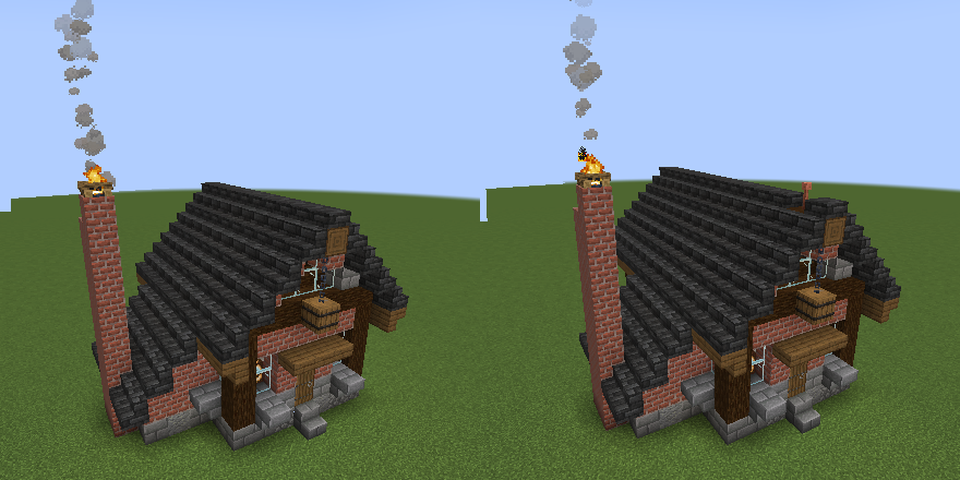

Stand a villager by a **smithing table** and sneak-right-click them with **redstone**: they become a **Tinkerer**. When
a builder nearby is waiting for **redstone and iron parts** — pistons, rails, hoppers, repeaters and comparators,
lanterns, iron bars and doors, chains, cauldrons, copper blocks — the tinkerer makes them from the builder's own stock
and brings them over, just as the carpenter does with wood. If there are no ingots yet they fire **raw ore** into ingots
first, for a **coal or charcoal** in every eight. Between jobs they look after the village's **iron golems**: one that's
badly hurt is patched up with iron ingots from the chests by the smithing table (or the storehouse's). What counts as a
tinkerer's part is the item tag `aliveworkplace:tinkering`, so data packs can add to it. The **Tinker's Workshop**
(Blueprint Table) is a brick workshop with a forge and a smoking chimney; the **Tinker's Workshop II** runs it back with
a storage loft and a cart track. Villages sometimes grow a Tinker's Shop, and a Sifting Shed for a sifter.

## Composters
Stand a villager by a **composter** and sneak-right-click them with **bone meal**: they become a **Composter**. The
village's scraps — seeds, saplings, leaves, crop waste, spoiled food and **rotten flesh** — from the chests by the
composter (or the storehouse's, when those run dry) go into it, and every five layers of compost come out as a **bone
meal** in the chests: better than a vanilla composter's seven, and
nothing's wasted on a bad roll. The florists, lumberjacks, orchard keepers and farmers take the bone meal from there (a
porter carries the rest to the storehouse). With nothing to compost they ask for scraps on the requests board.

## Netherworkers
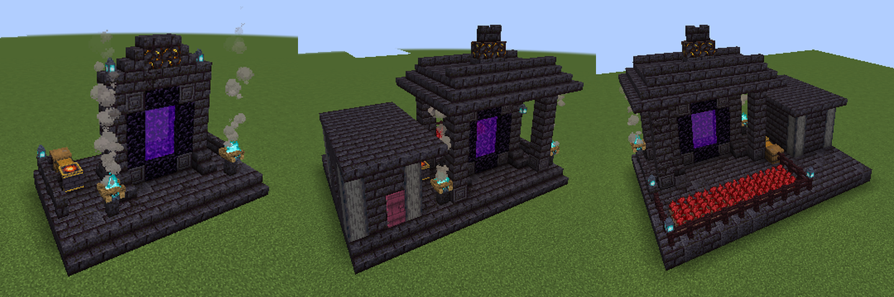

Place a **cartography table** within 32 blocks of a **Nether portal**, stand a villager by it and sneak-right-click them
with **netherrack**: they become a **Netherworker**. With three **rations** (bread, cooked meat and the like) in a chest
by the cartography table they pack up, walk to the portal and step through; a few minutes later (sooner as they level
up, or with pastured Fire and Dark Pokémon) they step back out with the Nether's goods — netherrack, soul sand, basalt,
glowstone, nether wart, gold — and put them in the chest. Leave them gear and they bring back more: a **pickaxe** for
quartz, gold and magma (a diamond one now and then finds ancient debris), an **axe** for crimson and warped stems and
shroomlights, a **sword** and a **chestplate** for a fortress's blaze rods and nether bricks, a **fire resistance
potion** to go further. The gear wears a little each trip, and without armor they sometimes come back hurt. With
Cobblemon they now and then find a Fire or Dusk Stone. While they're away they can't be seen or hurt. The **Nether
Gate** (Blueprint Table) is a blackstone arch round an obsidian portal frame, with a cartography table and a chest (hand
the villager there netherrack and they become its netherworker) — put a
**flint and steel** in the builder's chests and they light the portal when they're done; the **Nether Gate II** adds a
gatehouse roof, a storehouse and a nether wart garden.

## Fishermen
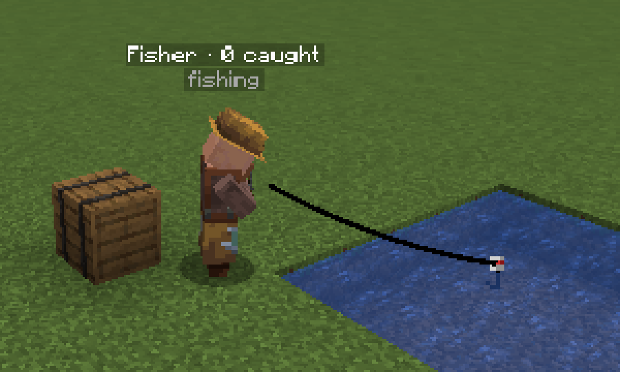

Hand any **Fisherman** villager (the ones with a barrel) a **fishing rod**. They walk to the nearest water within 16
blocks of their barrel, cast from the shore — the bobber floats on the water on the end of their line and goes under
when a fish bites — and reel in fish (and the odd bit of junk), bringing the catch back to
their barrel and any chests within 8 blocks of it. Rods wear out: put spares in the barrel. Put a **smoker** (or
furnace) next to the barrel and some coal or charcoal in it, and the raw cod and salmon go into the smoker instead,
with the cooked fish coming back out at the next drop-off. Sneak-right-click the fisherman with an empty hand to see
how it's going or to stop.

## Porters and the storehouse
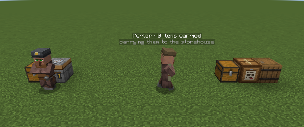

Craft a **Storehouse** (three planks over a barrel, a chest and a barrel), put chests or barrels within 8 blocks of it
and a villager without a job becomes a **Porter**. The porter walks round the other workers of the village and carries
what they make to the storehouse chests: the miner's ore, coal and spare stone, the lumberjack's logs, the farmer's
harvest, the fisherman's catch, the orchard keeper's fruit. They leave what each job needs: tools, the miner's torches
and ladders and some stone for the stairs, seeds and saplings, bone meal, and ore or fish waiting for a furnace next to
the worker. Builders and ball smiths have nothing to carry away. A worker's goods have to add up to 16 items to be worth
the walk.

The storehouse is part of the village's stock, so a builder short of stone finds it there. One you place (or have a builder build) is yours: its porter works for you, and only carries for
your workers and your friends'. A village's own storehouse carries for the village's workers. A porter carries 9 stacks
a trip, 3 more at each level.

**Stock orders.** Click the book on the Storehouse's board to see its stock orders, hold an item and click it at the
top right to order it: the village's crafters keep that many in the store, making what runs short from what's there —
carpenters anything from the crafting table, masons stone and bricks, tinkerers redstone and iron parts, chefs food.
Click an order to keep more (16, 32, 64, 128, 256; once more drops it). What's kept for one order isn't used up for
another.

**Drop Box.** Craft one from a barrel and a hopper and put it anywhere within 48 blocks of the storehouse: whatever you
drop in it — a pile of loot from a trip, tools, anything — the porter takes to the storehouse first, all of it. Workers
never help themselves from a Drop Box.

**The requests board.** Right-click the Storehouse to see what the workers nearby are waiting for: each builder's
missing materials, a miner's pickaxe or ladders, a lumberjack's axe, a farmer's seeds, a fisherman's rod. It shows how
much of each is already in the storehouse, and clicking one hands over what you have straight into that worker's
chests. Lumberjacks see the requests too: when a builder is waiting for birch planks (or stairs, doors, logs...), they
fell birch trees first.

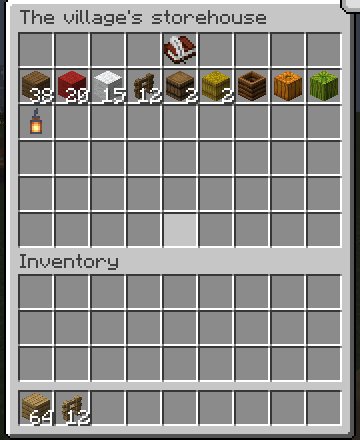

**Storehouse builds.** Porters sell the **Storehouse Shed** blueprint (it's in the Blueprint Table too): an open timber
shed with a Storehouse and eight chests. **Storehouse II** adds a second bay with eight more, and **Storehouse III** a
stone warehouse behind with sixteen more. Any building of your own with a Storehouse in it works just as well, and
villages sometimes grow a storehouse of their own.

## Carpenters, masons and dyers
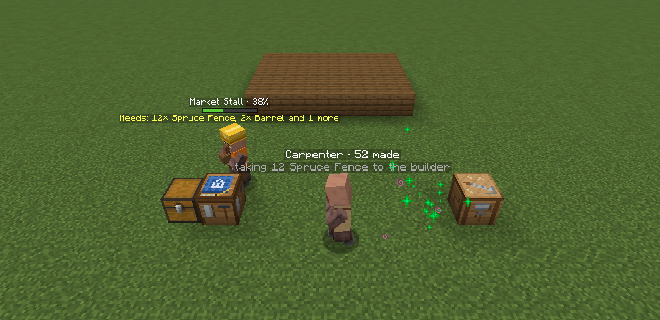
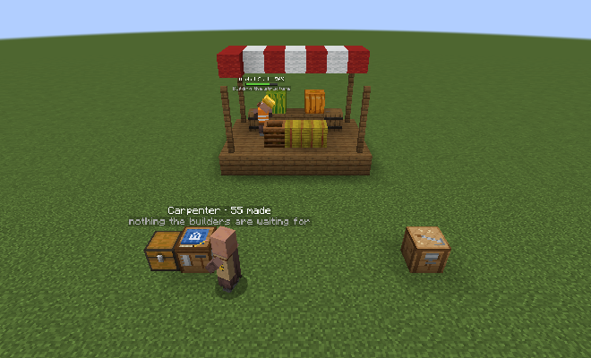

Stand a villager by a **crafting table** and sneak-right-click them with **planks**: they become a **Carpenter**. When a
builder nearby is waiting for something that can be made from what they can get at (their chests, and their village's),
the carpenter fetches the ingredients, makes it at the crafting table with the game's own crafting recipes (modded ones
too) and takes it to the builder's chests: stairs, slabs, doors, fences and planks from the builder's logs, sticks,
torches, glass panes... up to two steps down count, so fences come from logs by way of planks and sticks. Only what the
rest of the build doesn't need is used: planks for stairs, but not the planks the walls still want. **Masons** (vanilla
villagers at a stonecutter) do the same with the stonecutter's recipes — stone bricks, stairs, slabs and walls cut from
stone — and crush cobblestone into gravel and gravel into sand, and with a furnace by the stonecutter they are the
village's **kiln**: sand fired into glass, cobblestone into stone and smooth stone, clay into terracotta and bricks
(laid into brick blocks), netherrack into nether bricks — a coal for every 8 things fired; they go about their usual day
in between. **Leatherworkers** (vanilla villagers at a cauldron) are the village's dyers: anything coloured a builder is
waiting for — wool, carpet, stained glass, terracotta, candles, beds, dyes from flowers — they make the same way, and
they harden concrete powder into concrete in the cauldron (mixing the powder from sand, gravel and dye first if need
be). Villages sometimes grow a carpenter's workshop.

## Armorers, toolsmiths, weaponsmiths and fletchers
Every **Armorer** (the vanilla villager at a blast furnace) with a chest within 8 blocks of their blast furnace smelts
the village's ore: raw metal and ore blocks from that chest go into the blast furnace (and any furnaces nearby) with
coal or charcoal, and the ingots come out into the chest. When the chest runs out, they fetch ore — and the fuel to
smelt it — from the storehouse and from miners who don't smelt their own, and a porter carries the ingots on to the
storehouse (the armorer keeps 24 iron ingots). They also look after the guards: a guard of the village with nothing on
their head, chest, legs or feet, and nothing for it in their chests, gets a piece — made from the iron in the armorer's
chest and brought to the chests by the guard's grindstone. Sneak-right-click an armorer with coal or charcoal to hire
them, so they work with your own miners and guards too. Between jobs they go about their usual day.

**Toolsmiths** (the vanilla villager at a smithing table) make the tools the village's workers are waiting for — a
miner's pickaxe, a lumberjack's axe, a fisherman's rod — with the game's recipes, and take them to that worker's
chests: iron from the storehouse or an armorer, or stone if there's no iron; diamond tools only from diamonds in the
toolsmith's own chest, so the village never spends your diamonds unasked. Sneak-right-click one with an iron ingot to
hire them for your own workers.

**Weaponsmiths** (the vanilla villager at a grindstone) mend the village's worn gear the way an anvil does — each ingot,
plank, diamond or leather puts back a quarter of a tool's, weapon's or armor piece's durability. They mend what's worn
in the chests by their grindstone (drop your own worn gear there), by the guards' grindstones and at the other workers,
with materials from their chests, the storehouse and the smelters, and put each piece back where it was. A guard with no
weapon and none in their chests gets a sword (iron, else stone). Sneak-right-click one with an iron ingot to hire them.

**Fletchers** (the vanilla villager at a fletching table) look after the guards' bows: a guard with no bow gets a
crossbow if there's iron for one, else a bow; a guard with a bow and few special arrows gets eight spectral arrows
(glowstone dust and arrows — the arrows made from flint, sticks and feathers if need be). Guards with a bow fill a
quiver of up to 16 spectral or tipped arrows from their chests (put in your own tipped arrows too) and shoot those
first; plain arrows never run out. Sneak-right-click a fletcher with flint to hire them.

## Shepherds and butchers: the village's animals
**Shepherds** (the vanilla villager at a loom) look after the sheep within 16 blocks of their loom: they shear them
with shears from the chest by the loom, pick up the wool, and feed pairs wheat to breed while there are fewer than 8.
With Cobblemon they shear the woolly Pokémon kept in a pasture there too (Wooloo, Dubwool). **Butchers** (at a smoker)
do the same for the cows, pigs, chickens and rabbits around it — bred with the right food from the chest, eggs and
feathers picked up, cows milked into the empty buckets in the chest (up to 4 buckets of milk) — and a chef takes the
milk and eggs. Sneak-right-click a butcher with a lead to hire them for your own herd: a hired butcher also keeps each
kind at 10 grown animals, taking the rest for meat and leather — never babies, named or leashed animals. Everything
goes into the chests, and a porter carries the wool, eggs and meat on to the storehouse.

**With Cobblemon, butchers also look after the Pokémon in a Pasture Block** near their smoker, doing everything
Cobblemon lets a player do with an item in hand: with a bucket in the chest they milk a Miltank (or a female Gogoat,
Skiddo or Bouffalant) and fill it with lava from a Slugma, Numel or Camerupt; with a glass bottle, Moomoo Milk from a
Miltank or honey from a Vespiquen; with a brush, feathers from the birds, string from Cottonee, coal from Rolycoly and
many more (the brush wears down); with bone meal, cactus from a Cacnea, saplings from Exeggutor and Abomasnow, lily
pads from Lotad. Each Pokémon at most every two minutes (longer where Cobblemon says so). The list comes from
Cobblemon's own data, so a data pack that adds interactions adds chores too.

## Clerics: potions for the guards
**Clerics** (the vanilla villager at a brewing stand) brew what the guards need — potions of healing, regeneration and
strength, three of each — from the chest by the stand: nether wart, a glistering melon slice, a ghast tear or blaze
powder, with blaze powder as fuel, and water bottles (or glass bottles they fill at water or a cauldron nearby). A
guard of the village with fewer than two potions gets one brought to the chest by their grindstone; guards carry up to
three, drink a healing or regeneration potion when they fall below half health, and a strength potion as a fight
starts. Sneak-right-click a cleric with a glass bottle to hire them for your own guards.

## Librarians: enchanted gear
**Librarians** (the vanilla villager at a lectern) with an **Enchanting Table** within 8 blocks of their lectern enchant
the village's gear: they walk up to a guard and enchant the weapon, armor or bow they wear, then the tools the other
workers have in hand (a miner's pickaxe, a lumberjack's axe), one piece at a time, with lapis from their chest (or the
storehouse) — like an enchanting table at level 10 for a Novice up to level 30 for a Master, 1 to 3 lapis a piece.
Bookshelves round the table (two blocks out with nothing in between, as for your own table) add a level for every three,
so a full ring of fifteen — the Library III's enchanting room has one — lifts a Novice to level 15.
They also make the books, bookshelves, lecterns and paper a builder nearby is waiting for. Sneak-right-click one with
lapis to hire them for your own workers.

## Cartographers: expeditions and explorer maps
**Cartographers** (the vanilla villager at a cartography table) go exploring. With **food** in the chests by their table
(bread, baked potatoes, cooked meat, stew — one ration a stop; raw meat and rotten flesh won't do), they pack up and set
out on an expedition: a string of stops out in the land around the village, up to 48 blocks from the table
(`explorerRange` in the config), searching each for what the land has — flint, feathers, string, clay, nuggets, the odd
emerald, name tag or diamond, and what each biome adds: saplings and apples in forests, cocoa and bamboo in jungles,
cactus in deserts, gold in badlands, kelp and shells on beaches, snowballs and ice in the snow. With a **sword or axe**
in the chests they take it along and hunt as well (meat, bones, gunpowder, the rare ender pearl), wearing it down a
little every stop. Back home, the finds go in the chests (a porter carries them to the storehouse), they rest, and go
out again. Leave **empty maps** there too and every third expedition they draw an **Explorer's Map** to a place nearby
nobody has a map to yet — a village, a temple, an outpost, a ruined portal, trail ruins, a shipwreck — named and marked
like the vanilla explorer maps. With Cobblemon, expeditions also turn up apricorns, berries, Poké Balls, Exp. Candy and,
rarely, evolution stones and fossils (for the Fossil Scientist). Pastured Flying and Ground Pokémon shorten their searches
and rests. They only go where the world is running (near a player). Sneak-right-click one with a compass to hire them.

## Chefs
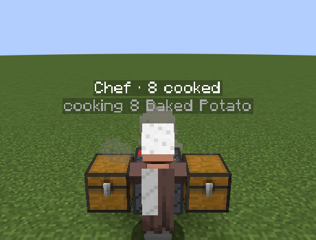

Stand a villager by a **smoker** and sneak-right-click them with raw food (**raw beef, pork, chicken, mutton, rabbit,
cod or salmon**, or a **potato**): they become a **Chef**.
Put the makings in a chest within 8 blocks and the chef cooks, a batch at a time, whatever there's enough for: bread,
cookies, pumpkin pie, cake, the stews, and everything a smoker cooks (steak, chicken, fish, baked potatoes). With
Cobblemon they also cook what its Campfire Pot does — **Poké Bait**, **Poké Snacks**, **Poké Cakes**, candied apples and
**Aprijuice** — with Cobblemon's own recipes. What's cooked goes into the same chests, and they stop making a dish once
there are 16 of it. With a porter in the village, the chef also takes the makings from the storehouse, so the farms'
and fishermen's spare harvest turns into food without anyone lifting a finger. Villages sometimes grow a kitchen.

## Mail and postmen
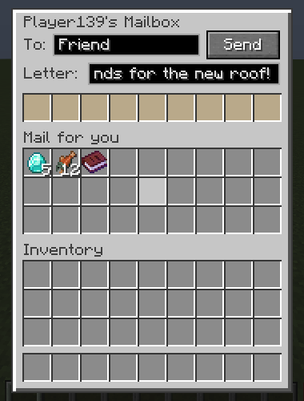

Craft a **Mailbox** (iron nuggets around a chest, on a fence) and place it: it's yours, and mail sent to you arrives
there (the red flag goes up). To send something, open your mailbox, put items in the top row, write a player's name and
press **Send**. Write something in the **Letter** line and it goes along as a letter (a book they can read), or on its
own if the top row is empty. `/workplace mail` (or **[Track]** after sending) shows where your parcels are. A
**Postman** picks it up: stand a villager by a **Mailbox** and sneak-right-click them with **paper**. Postmen walk their
round (64 blocks around the Mailbox they work at), collecting parcels and putting them in the right mailbox. Parcels for
a mailbox outside the round (another village, another dimension) go with the night mail and arrive at the next dawn (or
at once, by air mail, with a Flying-type Pokémon pastured by their Mailbox). Only you, your friends (`/workplace friend
add`) and operators can open your mailbox.

**The post office.** No mailbox? Mail for you waits at the post office: right-click any **Mailbox a postman works at**
(or an old Postal Desk) and you get every parcel handed in for you (you're told at dawn when some are waiting). That
works for night mail on its way to your mailbox too, if you'd rather not wait for dawn.

**Courier routes.** When there's no mail, postmen haul between your chests. Craft a **Delivery Note** (paper, a
feather and an ink sac), right-click the container to take from and then the one to bring to (say, the quarry chest
and the builder's chest), and give the note to a postman. They carry everything except tools, weapons and armor — or,
if you hold an item in your other hand and right-click the air with the note, only the kinds you pick. Up to 4 routes
per postman; sneak-right-click them to see their routes, and give them a blank note to end them. With Cobblemon, a
route can start at a **Pasture Block**: the postman empties every chest and barrel within 8 blocks of it — where
Cobbleworkers' Pokémon put what they gather.

## Guards
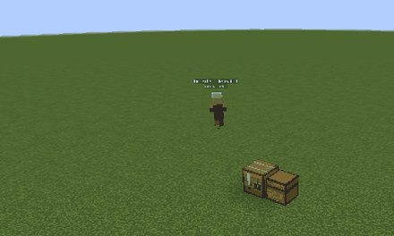

Stand a villager by a **grindstone** and sneak-right-click them with a **sword**: they become a **Guard**. Put weapons
and armor in a chest within 8 blocks of the grindstone: the guard takes the best of it. Guards fight monsters that
come within 24 blocks of it at any hour and never run away. Give them a **bow** or a **crossbow** (in the same
chest; a crossbow hits harder) and they
also shoot creepers from a safe distance — without one they leave creepers alone — and pick off other monsters
before they get close; they never shoot when a player, villager or pet is in the way. They have twice a villager's
health and keep the night watch, sleeping in the late morning instead. Players, villagers, animals, pets and
Pokémon are safe from them. **Ring the village bell** and, while everyone else runs home to hide, the guards head
for the bell and fight anything near it for a minute and a half.

**Kinds of guard.** What a guard holds in their other hand makes them an **Archer** (a bow or crossbow), a **Knight**
(a shield: they block most blows from in front — 60%, more as they level up — and the shield takes the wear) or a
**Medic** (a healing or regeneration potion: they carry six potions and give them to the most hurt villager or golem
nearby). Guards gear up with a bow if there's one in their chest, or else a shield; to choose yourself,
**sneak-right-click a guard with a bow, crossbow, shield or healing potion** and they take it (you get back what they
held). Their kind shows over their head. The **Barracks** (Blueprint Table) houses two guards — two grindstones (hand
the villager at each a sword), an armory chest, bunks and training dummies out front — and the **Barracks II** adds a
wing for two more.

**Raids.** A village with a Village Hall and at least 8 villagers may be **raided by monsters** at night (at most every
three nights; the bigger the village, the likelier — from 15% a night up to 35% — and the bigger the raid, 3 monsters
and one more for every four villagers; the more guards, the more of the raiders come in iron). Zombies, skeletons and
spiders gather at the edge of the village and go for its villagers; the village bell rings, so the guards rally and
everyone else hides, and players in the village are told. While the village is raided every guard defends all of it,
not just the ground round their post. The raid is over when the raiders are dead — or at dawn, when the last ones
flee. The chronicle remembers every raid. In a **pillager raid** guards don't hide either: they patrol and fight
anywhere in the raid's area. `villageRaids` in the config turns our raids off.

**Bandit camps.** Once a village reaches Village rank, bandits may make camp out beyond it, 80 to 100 blocks from the
hall — tents round a fire, a **Bandit Chief** in iron and a few of his men (pillagers and vindicators). Everyone nearby
is told where, the hall's guards icon shows it, and the villagers feel less safe while it stands. Until the chief falls,
the village's night raids come from the camp — bandits instead of monsters, and twice as often. Go and break it up:
take your guards along with a **Rally Banner**, or hire mercenaries. When the chief dies the rest of the band scatters,
the chest in his tent is yours (emeralds, iron, gold, maybe a diamond or an enchanted book) and the chronicle remembers
who did it. After that the village has a few days' peace. `banditCamps` in the config turns them off.

**Patrol routes.** Craft a **Patrol Map** (a map and red dye), right-click the ground at up to eight places — the
gate, the far field, the bridge — and sneak-right-click a guard with it: by day they walk your route point to point
instead of wandering round their post (the route shows in red while you hold the map). The map keeps the route for the
next guard; a blank map (sneak-right-click the ground to clear it) takes a guard's route away.

**Rally Banner.** Craft one (any banner and an iron ingot), sneak-right-click up to twelve guards with it to enlist them
(again to let one go), then right-click the air to raise it: while it's raised and anywhere in your inventory, those
guards leave their posts and follow you — across the fields, into a cave, to a pillager outpost — and fight whatever goes
for you or whatever you go for, as well as any monster near you (never players, villagers, pets or Pokémon). A guard
left more than 32 blocks behind catches up at once. Lower the banner and they go back to their posts (from far away,
straight there). Mercenaries can be enlisted too.

**Village Ledger.** Craft one (a book and an emerald) and right-click your Village Hall with it: from then on,
right-click the air anywhere nearby (the hall's chunk loaded, a few hundred blocks) to open the hall's screen —
its people, requests, builds, quests, chronicle and mercenaries — without walking back.

**Village Map.** The hall's map button draws the village on an empty map from your inventory: the land within 64 blocks
of the hall as it is that day (a finished map, like one locked on a cartography table — draw a new one as the village
grows), centred on the hall, with a banner on every building the builders finished there, coloured by what it is —
white homes, blue school and library, pink healing, yellow stores and shops, lime farms, black towers and barracks,
orange workshops, light blue wells and fountains — and the workplaces named. The map's tooltip has the legend.

**Treasury.** Every morning a village with a Village Hall puts by its takings: a fifth of an emerald a worker, from half
that in a badly kept village to half as much again in a well-kept one, and a quarter more a rank (ten workers in a
well-kept hamlet: 3 emeralds a day). The hall's name tag (the top-left icon of its screen) shows what's there — click it
to collect (CobbleDollars when the pack has them). It holds up to a stack a rank; `villageTreasury` and
`treasuryPerWorker` (hundredths of an emerald) in the config.

**Protecting the village.** Whoever places the Village Hall owns it. Shift-click the hall's name tag (top left of its
screen) to protect the village: inside the hall's area (64 blocks across the map from it, at any height) only you, your
friends (`/workplace friend add <player>`) and operators can break or place blocks, open chests and other blocks, empty
buckets, or hurt the villagers, golems and animals. Anyone can still walk in, open doors and gates, press buttons, ring
the bell, use a crafting table, trade with the villagers and open their own mailbox. Shift-click again to open the
village up. It's off until you turn it on; a hall placed before 0.135.0 goes to whoever protects it first. The server can
switch the setting off with `villageProtection` in the config.

**What next?** The compass at the right end of the hall's middle row lists what the village lacks, most pressing first —
a builder, beds, food in the store, a Storehouse, guards (one per ten villagers), a bandit camp nearby and where, the ill,
villagers sleeping in the dark, the jobless, a scholar, decorations, the next upgrade of a finished building, and what
the next rank still needs — each with how to put it right.

**Festivals.** Every eight days a village with a Village Hall and at least six villagers holds a festival (the hall's
firework button says when; click it with a cake to hold one sooner, at most every three days). After work the
villagers gather round the bell for a feast from the store, music and dancing, and at dusk fireworks go up over the
square. Everyone who came is in a better mood for two days, and while it's on, players in the village are Heroes of the
Village: cheaper trades, and the villagers throw them gifts. `festivals` in the config turns the regular ones off.

**Mercenaries.** Short of guards? Open the Village Hall and click the iron sword: for 12 emeralds (or their worth in
CobbleDollars) three **mercenaries** in iron — one with a shield — come to the hall and fight for the village like its
own guards until the next dawn, then leave. One band at a time; their gear goes with them.

**Walls and gates** (in the Blueprint Table): a wooden **Palisade** of sharpened logs with a walkway, a **Palisade
Gate**, a **Stone Wall** with battlements, a **Wall Tower** for the ends and corners, and a **Gatehouse** with two towers
over a gateway. Stand inside the village and place them facing out: the walkways and ladders are on your side. In a
village with a Village Hall and a guard, the gates of its Gatehouses and Palisade Gates are **shut at nightfall** and
opened in the morning (you can still open them yourself).

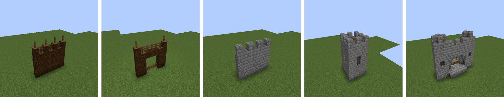

**Training Dummy** (a hay bale on sticks with wool on top): place one within 12 blocks of a guard's grindstone and, when
there's nothing to fight, the guard spars with it every couple of minutes during the day — a point of experience every
four hits, up to Expert; Masters are only made in real fights. Hit it yourself and it puffs straw too.

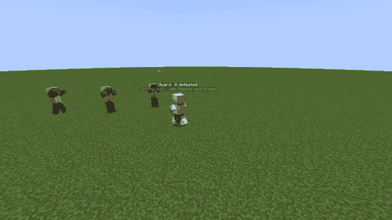

**Fighting beside their Pokémon** (with Cobblemon): keep Fighting or Dragon types in a Pasture Block within 16 blocks of
the guard's grindstone, and whenever the guard lands a hit on a monster within 20 blocks of them, up to three of them
follow up with a move of their own — you see them turn, attack and the hit land, with Cobblemon's own effects. A move
does 2 damage at level 1, 5 at level 50 and 8 at level 100 (once a second each). Monsters turn on the guard, never on
the Pokémon, and the kill counts as the guard's.

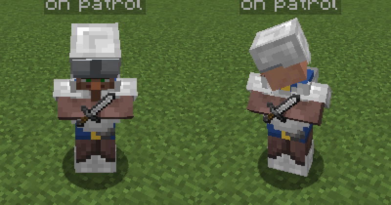

The armor a guard wears shows on them: helmet, chestplate (with shoulder pieces on the folded arms), leggings under
the robe and boots — any armor, including dyed leather and enchanted pieces.

## Nurses
Stand a villager by a **brewing stand** and sneak-right-click them with a **honey bottle**: they become a **Nurse**.
Right-click the nurse with an empty hand to get your health back and bad effects cleared; with **Cobblemon** installed
they heal your whole team too. Once a minute per player (less as they level up). They also look after hurt villagers and
iron golems nearby, and cure the village's ill with a honey bottle, a bucket of milk or a healing potion from the chest
by the brewing stand (see *Sickness*). Sneak-right-click to trade.

## Shops
Craft a **Shop Counter** (an emerald over planks and a chest) and place it near a villager without a job: the shop is
yours and the villager becomes its **Shopkeeper**. Open the counter to set your prices — in each column, the top slot
is what one sale hands over (for example 16 cobblestone) and the slot below it is the price (for example 1 emerald;
any item works). Put the goods in chests within 8 blocks of the counter. Other players buy by trading with the
shopkeeper as usual; only what's in the chests is for sale, and the payments land in the same chests.

**With CobbleDollars** (the Cobbleverse pack's money), right-clicking the shopkeeper opens the shop's own screen
instead: everything in stock, with emerald prices shown in CobbleDollars (100 per emerald). Click an item, then
click it again to buy. The CobbleDollars go straight to the owner — or, if they're offline, the next time they
join. Items priced in something other than emeralds are paid with those items, as before. Sneak-right-click the
shopkeeper for the usual trade screen. The owner can sneak-right-click the counter to see the latest sales.

**Price Tags** set a price in CobbleDollars directly: craft them (paper, a gold nugget and string make four),
right-click one to set the price with the +/− buttons (or rename it in an anvil to the price — say `250`) and put it in
a counter's price row. That column then costs 250
CobbleDollars. Without CobbleDollars a tag is paid in emeralds (100 CobbleDollars to the emerald, rounded up).

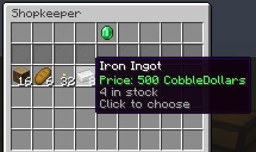

## Ferrymen and travel posts
Craft a **Travel Post** (a sign over planks and a boat); name it in an anvil first if you want ("Riverside"), then
place it. Right-click posts to add them to the ones you know. A villager without a job takes a post as its
**Ferryman**, who sells **Travel Tickets** to every other post you know (1 emerald per 256 blocks, 8 to another
dimension). Use a ticket within 16 blocks of any travel post and you arrive at the ticket's post. With CobbleDollars,
right-clicking the ferryman shows your destinations with fares in CobbleDollars (100 per emerald); click one twice
to buy its ticket, or sneak-right-click to pay in emeralds. Many villages have a **ferry house** with a travel post
and a ferryman already: the post joins the network under a village name ("Willowbrook"), so right-click it once and
it's on your list.

## Bards
Stand a villager by a **jukebox** and sneak-right-click them with a **music disc**: they become a **Bard**. Put music
discs in a chest within 8 blocks of the jukebox: in the morning and in the evening the bard plays them one after another
(the discs stay in the chest). No discs? They make up a tune on the harp.

## Pokémon Trainers (with Cobblemon)
Craft a **Training Post** (a target block on planks) and place it near a villager without a job: they become a
**Trainer**. Right-click a trainer with an empty hand to battle. Every trainer starts as a Novice with two young
Pokémon and ranks up as people battle them — Apprentice, Journeyman, Expert, Master — until they field six fully
evolved Pokémon at level 80–100 and play smart. From Journeyman their Pokémon have better IVs; Experts and Masters
also bring EVs, a matching nature (Adamant or Modest) and a held item (Life Orb, Leftovers, a Choice item…), and a
Master's Pokémon come with four strong attacks picked from everything they can learn (their own type first, then
coverage). Beating one pays **CobbleDollars** (100 for a Novice up to 2,500 for a
Master; emeralds if CobbleDollars isn't installed), once a day per trainer. No badges, no gyms.
With **Radical Cobblemon Trainers** installed (it is in the Cobbleverse pack), a trainer's Pokémon never go above
your level cap by more than their rank allows: a Novice stays 6 levels under your cap, a Journeyman meets it, a
Master goes 5 over. So the village's Master is a real fight whether you're new or far along.

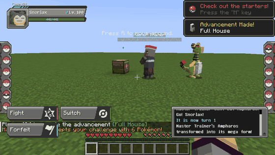

Trainers send their Pokémon out beside them, the way you do, and call them back when the battle is over. With
**Mega Showdown** installed (it is in the Cobbleverse pack), one Pokémon on every Master's team holds its Mega Stone —
their ace, and if none of their team can Mega Evolve, the last one is swapped for one that can — and the trainer Mega
Evolves it as soon as it comes out.

Each village can also have one **Trainer Leader**: stand a villager by a **Training Post** and sneak-right-click them
with a **block of gold**. The leader battles at Expert strength from the start, pays three times the prize, and
takes one challenge a day from each player.

## Move Tutors (with Cobblemon)
Stand a villager by a **Training Post** and sneak-right-click them with a **book**: they become a **Move Tutor**.
Right-click them with an empty hand (sneak to trade instead) to open their lessons: pick one of your Pokémon at the
top, then a move it could learn but won't get from levelling — tutor moves, TM moves and egg moves. Click a lesson
once to choose it and again to pay and teach it. The move goes straight into the Pokémon's moves if it knows fewer
than four, otherwise you can swap it in from the moves page of its summary.

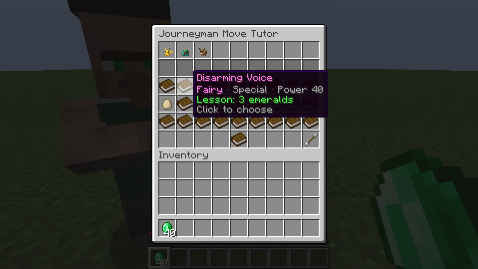

Lessons cost CobbleDollars: 300 for a weak move, up to 2,400 for the strongest (egg moves count as one step harder;
without CobbleDollars installed, 3 to 24 emeralds). A new tutor
only teaches weaker moves; they rank up with every lesson they give, and a Master teaches everything. Tutors also buy
paper and books, if you need emeralds.

## Ball Smiths (with Cobblemon)
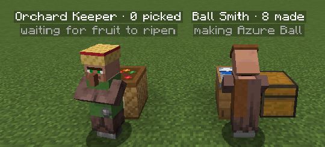

Stand a villager by a **smithing table** and sneak-right-click them with an **apricorn**: they become a **Ball Smith**.
Put apricorns and ball metals in chests within 8 blocks of it — copper ingots for Poké Balls and the other basic balls,
iron for Great Balls and friends, gold for Ultra Balls, diamonds for the rarest — and the smith turns them into balls
with Cobblemon's own recipes, a batch of four at a time, and puts the balls back in the chests. A new smith only works
copper; they learn the harder balls as they level up (iron at Apprentice, gold at Journeyman, diamonds at Expert). They
take turns between the kinds they can make and stop making a kind once the chests hold 64 of it. They never make Master
Balls. Pair them with an Orchard Keeper (or Cobbleworkers' apricorn pickers) for a steady supply.

**Orders.** Sneak-right-click the smith with an empty hand to pick which balls they make: click a ball to ask for it
(it glows), click again to stop. With nothing picked they make whatever the chests have the makings for.

## Fossil Scientists (with Cobblemon)
Stand a villager by Cobblemon's **Fossil Analyzer** and sneak-right-click them with a **fossil**: they become a **Fossil
Scientist** (a jobless villager never takes your analyzer by themselves; scientists from before 0.138.0 keep working at
their Training Post or Fossil Lab). Right-click them holding a fossil (for a Galar fossil, hold one half in each hand)
and pay 8 emeralds (800 CobbleDollars with CobbleDollars): they revive it at the analyzer while they work, without the
rest of the machine, about three minutes for a novice and quicker as they level up. The Pokémon joins your party (or goes to your PC) the moment it's done, or the next time
you're online. It's Cobblemon's own revival, the same Pokémon its machine gives. Right-click with an empty hand to see
how it's going; sneak to trade. A scientist takes on three fossils at a time. Villages sometimes grow a fossil lab, and
scientists at Journeyman level sell the **Research Lab** blueprint (a stone lab with a Fossil Analyzer and a fossil on
show: hand the villager there a fossil and they become its scientist; the **Research Lab II** adds a museum hall with
a big skeleton).

## Camp Cooks (with Cobblemon)
Put one of Cobblemon's **Campfire Pots** on a campfire, put a chest beside it, stand a villager by the pot and
sneak-right-click them with **Hearty Grains**: they become a **Camp Cook** (a jobless villager never takes your pot by
themselves). She cooks in the pot itself, the way you do: the makings from the chest into its grid, seasonings (berries,
for Aprijuice that comes out Tasty or Delicious) into its top row, the lid shut, the pot's own cooking time, then the
dish into the chest. She keeps 16 of each of these in the chest: Poké Snacks, Poké Bait, Aprijuice in all seven
colours, Exp. Candy XS, S and M, Ponigiri, Leek and Potato Stew, Smoked-Tail Curry, Open-Faced Sandwich, Vivichoke Dip
and Sinister Tea. With fishermen at work nearby she keeps more Poké Bait (and Poké Snacks for a Habitat Keeper). The
sweets and treats (Big Malasada, Casteliacone, Lava Cookies, the seven Sweets, the mochi, the EV candies, potions and
status heals...) she only makes for a **Storehouse's stock order**, and takes them to its chests. Her meals count as
meals in the village store, so villagers eat them and they add to a varied diet, and village farmers sow and harvest
Hearty Grains and Vivichoke from the chests' seeds. Her menu is data: one file per dish in
`data/<namespace>/camp_menu/` (`dish`, `keep`, `when`: `always`, `asked` with `for` the jobs that ask, or `order`), so a
data pack can add or change dishes. She sells Poké Bait and Poké Snacks, then Aprijuice, Exp. Candy S and M, Lumiose
Galette and Big Malasada, and at Master Exp. Candy L; Fire and Normal Pokémon help her, and a Fire partner breathes on
the campfire while it cooks.

## Gem Growers
Put a chest by a **stonecutter**, stand a villager beside it and sneak-right-click them with an **amethyst shard**: they
become a **Gem Grower** (a jobless villager still takes a stonecutter as a Mason, and a clay ball turns a grower back into
one). Works without Cobblemon. She finds the gem beds within 16 blocks of the stonecutter (a scan of a few thousand
blocks a tick, remembered) and tends them:
- **Amethyst.** Budding amethyst: she picks only the full clusters (four shards each, as with a pickaxe) and never
  breaks the budding block.
- **Tumblestones** (with Cobblemon). She plants tumblestones, sky tumblestones and black tumblestones from her chest
  against lava or a magma block, as Cobblemon grows them, and picks the full clusters.
- **Type Gems** (with Cobblemon 1.8). She sets a type's Gem Block from her chest against a Deepslate Crystal Core and
  picks the stage-3 clusters that grow on it, keeping the Gem Block. With glass and shards in her chests she also makes
  Blank TMs at the stonecutter by Cobblemon's own recipe, keeping up to 8.

Sneak-right-click her with an empty hand to pick which beds she keeps; with none picked she keeps every bed she has the
makings for. The beds are data files (`data/<namespace>/gem_beds/<name>.json`: what's planted, what it grows against,
which blocks grow and which is ripe), so a data pack can add more. She sells amethyst shards, then tumblestones, and Type
Gems at Expert (1.8); Rock and Steel Pokémon help her, and a Rock partner taps each ripe cluster loose. Config
`gemGrowers` (on).

## Vintners

*Part of 1.8, Classes and luxuries: off until that expansion is finished.*

Put a chest by a **cauldron**, stand a villager beside it and sneak-right-click them with **sweet berries, glow berries
or an apple**: they become a **Vintner**, and the cauldron is their vat (a jobless villager still takes a cauldron as a
Leatherworker; leather and gravel still pick the Leatherworker and the Sifter). While pressing, purple splashes jump out
of the vat and the fruit squelches. They keep the village store (the hall's kitchens and Storehouses, or the
Storehouses nearby) in 8 of each drink they can make, from their own chests, the store and the village's chests:

| Drink | Made from | Level | Wanted by |
|---|---|---|---|
| **Cider** | 3 apples and a glass bottle | Novice | Artisans, every 4 days (a want) |
| **Berry Wine** | 6 sweet berries or 4 glow berries (with Cobblemon, 4 of any berry) and a glass bottle | Apprentice | Burghers, every 2 days (a need) |
| **Vintage Wine** | a Berry Wine at least 3 days old, re-corked | Journeyman | Nobles, every 2 days (a need) |

Berry Wine carries the day it was pressed ("Pressed on day 42 · vintage in 2 days"); a bottle without a day (bought or
old stock) counts as aged. The porters carry the drinks to the store, the Noble's Ball serves them, and what the Vintner
is short of goes on the requests board. You can drink them too: Cider fills 2 hunger, Berry Wine 3, Vintage Wine 4 and
gives 5 seconds of Regeneration, and the bottle comes back. Vintners buy apples, berries and bottles and sell the drinks
of their level; Grass, Bug and Fairy Pokémon help them. The recipes are data (`data/<namespace>/luxury_recipes/`), so a
data pack can add more. Config `vintners` (on once 1.8 is finished).

## Daycare Keepers (with Cobblemon)
Stand a villager by a **Pasture Block** and sneak-right-click them with an **egg**: they become a **Daycare Keeper**.
Right-click her (sneak for her trades) to open the daycare: pick one Pokémon of your party, then its partner, and she
keeps the pair (one pair per player, three pairs per keeper). The screen says how well they get along, from Cobblemon's
species data: **very well** (same species, different original trainers), **well** (same species, or an egg group in
common), **so-so** (Ditto with anything that breeds), **not at all** (no group in common, the Undiscovered group, two
Ditto, or not a mother and a father). Each dawn she may find an egg with them: 70%, 50% or 20% (10% more at Expert and
Master), up to three kept for you, 4 emeralds (or their worth in CobbleDollars) each to collect.
- **With Cobbreeding** (the Cobbleverse pack's breeding mod) an egg is a real Cobbreeding egg, made with its own
  `/givepokemonegg`, which hatches as Cobbreeding hatches its eggs.
- **Without it** you get the hatchling itself, at level 1, to your party or PC: the base form of the mother (or of the
  parent that isn't Ditto), 3 IVs from the parents (5 when one holds a Destiny Knot), the nature of a parent holding an
  Everstone, the mother's ball, a 1 in 5 chance of a hidden ability the mother has, and the egg moves both parents know.

If she dies, the pairs go to their trainers' PCs. She sells Exp. Candy XS, an Everstone at Journeyman and a Destiny Knot
at Master; Normal and Fairy Pokémon help her, and a Normal partner keeps the pairs company in the pasture. Config
`daycareKeepers` (on).

## Habitat Keepers (with Cobblemon)
Put a chest by one of Cobblemon's **Pasture Blocks**, stand a villager beside it and sneak-right-click them with a
**honey bottle**: they become a **Habitat Keeper** (a jobless villager never takes your pasture by themselves). She keeps
the wild Pokémon round her pasture:
- **Lure spots.** She keeps a Poké Snack set out on up to three spots within 32 blocks, from her chest or a Camp Cook's,
  and sets out another when the Pokémon have eaten one up. Hand her a Field Marker with a spot marked (one block, or the
  middle of an area) to choose them; with none marked she uses grass 16 to 32 blocks out. Sneak-right-click her with an
  empty hand to pick a **lure**: a type or an egg group (the berries Cobblemon's own bait data gives it, such as Occa
  Berries for Fire), or Alphas with Cobblemon 1.8 (Hopo Berries). She asks the Camp Cook nearby for snacks seasoned
  with those berries, and sets out the seasoned ones first.
- **Honey.** She finds the Saccharine logs within 32 blocks (a scan of a few thousand blocks a tick, remembered) and
  slathers each with a honey bottle from her chest, as you would (a slathered log raises the hidden-ability chance
  nearby), and again once the honey is gone; the empty bottle goes back. She plants Saccharine saplings from her chest
  round the lure spots.
- **Sightings.** Every minute she looks over the wild Pokémon within 48 blocks: a shiny one, a species Cobblemon only
  spawns as rare or ultra-rare, or an Alpha is told to the players in the village ("Bramble spotted a shiny Eevee
  north-east of her pasture") and written in the chronicle once; the hall's list shows her last five.

She sells Saccharine saplings and honey, then honeycomb, Poké Snacks at Journeyman, Saccharine logs and a spyglass;
Flying and Grass Pokémon help her, and a Flying partner circles each new sighting. Config `habitatKeepers` and
`habitatSightings` (both on).

## Pokémon Traders (with Cobblemon)
Stand a villager by a **Shop Counter** and sneak-right-click them with a **Poké Ball**: they become a **Pokémon
Trader**. Right-click them with an empty hand (sneak to buy Poké Balls and candies instead) to see today's
offers — "my Tinkaton, level 62, for any Fighting type, level 55 or higher". Pick an offer, then one of your
Pokémon that fits (the rest are greyed out, with the reason), and click it twice to swap. A held item comes back to
you. Offers change every in-game day and are the same for everyone; each player gets one trade per trader per day.
A new trader has one offer of a young Pokémon; with every trade they rank up, and a Master has three offers at level
50–70, now and then a shiny one. Experts and Masters also make a **special request** each day: a particular Pokémon
(any of its evolutions will do) for one of theirs at the top of their range — shiny one time in four.

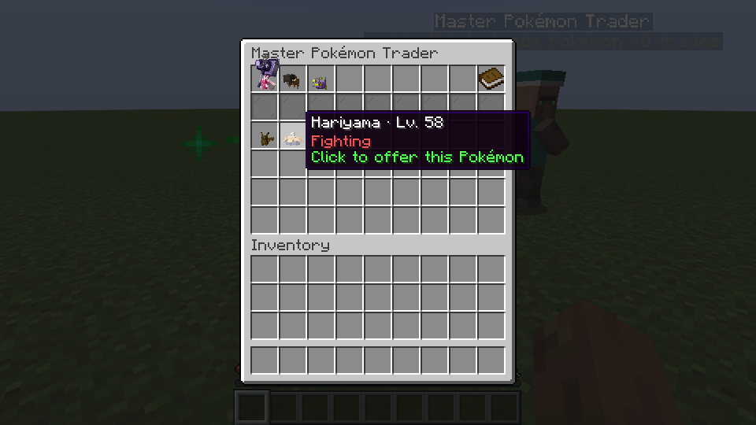

## Pokémon partners and Cobbleworkers (with Cobblemon)
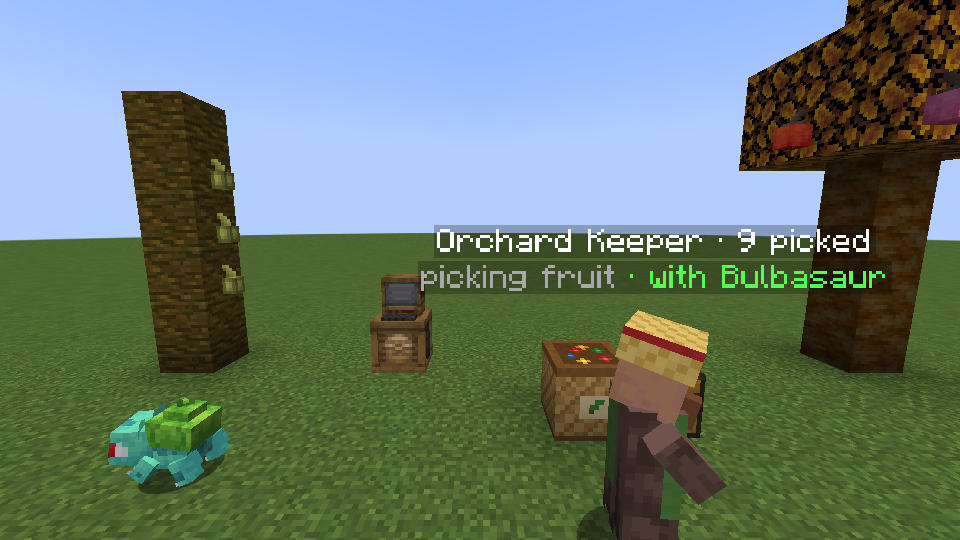

Pokémon you keep in a **Pasture Block** within 16 blocks of a villager's workstation help with the job when their
type suits it — each one cuts the time the work takes by 15%, up to three:

| Job | Helpful types |
| --- | --- |
| Builder | Fighting, Rock, Steel |
| Miner | Ground, Rock, Steel |
| Lumberjack | Grass, Bug, Fighting |
| Orchard Keeper | Grass, Bug, Flying |
| Farmer | Grass, Ground, Water |
| Fisherman | Water, Ice |
| Armorer | Fire, Steel: one more stack of ore each trip each (and Fire types smelt some on the spot) |
| Toolsmith | Steel, Fire |
| Weaponsmith | Steel, Fighting |
| Fletcher | Flying, Bug |
| Nurse | Fairy, Normal, Psychic |
| Ball Smith | Steel, Fire |
| Porter | Fighting, Normal: each carries 3 more stacks a trip |
| Carpenter, Mason | Fighting, Rock, Steel |
| Chef | Fire, Normal |
| Fossil Scientist | Rock, Psychic |
| Guard | Fighting, Dragon: they **fight beside the guard** (see *Guards*) |
| Postman | Flying: **air mail** — parcels for mailboxes outside the round go straight there instead of at dawn |
| Miner, Fisherman (their furnaces) | Fire: each time the worker tends a furnace or smoker by the workstation, every Fire-type partner smelts 8 of what's in it on the spot, no coal needed |

The line above the villager's head says who is helping ("· with Machop"), and sneak-right-clicking a worker shows
how much faster they are. It works with [Cobbleworkers](https://modrinth.com/mod/cobbleworkers) too: the same
Pokémon can work the pasture for Cobbleworkers and help the villager at the same time, and a postman's courier route
from the pasture (see *Courier routes*) takes what they gather to wherever it is needed.

## Blueprint Table: any build from the internet
Craft a **Blueprint Table** (blue dye on top, cartography table in the middle, planks around) and right-click it. It's
the Builder's workstation too: a villager without a job near it takes it and becomes a **Builder**.

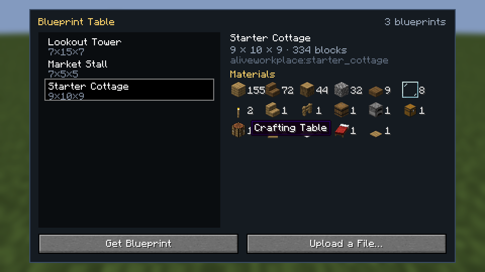

- Every blueprint on the server is listed with its size and **exactly what materials it needs**.
- **Get Blueprint** gives you a copy for one **Blank Blueprint** (paper + blue dye makes two).
- **Upload a File…** lists the build files in your own `blueprints` folder (**Open Folder** takes you there).
  Download builds from sites like Planet Minecraft or Minecraft-Schematics as `.litematic` or `.schem`,
  drop them in, pick one and press **Upload**. It becomes a blueprint everyone on the server can use.
- Anything saved with a Structure Block shows up too.

## Builds that use other mods
- **Chipped / Rechiseled** variants: stock the plain block (oak planks, stone bricks…) and the builder turns it into
  whichever variant the blueprint uses, just as the Chipped workbench or the chisel would for free.
- **Supplementaries**: way signs need the fence and the sign, rope knots the rope and the fence, potted plants a pot and
  the plant. Jars, shelves, safes and other containers are built empty — blueprints never hand out items.
- **Handcrafted, Beautify, CobbleFurnies, Carved Wood, Moar Concrete** (the Cobbleverse pack's building mods): every
  block costs its own item and builds like any other (tested with the real mods).
- **Storage mods**: Sophisticated Storage chests and barrels and Tom's Storage filing cabinets near the Blueprint Table
  work as supply chests. Storage-network blocks (Tom's connectors and terminals, the Sophisticated controller) are
  skipped, so nothing is counted twice — the builder uses the chests themselves.
- Blocks from mods that aren't installed turn into air and are left out.

## Commands and gamerules
| | |
|---|---|
| `/workplace sites` | your builds in progress, with a cancel button |
| `/workplace mail` | parcels on their way to and from you, and where they are |
| `/workplace quests` | the quests of the village nearest you, each with a clickable [Track] or [Untrack] (1.5) |
| `/workplace strip <height>` | the Quarry Marker in your hand digs a strip mine at that height, down a ladder shaft |
| `/workplace cancel <id>` | stop a build (placed blocks stay; you get the blueprint back) |
| `/workplace friend add <player>` | let a friend give orders to your builders (`remove`, `list` too) |
| `/workplace blueprints` (op) | list every blueprint the server knows |
| `/workplace blueprint <id>` (op) | get a blueprint item |
| `/workplace import` (op) | import files from `<world>/aliveworkplace/import/` |
| `/workplace steward explain` | every rule of the nearest hall's Steward, each condition's number and whether it held, and today's wishes |
| `/gamerule workplaceAllowUploads false` | only operators can upload blueprint files |
| `/gamerule workplaceFreeMaterials true` | builders need no materials (creative towns) |
| `/gamerule workplaceBuildDelay 8` | ticks per block (lower is faster) |
| `/gamerule workplaceBuildersHelp false` | idle builders stop helping with other builds |
| `/gamerule workplaceBuilderOwnership false` | anyone can give orders to any builder |
| `/gamerule workplaceFoundationDepth 12` | how far down builders fill under a build on uneven ground (0 = never) |
| `/gamerule workplaceLevelGround 0` | builders leave the ground around their builds alone (default 2 blocks, up to 8) |
| `/gamerule workplaceVillageFarms false` | village farmers don't take on the farm by their composter by themselves |
| `/gamerule workplaceKeepWorkLoaded false` | nothing is kept loaded: builds, quarries and villages stop when nobody is nearby (by default builds and quarries keep going while the player who ordered them is online, and villages while anyone is online; see `keepVillagesWorking`) |

**Server config** — `config/aliveworkplace.json` is written with the defaults the first time the game starts (edit it
and restart; out-of-range values are clamped). With [Mod Menu](https://modrinth.com/mod/modmenu) installed, the mod's
**Configure** button opens the same settings as sliders and on/off buttons, each with a tooltip; closing the screen
saves the file and puts the settings into effect in your own worlds (a dedicated server keeps its own file):

| Option | Default | What it does |
| --- | --- | --- |
| `supplyRadius` | 8 | chests and barrels this close to a workstation are its supply chests |
| `maxSiteDistance` | 48 | how far from their Blueprint Table a builder takes a build |
| `guardRadius` | 24 | how far from their grindstone guards patrol and fight |
| `lumberjackRadius`, `orchardRadius`, `fisherRadius` | 16 | how far lumberjacks cut, orchard keepers pick and fishers look for water |
| `partnerRadius` | 16 | how close to a workstation pastured Pokémon must be to help |
| `postmanRange` | 64 | how far a postman walks to deliver (mail going farther arrives at dawn) |
| `explorerRange` | 48 | how far from their Cartography Table explorers go on an expedition |
| `villageHallRadius` | 64 | how far from a Village Hall its village reaches |
| `keepVillagesWorking` | true | villages keep working when no player is near: while anyone is online, each worker's workstation chunk (and the chunk it is in) stays loaded; `false` pauses villages nobody is near (builds and quarries still follow `workplaceKeepWorkLoaded`) |
| `builderPaths` | true | builders lay a dirt path from each finished building to the village's bell or hall |
| `villageGrowthCap` | 40 | a village with a hall stops having babies at this many villagers (0: villages don't grow) |
| `villagerNames` | true | villagers in a village with a Village Hall get names |
| `villagerTraits` | true | villagers have traits (diligent, lazy, nimble, clever, strong, cheerful, glutton, frugal) |
| `villagerSickness` | true | villagers in a village with a Village Hall fall ill now and then (a Nurse cures them) |
| `villagerMoods` | true | villagers in a village with a Village Hall have moods that change how fast they work |
| `marketDays` | true | a village with a Village Hall and a Market Square holds a market once a week |
| `villageRaids` | true | monsters raid villages with a Village Hall and 8 or more villagers at night now and then |
| `villageRadius` | 48 | workers whose workstations are this close together share their chests (0 turns sharing off) |
| `maxWorkersPerVillage` | 0 | jobless villagers stop taking free workstations once this many workstations within `villageRadius` of each other are taken; nobody loses a job they have (0: no limit) |
| `workerPathRange` | 48 | how far villagers with a job look for a path in one go, in blocks; lower is lighter on the server, and farther walks are made in legs (vanilla: 48) |
| `builderRepairs` | true | idle builders repair the buildings they finished when blocks go missing |
| `banditCamps` | true | bandits make camp near villages of Village rank or more now and then, and raid them until their chief falls |
| `festivals` | true | villages with a Village Hall hold a festival every season (players can still call one with a cake) |
| `villagerChatter` | true | villagers near a player now and then say something about their day, over their heads |
| `villagerCouples` | true | villagers court, marry (a wedding at the bell) and mourn |
| `villageTreasury` | true | villages with a Village Hall put by takings every morning for players to collect at the hall |
| `partnerShows` | off until 1.2 | Pokémon pastured near a workstation are seen helping: they walk over to the work, carry things and lend a hand (with Cobblemon) |
| `nurseHealingMachine` | off until 1.2 | a nurse at Cobblemon's Healing Machine puts your team in it to heal them (free) and keeps it charged while on shift; off, she heals by hand |
| `berryBreeders` | off until 1.2 | with Cobblemon, a berry makes a villager at a composter a Berry Breeder, who breeds new berries from the village's own; off, no Berry Breeder job |
| `campCooks` | off until 1.2 | with Cobblemon, Hearty Grains make a villager at a Campfire Pot a Camp Cook, who cooks Cobblemon dishes in the pot; off, no Camp Cook job |
| `habitatKeepers` | off until 1.2 | with Cobblemon, a honey bottle makes a villager at a Pasture Block a Habitat Keeper, who sets out Poké Snacks, slathers Saccharine logs and watches the wild Pokémon; off, no Habitat Keeper job |
| `habitatSightings` | off until 1.2 | Habitat Keepers tell the village of the shiny, rare and Alpha wild Pokémon near their pasture and write them in the chronicle |
| `seasonDays` | 16 | days in each of the village calendar's four seasons (each season's festival is on its middle day) |
| `treasuryPerWorker` | 20 | what each worker brings the treasury a day, in hundredths of an emerald, before wellbeing and rank |
| `villageProtection` | true | a Village Hall's owner may protect the village from other players (shift-click the hall's name tag; off until they do) |
| `dollarsPerEmerald` | 100 | CobbleDollars per emerald for lessons, shop prices and fares |
| `steward` | off until 1.1 | a Journeyman Builder (or higher) by a Village Hall can be made its Steward with the hall's City Plan; off, no new Stewards, and those appointed stand idle (the City Plan still paints) |
| `stewardMaxOpenBuilds` | 4 | the most of a Steward's builds open at once, whatever his level and the village's rank (1 to 8) |
| `stewardSelfRun` | off until 1.1 | a Steward set to "Run the village" starts the builds he proposes himself; off, every village asks first |
| `stewardRoads` | off until 1.1 | the builders build the approved roads on the plan, and new buildings' doors join them with lanes; off, roads are drawn but not built |
| `caravanRoads` | off until 1.1 | villages with a trade route each build their half of a road to the other, ending at a milestone if it stops short |
| `caravanRoadReach` | 256 | the longest half of a road a village builds towards another, in blocks (32 to 512; it goes halfway at most) |
| `stewardWalls` | off until 1.1 | a raided village's Steward proposes a wall along the plan's wall line; off, he never proposes walls |
| `stewardRenewal` | off until 1.1 | a Steward rebuilds the old village houses in zones whose "renew old houses" switch is on, one at a time; off, they are listed, never renewed |

Expansions still being built stay off until the release that finishes them, whatever the file says: 1.1's Steward
(`steward`, `stewardSelfRun`), 1.2's Pokémon jobs and partner shows (the rows marked "off until 1.2", `daycareKeepers`,
`gemGrowers`, `villageHabitats`), 1.3's Legends and the Gifted (`legends`, `legendNeeds`, `legendSites`, `strangeMoods`,
`giftedChance`) and 1.4's edicts and civic items (`villageEdicts`, `workHorns`, `villageBanners`, `cradles`,
`harvestIdols`, `tonics`). Their switches aren't on the settings screen until then.

Every "needs" system (names, traits, moods, sickness, couples, chatter, markets, festivals, raids, bandit camps, the
treasury, repairs, paths) has its own switch above: set it to `false` and the village simply goes without it; nothing
else needs looking after. For a big server, `maxWorkersPerVillage`, `workerPathRange` and `keepVillagesWorking` are the
ones that keep villages light.

## Performance
Tested on a real server with the whole Cobbleverse pack: 80 busy workers (40 builders, and miners, lumberjacks,
porters, carpenters and masons) took an average tick from 2 ms to about 7 ms, of the 50 ms a tick may take. Alive
Workplace's own code is about a tenth of that; the rest is what any 80 villagers cost, mostly finding their way
around. (`PERF=true tools/packtest/run.sh` runs the test.)

## What's next
See [ROADMAP.md](ROADMAP.md) for what's planned.

## Building from source
```
./gradlew build          # jar in versions/1.21.1/build/libs, runs the in-game test suites
./gradlew runGameTest    # just the tests
```
Every push is built and tested by GitHub Actions; the jar is attached to each run.

## License
Alive Workplace is free software under the **GNU General Public License, version 3 or (at your option) any later
version** (GPL-3.0-or-later). The full text is in [LICENSE](LICENSE), and every jar carries a copy
(`LICENSE_alive-workplace`). You may use it in modpacks, change it and share it; a changed version you share must stay
under the same license, with its source.

Credits:
- Some jobs take ideas from [MineColonies](https://github.com/ldtteam/minecolonies) (GPL-3.0): the Cartographer's
  expeditions and the Netherworker. Their code is our own; a file that adapts code from a GPL project says so, with
  the project's name, in its header.
- Every build the Builders build is original to this mod.
- Textures are drawn for this mod. Minecraft is a trademark of Mojang; this mod is not affiliated with Mojang or
  Microsoft.
