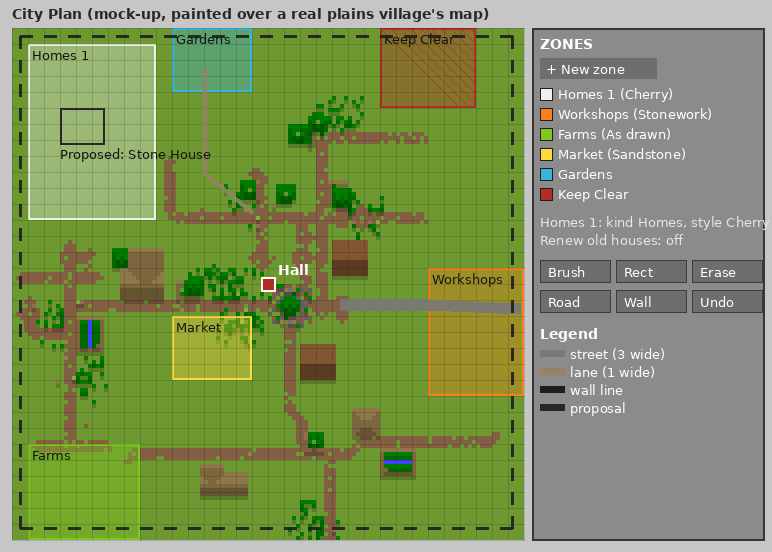

# M27 design note: Villages that build themselves (1.1)

Written for ROADMAP 27.1 (lane-a-1004-1533, 2026-10-04). The roadmap items 27.2 to 27.22 hold the full specs and
their tests; this note is the overview the owner reviews and the map the lanes build from. Lanes don't wait for the
owner's reply; anything he changes goes back into the items.

**In one line:** you paint your village's plan once on a City Plan, appoint a Steward at the hall, and he grows the
village into it: the right building in the right zone and style, roads with lamps and bridges, a wall once raids
start, and old vanilla houses renewed one at a time, each step proposed for your click or done by himself.

## 1. What the player sees

### The City Plan and its screen (27.2 to 27.4)

The **City Plan** is a new item (recipe: a Map, a Blank Blueprint and a Heart of the Sea, shapeless; its icon the zones painted on vanilla's map paper,
drawn with the pixel-art skill). Right-click a Village Hall to bind it, as the Village Ledger binds; its tooltip names
the village. Right-click the air with it to open the plan screen:



(A mock-up: the map is a real vanilla plains village drawn the way the hall's village map draws it, a block a pixel,
with the grid, six zones, a planned street and lane, the wall line and one of the Steward's proposals painted over it.)

- Up to 16 **zones**, each a kind, a name, a style (one of the blueprint styles, or "as drawn") and a "renew old
  houses" switch (off). The 8 shipped kinds, coloured as the village map's banners: **Homes** (white), **Workshops**
  (orange), **Farms** (lime), **Market** (yellow), **Civic** (blue: school, library, clinic, chapel, graveyard),
  **Gardens** (light blue), **Defences** (black) and **Keep Clear** (red: nothing is ever built there; roads may
  cross).
- Tools: a one-cell brush, a rectangle, an eraser, undo (10 steps), **Road** (click points, double-click to end; a
  lane 1 wide, a street 3 or an avenue 5, in a road style) and **Wall line** (one line round the village, open or
  closed). Roads a player draws count as approved.
- Holding the plan, its zone edges, roads and wall line show **on the ground** within 24 blocks as coloured particles
  (nothing is placed). The hall's map button draws the zones and roads on the village map, so the plan can hang in an
  item frame by the hall.
- Who may change a plan: the hall's owner, their friends and operators (the Village Hall's protection rules); a hall
  nobody owns is claimed by the first player who paints. A cell nearer another hall can't be painted.

### The Steward and his day (27.5)

A new job at the Village Hall, one per hall. **Appointed**, not taken: sneak-right-click a seasoned Builder by the hall
with its City Plan, or use the desk's "Appoint a Steward" button. Nobody takes the hall by himself. He wears a clerk's
long coat with a rolled plan at the belt (and a zombie version).

| Time | What he does |
|---|---|
| Morning | walks his rounds holding the plan: up to 6 stops (his open sites, empty zones, the storehouse), 3 s at each |
| Back at the hall | ranks the rules that hold into the day's wishes, finds plots, lines up builds, jobs and research |
| Day | stays at the hall; his status over his head: "Planning a Stone House: 3 villagers have no bed" |
| Evening | home like everyone else |

His level (XP from his finished builds, jobs given and trades: City Plans, Blank Blueprints and Village Ledgers for
emeralds; he buys paper and books) sets how many of his builds may be open at once: 1, 2, 2, 3, 4 from Novice to
Master, never more than the rank allows (Hamlet 1, Village 2, Town 3, City 4).

### His desk: ask first, or run itself (27.8, 27.9)

With a Steward, the hall's "What next?" page becomes his desk: his level, the mode (**Ask me first**, **Run the
village**, **Rest**), his open builds with Cancel, the "What next?" tips as now, and up to 9 proposals. A proposal
reads:

> **Stone House (Cherry)**, because 3 villagers have no bed. 22 blocks north-east, in Homes 1. Needs: 96 cobblestone
> (40 in store), 48 cherry planks (all in store), … Built by Bram, after the Well.
> [Approve] [Decline] [Show me] [Another spot] [Another style]

Approving starts an ordinary build site for that builder, owned by the hall's owner, noted in the chronicle (a new
kind, Plans). **Run the village** does the same without the click, with one chat line a morning listing what was
started. Unanswered proposals lapse after 3 days; a declined one stays away for 3 days. The same page also gives
jobless villagers jobs, the village's biggest gap first (a builder while there's none, a farmer while food is short,
…), and picks the scholars' next research topic.

### What he builds, and why (27.6, 27.10 to 27.14)

Every wish is a data rule: conditions read the census the hall already takes (beds, food, jobs, beauty, raids,
illness…), so the desk and today's "What next?" tips always agree. Shipped rules, in short:

| Need | He proposes | Zone |
|---|---|---|
| beds short | upgrade a home whose next tier adds beds, else Starter Cottage / Stone House / Terrace / Inn by shortfall and rank | Homes, Market |
| most homes tier I | upgrade them | Homes |
| no store, or it's 80% full | Storehouse, then II and III | Market |
| food short | Berry Farm, Ranch | Farms |
| a worker with no workstation | the building with that job's block (Builder's Workshop, Kitchen, Clinic… 12 buildable copies of our village houses, plus Smithy, Mason's Yard, Fletcher's Lodge, Map Room, Farmstead, Fisher's Hut, Weaver's Cottage, Bandstand, new) | Workshops, Civic, Farms |
| the ill, the dead, children, scholars, couples | Clinic, Graveyard, Schoolhouse, Library, Chapel | Civic |
| guards short | Lookout Tower, Barracks | Defences |
| dark beds | a Street Lamp by the darkest doors | that zone |
| beauty low | Well, Park Bench, Fountain, Gazebo | Gardens |
| a Town with no square | Market Square | Market |
| no builder | asks you: "place a Blueprint Table and give a villager the job" | — |

**Plots** (27.7): in the rule's zone and its style, facing the nearest road (else the hall), ground within 4 blocks
of level, nothing in the box but natural ground and trees, 2 blocks clear of every site and building, nearest the hall
first, never the same blueprint mirrored the same way within 24 blocks.

### Roads, lamps, bridges, and roads between villages (27.15 to 27.17)

The roads on the plan get built in segments of up to 24 blocks, each a build site for the nearest builder (only when
no building waits), in the road style of the zone they start in: **As drawn** (dirt path, coarse dirt and gravel),
**Stonework** (stone bricks), **Sandstone**, **Dark Oak** (deepslate), **Cherry** (polished diorite) and, with
Cobblemon, **Apricorn** (bricks). Every new building's door joins the nearest road with a lane. Streets get a lamp
every 16 blocks on alternate sides and at crossings, lanes a lantern post every 12; water or a drop up to 16 blocks
gets a bridge with rails and pillars; one-block rises become stairs. Each caravan route builds its half of a road to
the other village (up to 256 blocks), ending at a milestone sign if it stops short; caravans on a finished road
arrive in three quarters of the time.

### Walls (27.18)

Once the village was raided in the last 7 days, or a bandit camp is near, he proposes its wall along the wall line
(or a line of his own, 4 blocks round the zones): a **Palisade** kit up to a Village (with a new Palisade Tower), a
**Stone** kit from a Town (Stone Wall, Wall Tower, Gatehouse; a Town replaces its palisade a segment at a time).
Towers at corners and every 28 blocks, a gate wherever a road crosses, shut at night.

### Old villages renewed (27.20, 27.21)

In zones with "renew old houses" on, he finds houses no builder built (by their beds and job blocks, measured by a
flood fill over vanilla village blocks; never one with a chest, never one a player changed), lists them on the desk,
and rebuilds one at a time in the zone's style: "Renew the old house 14 blocks west as a Stone House (Cherry)". The
old house is scanned, taken down by the builders (its blocks go to the store), and the new one built on the plot;
its sleepers and its worker move in (an old armorer's house becomes a Smithy, and the armorer keeps his level).

## 2. Data formats (all under `data/aliveworkplace/`, one file per entry, loaded by reload listeners)

A malformed file is logged with its name and the field and skipped; the rest still load. Anything that needs
Cobblemon says `"requires": ["cobblemon"]` and is skipped without it, as the Apricorn style does: no Cobblemon classes
in this milestone.

| Folder | One file is | Fields |
|---|---|---|
| `city_zones/<kind>.json` | one zone kind | `name` (lang key), `color` (dye), `map_tint`, `icon` (item), `order`, `buildable` |
| `steward_rules/<name>.json` | one rule | `when` (conditions, all must hold), `do` (one effect), `priority` (0-100), `why` (lang key), `cooldown_days`, `max`, `min_rank`, `requires` |
| `road_styles/<name>.json` | one road style | `middle`, `edges` (weighted block mixes), `step_slab`, `step_stairs`, `bridge_deck`, `bridge_rail`, `bridge_pillar`, `lamp` (a blueprint id, built in the road's style as `styled/<style>/…`), `lantern_post` (fence block), `requires` |
| `wall_kits/<name>.json` | one wall kit | `segment`, `corner_tower`, `gate` (blueprint ids), `min_rank`, `max_rank` |
| `steward_renewal/<name>.json` | one renewal list | `old_house` (`home`, or a point of interest id), `try` (blueprint ids, in order) |

One example of each:

```json
// city_zones/homes.json
{ "name": "zone.aliveworkplace.homes", "color": "white", "map_tint": "#E8E8E8", "icon": "minecraft:white_bed",
  "order": 0, "buildable": true }

// steward_rules/homes_stone_house.json
{ "when": [ { "beds_short": { "at_least": 2 } }, { "rank_at_least": { "rank": "hamlet" } } ],
  "do": { "build": { "blueprint": "aliveworkplace:stone_house", "zone": "homes" } },
  "priority": 70, "why": "steward.aliveworkplace.why.beds_short", "cooldown_days": 1, "max": 99 }

// road_styles/stonework.json
{ "middle": [ { "block": "minecraft:stone_bricks", "weight": 6 }, { "block": "minecraft:cracked_stone_bricks", "weight": 1 } ],
  "edges": [ { "block": "minecraft:cobblestone", "weight": 1 } ],
  "step_slab": "minecraft:stone_brick_slab", "step_stairs": "minecraft:stone_brick_stairs",
  "bridge_deck": "minecraft:stone_bricks", "bridge_rail": "minecraft:stone_brick_wall",
  "bridge_pillar": "minecraft:stone_bricks", "lamp": "aliveworkplace:street_lamp",
  "lantern_post": "minecraft:cobblestone_wall" }

// wall_kits/palisade.json
{ "segment": "aliveworkplace:palisade", "corner_tower": "aliveworkplace:palisade_tower",
  "gate": "aliveworkplace:palisade_gate", "min_rank": "hamlet", "max_rank": "village" }

// steward_renewal/armorer.json
{ "old_house": "minecraft:armorer", "try": [ "aliveworkplace:smithy" ] }
```

Conditions (27.6, 27.12): `beds_short`, `food_short`, `missing_poi`, `worker_without_workstation`, `jobless`,
`no_builder`, `rank_at_least`, `villagers_at_least`, `built_count_below`, `upgrade_available`, `homes_tier_low`,
`store_full`, `research_idle`, `research_at_least`, `mod_loaded`, `guards_short`, `raided_within`,
`bandit_camp_near`, `ill`, `dark_beds`, `beauty_below`, `children_at_least`, `courting_couples`, `died_within`.
Effects: `build`, `upgrade`, `assign_jobs`, `research`, `ask`. `/workplace steward explain` lists every rule for the
nearest hall with each condition's value and whether it held.

## 3. Config switches (`config/aliveworkplace.json`, all in the Mod Menu screen)

| Switch | Default | Off means |
|---|---|---|
| `steward` | true | no Steward appointments (the City Plan still paints) |
| `stewardMaxOpenBuilds` | 4 (1 to 16) | the most of his builds open at once, whatever his level and the rank |
| `stewardSelfRun` | true | "Run the village" is refused: every village asks first |
| `stewardRoads` | true | roads on the plan are drawn but not built |
| `caravanRoads` | true | no roads between villages |
| `caravanRoadReach` | 256 (32 to 1024) | how far a village builds toward a trade partner |
| `stewardWalls` | true | he never proposes walls |
| `stewardRenewal` | true | old houses are listed, never renewed |

## 4. Save data (every field optional with a default, so old saves load unchanged)

| Where | Name | Holds | Default |
|---|---|---|---|
| hall (`VillageHallBlockEntity`) | `plan` | zones (kind, name, style, renew switch, cells), roads (points, width, style, built segments), the wall line, the Steward's mode | empty plan, mode Ask me first |
| hall | `steward` | the Steward's UUID, the day's wishes, proposals (blueprint, style, spot, turn, builder, day proposed), declined until, his open sites, last morning planned | absent (no Steward) |
| hall item | `plan` | the plan, kept when the hall is broken (as its name is), centred on the new spot when placed again | absent |
| villager attachment | `steward_xp` (with vanilla's level) | his XP | 0 |
| `Caravans` entry | `road` | the half-road's points and how far it's built | absent |
| saved data, per dimension | `aliveworkplace_player_built` | 16×16×16 sections a player built in, inside a hall's area, from 1.1 on | empty |
| build sites | `steward` flag, `hall` | started by a Steward (for the desk, safety and Cancel) | false, absent |
| chronicle | new kind `PLANS` (a map icon) | what he started, roads and renewals finished | — |
| blueprints | `roads/<hall>/<n>`, `renewal/<hall>/<n>` | generated road segments, scanned old houses (as `Shapes` and the Scan Tool save theirs) | — |

Road segments are kept on the plan, not in the finished-build list, so ranks, homes, upkeep and the map skip them.

## 5. Budgets (per hall, per tick)

| Work | Budget |
|---|---|
| plot search | 64 columns; the morning's results kept until a zone or a build in it changes |
| road routing | 600 path nodes; at most 2 road segments open at once |
| old-house flood fill | 256 blocks (a house at most 2000 blocks, 20×16×20) |
| walls | at most 3 wall sites open at once |
| everything the Steward does | under 0.5 ms a tick per village at p95 (`PERF=true`, 27.22) |

Planning runs once a morning; nothing touches the world from another thread (C2ME).

## 6. Safe by design (27.19)

- Only inside his own village's zones of the right kind: never in Keep Clear, never nearer another hall, never in a
  protected village whose owner isn't his hall's owner.
- A **ledger of what players built**: a block a player places or breaks within a hall's area (from 1.1 on) marks its
  16×16×16 section; no plan, road or wall goes through a marked section unless the owner approved that one by hand.
- His sites clear only natural blocks: a block a player puts in the way after the build started stays, its step is
  skipped, and the desk says "a player's block is in the way".
- Materials: one shopping list for all his waiting builds (the 8 most needed) on the Storehouse's board and the desk,
  told to the owner once a day and seen by caravans; no new build while 2 of his builds have waited a whole day.

## 7. For the owner to decide (the lanes build the defaults meanwhile)

1. **Appointing**: a Steward is appointed with the City Plan (sneak-right-click a villager by the hall), rather than a
   jobless villager taking the hall by himself. Default: appointed with the plan.
2. **First mode**: a new Steward starts in **Ask me first** (every build waits for your click). Default: yes.
3. **The City Plan's recipe**: a Map and a Blank Blueprint. Default: that. **Answered 2026-10-05 (27.1a):** harder: a Map,
   a Blank Blueprint and a Heart of the Sea (shapeless), so a city is something a player works toward.
4. **Who may be Steward** (owner, 2026-10-05, 27.1a): only a villager who has been a Builder for a while. **Decision:** a
   Builder at **Journeyman (level 3) or higher**. Builder levels are already tracked and saved (1 XP per 5 blocks placed,
   10 per finished build), so Journeyman means about 350 blocks of steady work, a few in-game days, and needs no new
   saved field. Anyone else (jobless, a lower Builder, any other job, however high) is refused with "%s isn't ready to be
   a Steward: only a Builder who has reached Journeyman or higher can run a village". He starts the new job as a Novice
   Steward (his open builds grow with his Steward levels, as before). Stewards appointed before this rule keep their job
   (the check is only at appointment, and a Steward always qualifies, also to move to another hall).
