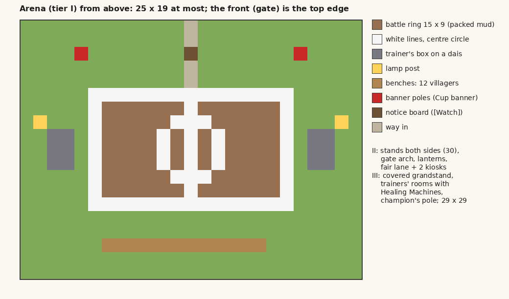

# M28 design note: Pokémon and villagers, together (1.2)

Written for ROADMAP 28.1 (lane-b-1004-0632, 2026-10-04). The roadmap items 28.2 to 28.22 hold the full specs and
their tests; this note is the overview the owner reviews and the map the lanes build from. Lanes don't wait for the
owner's reply; anything he changes goes back into the items.

**In one line:** Pokémon working beside a villager are seen doing the work, five new jobs use Cobblemon's own blocks,
villages get a Pokémon Center, and a village with an Arena turns every third festival into a Cup between villages.

## 1. What the player sees

### Partner shows (28.3 to 28.6)

A Pokémon pastured near a worker's job block already speeds the job up. Now it is seen helping, at the moment the
work happens:

| Job | Partner type | The show |
|---|---|---|
| Builder | Fighting / Rock / Steel | carries the planks, stone or iron parts from the supply chest; punches each block home |
| Porter | Fighting, Normal | follows the round with a barrel on its back |
| Carpenter, Mason | Fighting, Rock, Steel | holds the board or stone at the table, crack particles |
| Farmer | Water / Grass / Ground | waters a 3×3 patch (the farmland really becomes moist) / green sparkles / walks the furrow ahead |
| Lumberjack | Fighting / Grass, Bug | strikes the trunk with each chop / plants the sapling |
| Orchard Keeper | Flying, Bug | flutters through the tree being picked |
| Postman | Flying | takes off from the Mailbox with a bundle for air mail; flies ahead on the round |
| Armorer, Miner, Fisherman, Chef | Fire | breathes into the furnace or smoker as it smelts |
| Toolsmith, Ball Smith, Weaponsmith, Fletcher, Tinkerer | Steel, Fire, Fighting, Flying, Bug, Electric | sparks, holds the worn piece, brings feathers, electric sparks |
| Miner, Fisherman, Scholar, Teacher, Nurse, Composter, Florist, Beekeeper, Sifter, Netherworker, Cartographer, Rancher | by job | digs along, swims round the bobber, floats a book, pink healing pulse, stirs, sprinkles, circles the hive, shakes dust, walks them to the portal, scouts ahead, walks beside the horse |

What it never does: untether a pastured Pokémon (it stays inside its pasture's range and plays at the nearest point
it may reach), touch a Pokémon in battle, ridden or on a shoulder, or change its held item, friendship, moves or stats.
A carried item is a display that follows the Pokémon, never a real item; one left by a cut-off show is cleaned up when
its chunk loads. Budget: one show per worker every 10 s, 6 per level at once, none with no player within 48 blocks.

### Five new jobs (28.8 to 28.12) and their builds (28.13)

Each is started the usual way: stand a villager by the block and sneak-right-click them with the item. None of these
blocks is ever taken by a jobless villager on its own.

| Job | Block | Start with | What she does | Build (and its upgrade) |
|---|---|---|---|---|
| **Camp Cook** | Campfire Pot | Hearty Grains | cooks in the real pot (lid shut, its own cooking time) from a data menu: snacks, bait, Aprijuice, candies, the meals; meals feed the village store and Diet | Camp Kitchen: timber shelter, grain store, benches (II: Hearty Grain plot, smokehouse) |
| **Berry Breeder** | Composter | any berry | the berry book (every berry, found ones lit, the pair that makes each); pick a goal and she plants the parent pairs, mulches and picks until it mutates | Berry Nursery: paired beds, potting bench (II: greenhouse, 4 more beds) |
| **Habitat Keeper** | Pasture Block | honey bottle | sets out up to 3 lure snacks on marked spots, slathers Saccharine logs with honey, and every minute notes rare, shiny (and with 1.8, Alpha) wild Pokémon nearby: "Bramble spotted a shiny Eevee by the east field" | Habitat Garden: pond, tall grass, Saccharine tree, pasture in a hedge round a mossy centre stone (II: a hide on stilts, a second pond) |
| **Gem Grower** | Stonecutter | amethyst shard | tends gem beds: amethyst (never breaks the budding block), tumblestones on lava or magma, and with 1.8 the 18 Type Gems on Deepslate Crystal Cores; Blank TMs from shards (1.8). Works without Cobblemon | Gem Grotto: stone shed over a lava pool behind glass (II: a chamber with 4 crystal cores) |
| **Daycare Keeper** | Pasture Block | an egg | the daycare screen: one pair per player, 3 per keeper, "how well they get along"; each dawn maybe an egg (70/50/20%), 4 emeralds to collect. With Cobbreeding a real Cobbreeding egg; without it, a level-1 hatchling with inherited IVs, nature, ball, egg moves | Daycare: barn, paddock, straw nursery (II: second paddock, hatchery) |

Villages also grow these five as village houses, one per house in each of the five village styles, with the villager
already in the job (28.15), and with Cobblemon 1.8 an Expert Habitat Keeper can found **a habitat of the village's
own** under the Habitat Garden's centre stone, its spawn pool picked by biome (28.14).

### The Pokémon Center (28.7)

Two tiers: a bright hall under a red roof with a glass front, a counter with Cobblemon's Healing Machine, a PC and
potion shelves, benches; tier II adds a lodge with four beds, a trade corner with a Shop Counter and a garden with a
Pasture Block. The Healing Machine becomes a Nurse workstation (picked with a honey bottle): right-click her and she
puts your balls in the machine, free, with its own animation. The hall's "What next?" suggests one to a Cobblemon
village of Village rank.

### The Arena and the Festival Cup (28.16 to 28.22)

Three tiers of Arena (sold by an Expert Trainer Leader): a 15×9 ring with a trainer's box at each end and benches for
12 (at most 25×19); II adds stands on both sides (30 seats), a gate arch and a fair lane; III a covered grandstand,
trainers' rooms with Healing Machines and a champion's pole (at most 29×29).

A village with a hall, a finished Arena, Cobblemon and Village rank hosts every third festival as a Cup. Its circuit is
itself plus up to six villages it has trade routes with, nearest first. Each sends its Trainer Leader (or best
Trainer); players sign up for a village they own, are friends of, or that nobody owns (two per village). Brackets of
4, 8 (Town host) or 16 (City host); fewer than 4 entrants and it stays a plain festival, and the Cup page says why.

**A Cup day, hour by hour** (Minecraft time; ticks in brackets):

| Time | What happens |
|---|---|
| The evening before | players in circuit villages are reminded (sign-up opened when the previous festival ended) |
| 07:00 (1000) | delegates of far villages walk in from the side their home lies, in Trainer Leader outfits, "Mira of Thornholm"; the host's entrants walk to the Arena; a real Leader of a loaded village is "away at the Cup" |
| Morning | the fair: the market's travelling traders, two more than a market day, set up on the fair lane, each also selling the theme's wares |
| 12:00 (6000) | villagers off work fill the stands (seated on the benches), eat the feast (the theme's dish first) and the bard plays the theme's disc; the first round starts |
| Afternoon | rounds of bouts: villager against villager is an exhibition at the ring (their Pokémon trade moves with real animations, seeded so it can be replayed, 90 s at most); a player's bout is called in chat with [I'm ready] and is a real Cobblemon battle at the theme's level, with healed copies so nobody gains or loses anything; the crowd cheers its own village's entrant |
| The final | every villager comes to the stands |
| After the final | fireworks in the theme's colours, Hero of the Village for players there, the festival mood lift; the chronicle of every circuit village gets the Cup; the champion's village raises the Cup banner |
| Midnight (18000) | any bout left is settled as an exhibition; players who aren't at the ring lose by walkover |
| Dawn | delegates leave out of sight |

The Lantern Cup is the exception: it starts at dusk and may run until dawn. A host not loaded on its Cup morning puts
it off a day at a time (eight days at most); a host whose Arena is gone holds a plain festival.

**Themes** (in order): Blossom (Grass, Bug, Fairy), Little (first stages, level 5), Sun (Fire, Water, Electric,
doubles), Workers' (only Pokémon that helped a villager on 3 days or more), Harvest (Ground, Rock, Normal), Lantern
(Ghost, Dark, Psychic, at night), Frost (Ice, Steel, Dragon) and Grand (anything, level 100, bring 6). Each brings its
wares, dish, firework colours and a vanilla disc.

**How the Cup keeps the owner's rules:**

- Villages enter, with their Leaders and the players who represent them; a player always plays *for a village*.
- No badges, no gyms and no trophies for players: the pack's Badges & Trophies mod does that. The Cup gives players
  nothing to wear or keep but money.
- Leaders and the purse pay **money only**: 500 per bout won, 2,000 more for the final, half as much again at a City
  host; CobbleDollars when installed, emeralds without.
- **The banner belongs to the village**: the Cup banner (our own pattern, in the theme's colours) flies over the
  holder's champion's pole or hall until the next Cup, the roll of champions keeps its name, and its villagers are
  proud (+5 mood). The player who won gets the purse only.

## 2. Data formats (all under `data/aliveworkplace/`, one file per entry, loaded by reload listeners)

A malformed file is logged (with the file name and the field) and skipped; the rest still load. Ids are registry ids,
so a data pack can add entries for other mods' Pokémon blocks and items.

| Folder | One file is | Fields |
|---|---|---|
| `partner_shows/<name>.json` | one show | `jobs` (profession ids), `types` (Pokémon types), `cue`, `carry` (item id or `"from_work"`), `animation` (`physical`, `special`, `cry`), `particles`, `sound`, `ticks`, `effect` (`none`, `hydrate_farmland`, `smoke`, `sparks`) |
| `camp_menu/<dish>.json` | one dish | `dish` (item id), `keep` (how many), `when` (`always`, `asked`, `order`), optional `seasonings` |
| `gem_beds/<name>.json` | one bed | `plant` (item id or none), `touch` (block or tag), `grows` (blocks), `ripe` (block state), `harvest` (`loot`, the block's own), optional `requires` (`type_gems`) |
| `village_habitats/<name>.json` | one biome rule | `biomes` (biome tag), `pool` (a Cobblemon habitat pool id) |
| `cups/<name>.json` | one Cup theme | `name` (lang key), `order`, `format` (`singles`, `doubles`), `level`, `bring`, `types`, `stage` (`first`, `final`, `any`), `banned_labels`, `rules` (Showdown clauses), `start`, `end` (ticks), `wares` (item, price), `dish`, `fireworks` (colours), `disc` |
| `type_chart.json` | the 18 types' chart | attacker → defender → multiplier (2, 0.5, 0); missing pairs are 1 |

Cobblemon's own data is read, never copied: berry `mutations`, `spawn_bait_effects`, spawn rarity buckets,
`habitat_pools`, species egg groups.

## 3. Config switches (`config/aliveworkplace.json`, all on by default, all in the Mod Menu screen)

| Switch | Default | Off means |
|---|---|---|
| `partnerShows` | true | partners still speed jobs up, no shows |
| `nurseHealingMachine` | true | the Healing Machine isn't a Nurse workstation |
| `campCooks` | true | no Camp Cook job |
| `berryBreeders` | true | no Berry Breeder job |
| `habitatKeepers` | true | no Habitat Keeper job |
| `habitatSightings` | true | the keeper doesn't announce sightings |
| `gemGrowers` | true | no Gem Grower job |
| `daycareKeepers` | true | no Daycare Keeper job |
| `villageHabitats` | true | keepers never found a habitat (owner's call, below) |
| `pokemonVillageHouses` | true | villages don't grow the five houses |
| `festivalCup` | true | every festival stays a plain festival |
| `cupEveryFestivals` | 3 (range 1 to 12) | how often a host's festival is a Cup |

Every feature that needs Cobblemon is also off without it, whatever the switch says.

## 4. Save data (every field optional with a default, so old saves load unchanged)

| Where | Name | Holds | Default |
|---|---|---|---|
| villager attachment | `cup_delegate` | home hall, the Leader's UUID, tier | absent (not a delegate) |
| villager attachment | `berry_goal` | the breeder's goal berry and the current step | absent |
| villager attachment | `gem_orders` | the beds the grower keeps | empty (every bed she can) |
| villager attachment | `habitat_lure` | the keeper's lure (type or egg group) and lure spots | absent (no lure) |
| villager attachment | `daycare_pairs` | the keeper's pairs (owner, two Pokémon, eggs waiting) | empty |
| hall field | `found_berries` | berries the village has found | empty |
| hall field | `sightings` | the last five sightings | empty |
| hall field | `village_habitat` | the founded Habitat Block's position | absent |
| hall field | `cup_holder` | the Cup this village holds (host, theme) | absent |
| `Caravans` entry fields | `leader` (UUID, name, tier, XP), `banked_xp` | for unloaded villages | absent, 0 |
| Pokémon persistent data | `aliveworkplace_work_days`, `aliveworkplace_last_work_day` | the Workers' Cup counter, once a day | 0 |
| saved data, per dimension | `aliveworkplace_cups` | by host: theme, day, entrants, bracket, results, champions | empty |
| chronicle | new kinds `SIGHTING` (spyglass), `CUP` (gold ingot) | old chronicles read as before | — |

Show displays and bout Pokémon are never saved as such: they are tagged and removed on chunk load.

## 5. Cobblemon 1.8 and 1.7.3

Checked on 2026-10-03 (Cobblemon wiki and changelog): Alphas, TMs and the TM Machine, Type Gems grown on Deepslate
Crystal Cores and the Habitat Block came in **1.8.0 (2026-09-06)**; the Cobbleverse pack 1.7.42 still ships **1.7.3**.
28.2 makes the mod test against both, and `work/PokemonFeatures` (`HABITATS`, `TYPE_GEMS`, `TM_MACHINE`, `ALPHAS`,
by registry id) answers "is this here?". 1.8-only parts wait quietly until the pack moves up.

| Works on 1.7.3 (the owner's pack today) | Needs 1.8 |
|---|---|
| every partner show; the Pokémon Center and the Healing Machine nurse | Type Gem beds and Blank TMs (Gem Grower) |
| Camp Cook (Campfire Pot, Hearty Grains, Poké Snacks and the dishes) | Alphas in sightings and Hopo lures (Habitat Keeper) |
| Berry Breeder (berry mutations) | a habitat of the village's own (28.14), tending natural Habitat Blocks |
| Habitat Keeper's lures, Saccharine honey and shiny/rare sightings | |
| Gem Grower's amethyst and tumblestone beds | |
| Daycare Keeper; the five builds and village houses | |
| the Arena and the whole Cup | |

## 6. For the owner to decide

1. **Habitat Blocks in survival** (28.14): Cobblemon gives none in survival. Should an Expert Habitat Keeper be able to
   found one per village? Meanwhile: on, one per village, `villageHabitats` turns it off.
2. **The purse** (28.20): 500 a bout, 2,000 for the final, +50% at a City host. Too much or too little for your
   server's economy?
3. **How often**: every third festival of a host (`cupEveryFestivals` 3). More or less often?
