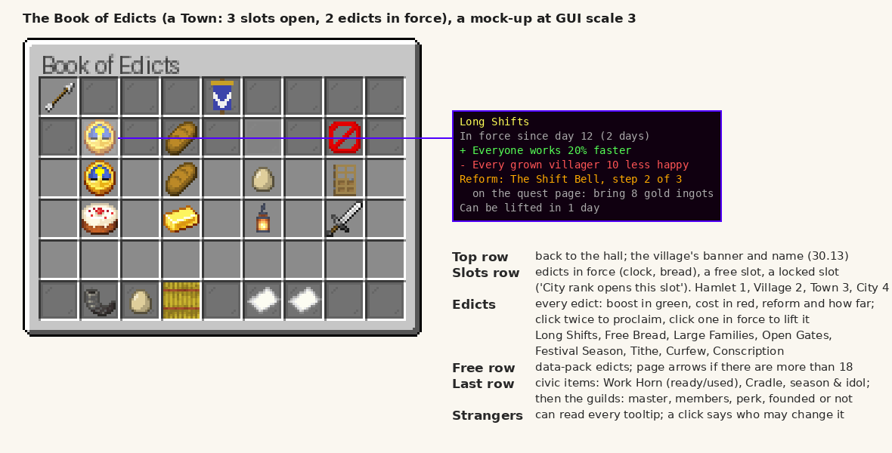

# M30 design note: Edicts and civic items (1.4)

Written for ROADMAP 30.1 (2026-10-04). The roadmap items 30.2 to 30.22 hold the full specs and their tests; this note
is the overview the owner reviews and the map the lanes build from. Lanes don't wait for the owner's reply; anything
he changes goes back into the items.

**In one line:** the village's owner rules it with edicts (each a real trade-off: a boost, a cost, and a reform that
villagers' quests can win to drop the cost), and five civic items (the Work Horn, the Cradle, the Village Banner, the
Harvest Idol and the tonics) plus guilds of master craftsmen make a well-run village visibly faster, bigger and prouder.

## What you'll see (the short version)

- **A new button on the Village Hall: the Book of Edicts** (a lectern, where the "previous page" arrow sat; the arrows
  move to the bottom corners). The Village Ledger opens it too: sneak-right-click the air.
- **Edicts are laws with a price.** A Hamlet may have 1 in force, a Village 2, a Town 3, a City 4. Click an edict twice
  to proclaim it; it must stay 3 days before it can be lifted. Everyone in the village is told, and the chronicle
  keeps it.
- **Every edict can be reformed.** While it's in force, a special quest appears on the quest page (a book-and-quill
  icon): three steps, one a morning. Finish them and the edict's cost is gone for good, with fireworks over the hall.
- **Civic items you hold or place:** a brass-banded **Work Horn** (a 5-minute rush, once a day, then the village is
  worn out till dawn); a **Cradle** (children grow up twice as fast, one more baby a day); a **Village Banner** (your
  village's colours over every new front door, on the guards' shields, on the trade routes page and at festivals); a
  **Harvest Idol** (crops nearby grow a quarter faster in autumn); and six **tonics** the alchemist and the chef make
  (one job family works 25% faster for a day).
- **Guilds.** Give a Master a **Guild Charter** and they lead a guild of their trade; once a **Guildhall** stands in the
  village, every member works 15% faster and gets a perk (miners' pickaxes wear half as fast, up to 5 builders on one
  build, and so on).
- **One speed limit for everything.** All these boosts, plus Pokémon partners, research and moods, add up to at most
  **twice the normal pace** (a config setting). Sickness and bad moods still slow a worker down after that.
  A worker's status says "62% faster" or "100% faster: at the cap", with the reasons.



(A mock-up drawn from vanilla's chest screen and item art, not a screenshot: a Town with Long Shifts and Free Bread in
force, a free slot and a locked one, the eight edicts below, the civic items and two guilds in the last row, and the
tooltip of Long Shifts.)

### The eight edicts

| Edict | Boost (green) | Cost (red) | Reform: its line | Steps (emeralds paid) | Reformed |
|---|---|---|---|---|---|
| **Long Shifts** (30.3, 30.5) | everyone works 20% faster | every grown villager 10 less happy ("long shifts") | **The Shift Bell**: "a bell in the yard calls the shifts, so nobody works past their hour" | 24 clocks (5), 128 gold ingots (5), 300 bread (4) | still 20% faster, no mood loss |
| **Free Bread** (30.6) | everyone fed in the last day 10 happier ("free bread") | the village eats 30% more | **The Common Granary**: "a granary keeps the bread line" | 512 wheat (4), 128 hay bales (5), 48 barrels (3) | no extra food |
| **Large Families** (30.6) | up to two babies a day | a baby needs 24 meals in store (not 16), the family eats 12 (not 8); illness 50% more often | **The Midwives**: "midwives see every mother and child through" | 48 honey bottles (4), 192 white wool (3), 64 golden carrots (5) | two a day, usual food and sickness |
| **Open Gates** (30.7) | inns take 4 guests (not 2), up to two travellers a morning; one more trader on market days; Legends visit twice as often once M29 adds them | bandits camp near the village twice as often | **The Watchful Gate**: "a gate watch that knows every face" | 192 iron ingots (5), 256 arrows (4), clear out 40 monsters (6) | travellers keep coming, bandits as usual |
| **Festival Season** (30.8) | a festival every 4 days (not 8) | each costs the treasury 3 emeralds + 1 per 4 villagers; no money: no festival and 5 less happy that day ("disappointed"). A cake-called festival stays free | **The Festival Fund**: "the villagers put by for their own festivals" | 24 cakes (5), 256 firework rockets (5), 48 note blocks (4) | every 4 days, free |
| **Tithe** (30.8) | a tenth of the emeralds players pay the village's villagers goes to the treasury | their emerald prices 10% higher (rounded, so under 5 emeralds is unchanged) | **The Fair Ledger**: "the tithe comes out of the takings, not the price" | 24 books and quills (4), 192 gold ingots (6), beat one of the village's trainers (8; else clear out 32 monsters) | the tenth stays, prices normal |
| **Curfew** (30.9) | dusk to dawn every grown villager but guards and mercenaries goes to bed, and can't be hurt asleep; raids half as likely; nights count as safe | no trading at night ("Curfew: come back in the morning."), festivals end at dusk without fireworks, market traders leave at dusk, no night work (netherworkers and explorers don't set out after midday) | **The Lamplighters**: "lamplit streets, so the curfew can end at the door" | 192 lanterns (5), 96 glowstone (4), clear out 32 monsters (6) | raids still halved, nights safe, nobody has to stay in |
| **Conscription** (30.10) | in a raid every grown villager who isn't ill fights: wakes, never panics, holds a stone sword (3 damage, 15% more if Strong) and goes for raiders within 24 blocks | all work stops during the raid and until noon next day; conscripts can be hurt and killed | **The Militia Drill**: "drilled at the dummies, the militia fights without stopping the village" | 32 iron swords (6), 32 shields (5), clear out 48 monsters (8) | everyone still fights; work stops only near a raider, the morning after is normal |

Open Gates and Curfew exclude each other. Reform steps pay as quests do (a quarter more a rank).

A reform is a grind on purpose (owner, 2026-10-05, 30.1a): hundreds of items a reform, so it is worth working towards
rather than done in an afternoon. A step is handed in over as many trips as it takes (each click hands in all you carry
of it, up to what's left, across every slot), and what was given is kept. The emeralds a step pays stay as they were:
the reward is the reform.

### The civic items

| Item | Made from | What it does |
|---|---|---|
| **Work Horn** (30.11) | goat horn, gold ingot, emerald | blown in a village: every grown villager works 50% faster for 5 minutes, sparks over the workers; once a village a day ("The village has already answered the horn today."); then 10 less happy until dawn ("worn out") |
| **Cradle** (30.12) | planks, sticks, white wool | within 4 blocks of a bed in a village with a hall: children grow up in half the time, one more baby a day may be born (three a day with Large Families); a child sleeps in it at night. More cradles add nothing |
| **Village Banner** (30.13) | any banner + a gold ingot (keeps its design) | right-click the hall: the design becomes the village's colours (the banner isn't used up). Builders hang one over each new building's door (when a banner of the base colour is in their chests), guards' plain shields are painted, the trade routes page and the Book show it, and a banner near the festival square makes the festival's mood 20 for 3 days (from 15 for 2) |
| **Harvest Idol** (30.14) | hay bale, 3 wheat, stick, gold ingot | in autumn (harvest season) crops within 32 blocks grow 25% faster; golden sparkles; idols don't stack |
| **Tonics** (30.15, 30.16) | brewed by the Cleric (alchemist) or cooked by the Chef, never crafted by players | right-click a villager whose job it suits: 25% faster for a day. Miner's Brew (miners, sifters, netherworkers), Builder's Tea (builders, carpenters, masons, dyers), Smith's Draught, Scholar's Infusion, Harvest Cordial, Woodsman's Broth. A tonic that doesn't suit is refused and kept ("Dara has no use for Miner's Brew.") |
| **Guild Charter** (30.17) | 3 paper, emerald, gold ingot, red dye | sneak-right-click a Master in a village of Village rank or more: they become Guild Master of their trade's guild |

**Guilds** (30.17 to 30.20), each founded once a finished Guildhall stands for it; members work 15% faster unless said:

| Guild | Trades | Perk |
|---|---|---|
| Builders' | Builders, Carpenters, Masons, Dyers | up to 5 idle builders help at one build (not 3) |
| Miners' | Miners, Sifters, Netherworkers | pickaxes and the netherworker's gear wear half as fast |
| Smiths' | Armorers, Toolsmiths, Weaponsmiths, Tinkerers, Ball Smiths | mending puts back a third per material (not a quarter) |
| Woodsmen's | Lumberjacks, Fletchers, Fishermen | axes and fishing rods wear half as fast |
| Harvest | Farmers, Orchard Keepers, Florists, Beekeepers, Composters, Chefs | farms and orchard rounds reach 24 blocks (not 16) |
| Herders' | Shepherds, Butchers, Ranchers | herds 4 bigger (12 of a kind, butchers keep 14) |
| Scholars' | Scholars, Teachers, Librarians, Cartographers | research levels cost a quarter less paper, books and emeralds |
| Healers' | Nurses, Clerics, Undertakers | the ill recover in 2 days (not 3); nurses and undertakers look 48 blocks out (not 32) |
| Merchants' | Shopkeepers, Innkeepers, Ferrymen, Postmen, Porters | travellers a quarter cheaper to hire; porters carry 3 more stacks |
| Wardens' (no 15%) | Guards | train on the dummies up to Master (not Expert); hit 10% harder |
| Trainers' (no 15%; with Cobblemon) | Trainers, Trainer Leaders, Move Tutors, Pokémon Traders, Fossil Scientists | lessons and revivals a fifth cheaper; trainers rank up a quarter faster |

A village may have one guild per rank above Hamlet (Village 1, Town 2, City 3), one per trade. The Guildhall (I: a
two-storey hall with a long table and the charter over the hearth; II: a tower wing with a meeting room and a bell) is in
the Blueprint Table and sold by every Guild Master. When a Guild Master dies, the most experienced member takes over.

### What changes on the hall's screen and the Village Ledger

| Where | Today | With M30 |
|---|---|---|
| Hall, slot 9 | "previous page" arrow of the people list | **Book of Edicts** (lectern) |
| Hall, slot 17 | "next page" arrow | left free for another milestone's page |
| Hall, slots 45 and 53 | people | the people list's page arrows; **25 people a page** (see decisions) |
| Hall, name icon (slot 0) | name, rank | also lists the edicts in force |
| Hall, beds icon (slot 2) | beds | says whether the village has a Cradle |
| Hall, festival icon (slot 14) | next festival | also the season and its day ("Autumn: harvest season, day 3 of 16") and, under Festival Season, the next festival's cost |
| Hall, people list and a worker's status | job, what they're doing | the pace total with its sources; "Guild Master of the Builders' Guild" |
| Hall, quest page | three daily quests | plus one reform step per edict in force, in the row below (book-and-quill icon, never expires) |
| Hall, trade routes page | villages by name | each village shown by its banner |
| Village Ledger | right-click the air: the hall's screen | sneak-right-click the air: the Book straight away (its tooltip says so) |

## Technical detail

### The pace rule (30.2), exactly as the roadmap writes it

A new core class `work/Pace` is the one place a job's work time is worked out. Each bonus and penalty is a **named
source** (registered once, with a lang key for the status line), and:

- **Bonuses** (factors under 1) multiply and **stop at `100 / maxWorkPace`** of the usual time (0.5 at the default 200).
  They are: Pokémon partners (`Partners.factor`), a well-kept village (`VillageNeeds.factor` when under 1), Swift Hands
  (inside `VillageNeeds.factor` today: `swiftHands`), Diligent (`Traits.pace`), a happy mood (`Moods.pace`, 0.93),
  Craftsmanship (crafters), Expeditions (explorers, netherworkers), and this milestone's edicts (`work_pace`), the Work
  Horn's rush (1/1.5), tonics (1/1.25) and guilds (1/1.15).
- **Penalties** (sickness ×2 `Sickness.PACE`, an unhappy mood ×1.15, Lazy ×1.1, a badly kept village up to ×1.25
  `VillageNeeds.WORST`) **multiply after the cap**, so a sick worker still works at half the capped pace.
- **A worker's level is their normal pace, not a bonus**: `BuilderLevels.delay(base, level)` (100% → 40%, so a Master
  builds 2.5x as fast as a Novice) is applied before, and outside, the cap.
- **Not work pace**: walking speed (`Traits.speed`, Nimble), the daycare's experience rate and the
  `workplaceBuildDelay` gamerule (it sets the base the level and pace work from).

```
time = base × levelShare × max(100 / maxWorkPace, Π bonuses) × Π penalties
```

`BuilderLevels.delay(base, villager)` becomes `delay(base, level) × Pace.factor(villager)`, replacing today's product of
five factors. `TeacherWork`, `ScholarWork`, `RancherWork`, `CrafterWork`'s Craftsmanship and the explorer's and
netherworker's rests and trips go through `Pace` too; the five jobs that count partners twice today (`SifterWork`,
`BeekeeperWork`, `FloristWork`, `ExplorerWork`'s search, `CompostWork`) count them once. `Pace.factor` is cached per
villager for 200 ticks, as `VillageNeeds.factor` is now, so a lookup costs no more than today. The status line shows
`round((1 / factor - 1) × 100)` percent with the level left out, and "at the cap" when the bonuses hit it.

**Owner's call:** this reading of "twice normal pace" is the default until he says otherwise (see the last section).

### Data formats

All under `data/<namespace>/`, one file per entry, loaded by reload listeners (`Platform.get().onDataReload`, like
`CityZones` and `PartnerShows`). A malformed file is logged with its name and the field, and skipped; the rest load.
A data pack switches one of ours off by putting a file at the same path with `"enabled": false`. Texts (`name`,
`description`, `line`, `reason`) are text components: ours use `{"translate": "..."}` keys in `en_us.json`, a data pack's
may be a plain string. Item and job ids are registry ids (profession ids for jobs: `aliveworkplace:builder`,
`minecraft:mason`; the dyer is the `minecraft:leatherworker`).

**`edicts/<id>.json`** (loader `hall/Edicts`, 30.3):

```json
{
  "icon": "minecraft:clock",
  "name": {"translate": "edict.aliveworkplace.long_shifts"},
  "description": {"translate": "edict.aliveworkplace.long_shifts.desc"},
  "order": 1,
  "boost": [{"type": "aliveworkplace:work_pace", "percent": 20}],
  "cost": [{"type": "aliveworkplace:mood", "points": -10, "reason": {"translate": "mood.aliveworkplace.reason.long_shifts"}}],
  "excludes": [],
  "reform": {
    "name": {"translate": "reform.aliveworkplace.shift_bell"},
    "line": {"translate": "reform.aliveworkplace.shift_bell.line"},
    "steps": [
      {"kind": "bring", "item": "minecraft:clock", "count": 24, "reward": 5},
      {"kind": "bring", "item": "minecraft:gold_ingot", "count": 128, "reward": 5},
      {"kind": "bring", "item": "minecraft:bread", "count": 300, "reward": 4}
    ],
    "effects": []
  },
  "enabled": true
}
```

- `excludes`: edict ids that can't be in force alongside (checked both ways, so one side naming it is enough).
- `reform.steps[]`: `kind` is one of today's quest kinds (`bring`, `slay`, `battle`: `VillageQuests.Kind`), with `item`
  and `count` for `bring` (1 to 4096, more than a stack is fine), `count` monsters for `slay`, and for `battle` a
  `fallback` step used when Cobblemon or a trainer is missing (`{"kind": "slay", "count": 32, "reward": 8}`). `reward` in emeralds, before the rank's quarter.
- `reform.effects`: what replaces the cost once reformed (empty: the cost just goes). Conscription uses it: its cost
  `work_stops_in_raids {"until_noon": true}` becomes `{"near": 24}`.
- Room for M31: a step or the whole reform may later carry an `arc` id (unread until M31's story arcs exist); a file
  with one loads today.

**`tonics/<id>.json`** (loader `people/Tonics` or with the brewing code, 30.15):

```json
{
  "item": "aliveworkplace:miners_brew",
  "maker": "alchemist",
  "ingredients": ["minecraft:glass_bottle", "minecraft:glowstone_dust", "minecraft:coal", "minecraft:sugar"],
  "jobs": ["aliveworkplace:miner", "aliveworkplace:sifter", "aliveworkplace:netherworker"],
  "effects": [{"type": "aliveworkplace:work_pace", "percent": 25}],
  "ticks": 24000,
  "keep": 4,
  "enabled": true
}
```

`maker` is `alchemist` (`AlchemistWork`, the vanilla Cleric, after the guards' potions) or `chef` (`ChefWork`, after the
menu); `ingredients` are items or `#tags`, taken from the chests by the station and the store; `keep` is how many the
maker keeps stocked. Any item can be a tonic: a tonic is drunk on a plain right-click only when it suits the villager's
job (sneak-right-click stays the job-start gesture), so it doesn't steal other uses of the same item.

**`guilds/<id>.json`** (loader `hall/Guilds`, 30.17):

```json
{
  "name": {"translate": "guild.aliveworkplace.builders"},
  "icon": "minecraft:bricks",
  "trades": ["aliveworkplace:builder", "aliveworkplace:carpenter", "minecraft:mason", "minecraft:leatherworker"],
  "perks": [
    {"type": "aliveworkplace:work_pace", "percent": 15},
    {"type": "aliveworkplace:build_helpers", "max": 5}
  ],
  "enabled": true
}
```

A guild's perks apply only to its members (villagers of its `trades` in the village), only once it is founded. The
Trainers' Guild file carries `"fabric:load_conditions"` (Cobblemon loaded). Our loaders aren't vanilla JSON loaders, so
Fabric doesn't check that by itself: the loader asks `Platform` whether a file's conditions hold (the Fabric platform
uses Fabric's resource conditions), which keeps `hall/Guilds` core.

### The effect toolbox (`hall/CivicEffects`)

Typed effects with codecs (`"type"` picks the codec), shared by edicts (village-wide), tonics (the drinker) and guilds
(the members). An optional `jobs` list on any effect narrows it to those professions. Each type is read by exactly the
system it changes; effects of one type from several sources combine as the last column says.

| Type | Fields | Read by | Added in | Combines |
|---|---|---|---|---|
| `work_pace` | `percent` | `Pace` (a source per edict, tonic, guild) | 30.3 | each its own bonus |
| `mood` | `points`, `reason`, optional `when` (`always`, `fed_today`) | `Moods.work` (reason in the hall's list) | 30.3 | points add |
| `food_use` | `percent` | `VillageNeeds` (meals taken from the store) | 30.6 | add |
| `births` | `per_day`, optional `food_needed`, `family_meals` | `VillageGrowth` (`EVERY` ÷ per_day, `FOOD_NEEDED`, `MEALS`) | 30.6 | per_day adds over 1; food: highest |
| `sickness` | `percent` | `Sickness.dailyChance` | 30.6 | add |
| `inn` | `guests`, `arrivals` | `Innkeepers` (`MAX_GUESTS`) and the morning arrivals | 30.7 | highest |
| `market_traders` | `extra` | `MarketDays` | 30.7 | add |
| `legend_visits` | `factor` | M29's inn visitors (nothing reads it until then) | 30.7 | multiply |
| `bandit_camps` | `factor` | `BanditCamps` (`DAILY_CHANCE` for this village) | 30.7 | multiply |
| `festival_every` | `days` | `Festivals` (`EVERY_DAYS` for this hall) | 30.8 | lowest |
| `festival_cost` | `emeralds`, `per_villagers` | `Festivals` (taken from `Treasury` on the morning) | 30.8 | add |
| `tithe` | `percent` | the trade hook, into `Treasury` (hundredths, up to the cap) | 30.8 | add |
| `trade_prices` | `percent` | the village villagers' emerald prices | 30.8 | add |
| `curfew` | `indoors`, `raid_chance`, `safe_nights` | bedtime brain, the sleeping-villager damage check, `VillageRaids`, `BanditCamps`, `VillageNeeds` safety, trading, `Festivals`, `MarketDays`, `Netherworkers`/`ExplorerWork` | 30.9 | any `indoors`; chance multiplies |
| `militia` | `damage`, `range` | the raid fighting behaviour (guards' foe rules, `GuardCombat`) | 30.10 | highest |
| `work_stops_in_raids` | `until_noon`, optional `near` | one shared work gate every job passes (`Pace` or `Jobs`) | 30.10 | strictest |
| `build_helpers` | `max` | `Builders` (`MAX_HELPERS`) | 30.17 | highest |
| `tool_wear` | `percent`, `tools` (item tag) | `MinerWork`, `Netherworkers`, `LumberjackWork`, `FisherWork` | 30.18 | multiply |
| `mend_per_unit` | `share` | `MendingWork` (`PER_UNIT`) | 30.18 | highest |
| `work_reach` | `blocks` | farms (`Fields`) and `OrchardWork.RADIUS` | 30.19 | highest |
| `herd_size` | `extra` | `ShepherdWork`, `RancherWork`, `HerderWork` | 30.19 | add |
| `research_cost` | `percent` | `Research` level costs (rounded up) | 30.19 | add |
| `recovery_days` | `days` | `Sickness` (`RECOVERY`) | 30.20 | lowest |
| `work_radius` | `blocks` | `Nurses`, `UndertakerWork` | 30.20 | highest |
| `hire_price` | `percent` | travellers' hire (`Hiring`) | 30.20 | add |
| `carry` | `stacks` | `Porters` | 30.20 | add |
| `train_up_to` | `level` | `Guards` dummy training | 30.20 | highest |
| `strength` | `percent` | guards' damage (`GuardCombat`) | 30.20 | add |
| `lesson_price` | `percent` | `MoveLessons`, fossil revivals | 30.20 | add |
| `trainer_xp` | `percent` | `Trainers` | 30.20 | add |

The effects in force are summed **per hall** whenever an edict, a reform or a guild changes (and on load), and kept on
the hall; a villager's lookup finds the nearest hall as `VillageNeeds.factor` does and reads the sum, so nothing is
recomputed per tick.

### Rules for edicts (30.3)

- One slot per rank: Hamlet 1, Village 2, Town 3, City 4 (`VillageRanks.Rank`). A village that drops a rank loses its
  newest edict (chronicle).
- An edict stays at least `edictMinDays` (3) before it can be lifted; edicts that exclude each other can't both be in
  force.
- Proclaiming and lifting are told to the players in the village and go in the chronicle (new kind `EDICT`); an
  operator's `/workplace edict proclaim|lift <id>` does it too (and stays for admins).
- Reforms (30.5): while an edict is in force and not reformed, the hall keeps its next step on the quest page; the next
  step goes up the morning after the last was done (so three days at least); progress is kept per edict, also while
  lifted; the last step reforms it for good (fireworks over the hall, everyone told, chronicle kind `REFORM`).

### Who may do what

The hall's owner, their friends and operators, and anyone while the hall has no owner: exactly today's
`VillageProtection.mayBuild(level, hall, player)` (owner, `Friends.mayDirect`, permission level 2). That one check
covers **proclaiming and lifting** edicts, **blowing the Work Horn** in an owned village (a stranger's horn sounds but
calls no rush), **setting the colours** with a Village Banner and **granting a Guild Charter**. Everyone else can open
the Book and read every tooltip; a click tells them who may change it ("Only Jesse and their friends can proclaim
edicts in Oakvale."). Using a hall nobody owns does not claim it (only protection and the City Plan claim a hall).

### Config switches (`config/aliveworkplace.json`, all in the Mod Menu screen)

| Switch | Default | Range | Off means |
|---|---|---|---|
| `villageEdicts` | true | | no Book button, no edicts' effects; edicts in force stay saved and come back when it's on |
| `edictMinDays` | 3 | 0 to 30 | days an edict stays before it can be lifted |
| `maxWorkPace` | 200 | 100 to 400 | the cap, in percent of normal pace |
| `workHorns` | true | | the horn sounds like a goat horn and calls no rush |
| `cradles` | true | | cradles are furniture: no faster growing, no extra baby |
| `villageBanners` | true | | the banner is a plain banner: no colours set, hung, painted or shown |
| `harvestIdols` | true | | idols are decoration |
| `seasonDays` | **16** (already there) | 1 to 120 | the season clock of 22.6; the roadmap's "8" predates the owner's 16-day seasons (22.6a), so harvest season is 16 days |
| `tonics` | true | | makers don't brew them, villagers refuse them |
| `guilds` | true | | charters are refused, perks off; guilds stay saved |
| `guildsPerRank` | 1 | 1 to 4 | guilds per rank above Hamlet (Village 1×, Town 2×, City 3×) |

Adding options needs no `configVersion` bump: a missing value takes its default. As with today's switches, features
that depend on chance are off in GameTests unless the test turns them on.

### Saved fields (every one optional, with a default, so old saves load unchanged)

| Where | Name | Holds | Default |
|---|---|---|---|
| hall NBT | `edicts` | list of {`id`, `day` proclaimed}, oldest first | empty |
| hall NBT | `reforms` | list of {`id`, `step` (steps done), `reformed`, `nextDay` (when the next step goes up)} | empty |
| hall NBT | `colours` | the banner's base colour and pattern layers (vanilla's codecs) | absent (no colours) |
| hall NBT | `hornDay` | the day the horn was last answered (`Chronicle.day`) | 0 (never) |
| hall NBT | `rushUntil` | game time the rush ends | 0 |
| hall NBT | `guilds` | list of {`id`, `master` (UUID and name), `day` chartered, optional `guildhall` (the finished build's position)} | empty |
| hall NBT | `extraMeals` | Free Bread's running fraction of a meal (0 to 1) | 0 |
| hall NBT | `disappointedDay` | the day Festival Season couldn't pay | 0 |
| hall NBT | `raidWorkUntil` | game time work may start again after a raid (Conscription) | 0 |
| villager attachment | `tonic` | {`id`, `until` (game time)} | absent |
| villager attachment | `guild_master` | {`guild` id, `hall` position} | absent |
| villager attachment | `worn_out` | the day it lasts until (dawn) | absent |
| `VillageQuests.Quest` | `reform` | {`edict`, `step`}: this quest is that edict's reform step | absent (an ordinary quest) |
| item components | the Village Banner | vanilla's `banner_patterns` and `base_color` | |
| chronicle | new kinds `EDICT` (lectern), `REFORM` (book and quill), `GUILD` (paper), `BANNER` (white banner) | `Chronicle.Kind.parse` already reads an unknown kind as FOUNDED, so a downgrade is safe | |

Not saved: the per-hall sum of effects (rebuilt on load), the Harvest Idols' set per dimension (each idol's block
entity joins it when its chunk loads and leaves when removed, so nothing is scanned), guild membership (worked out from
professions), and the conscripts' stone swords: they are tagged, never taken from a chest, removed when the raid ends
and again when the villager loads, so a save mid-raid can't leave a villager with a free sword.

### Other decisions taken (not the owner's)

- **`Pace` keeps no cache of its own (30.2).** Each source reads what its own system already keeps (the hall's needs
  and research for 200 ticks, the partners for 100, the mood for its while), so a lookup costs what the five factors
  did; a second cache would have hidden a fresh illness or trait for up to 200 ticks.
- **Craftsmanship and Expeditions go by job (30.2):** Craftsmanship speeds every paced task of the crafting jobs (the
  CrafterWork kinds: carpenter, mason, chef, tinkerer, toolsmith, weaponsmith, fletcher, dyer, scribe), Expeditions
  every paced task of explorers and netherworkers (now also their searches and rests, not only some of them).
- **Edicts' pace is one `Pace` source, `edicts` (30.3)**, labelled with each edict that speeds the worker ("the Long
  Shifts edict"), rather than a source registered per edict: data packs come and go on reload, sources don't. Each
  `work_pace` effect still multiplies as its own bonus. A negative `percent` does nothing (bonuses can't slow work).
- **The Legend's `pace` power is a `Pace` source, `legend` (29.2 merged with 30.2)**: 29.2 divided only the
  builder's delay by `LegendPowers.pace`; now every paced task of the trades a power covers gets it, as a bonus under
  `maxWorkPace` with the rest ("a Legend nearby"). `LegendPowers.PACE_CAP` (2x) stays as the Legends' own ceiling
  among themselves, so at the default cap the numbers are 29.2's; a lower `maxWorkPace` now holds Legends too.
- **Edicts' ids (30.3):** ours may be written without the namespace (`long_shifts`, also in `excludes` and the
  command); a pack's in full (`pack:rest`). The hall saves the full id. An edict in force whose file is gone stays
  saved, does nothing, still takes its slot and can be lifted by id.
- **`/workplace edict` acts on the nearest hall to where it runs (30.3)**; Long Shifts' `reform` block arrives with
  30.5 (a file with one loads today: unknown fields are ignored).
- **People per page: 25, not 34.** 30.4 says 34; it was written before the page row (22.5) moved the list to slots 27 to
  53. Those 27 slots less the two arrows leave 25. 30.4's paging test uses 25.
- **Harvest season is 16 days** (`seasonDays` from 22.6a, the existing `hall/Seasons`, `Season.AUTUMN`). 30.14's test
  days 1, 17 and 32 assume 8-day seasons: the test sets `seasonDays` to 8 for them.
- **Festival Season** halves `Festivals.EVERY_DAYS` (8, per hall, separate from the season festivals and the Cup), so
  "every 4 days instead of 8" holds as written.
- **Two new effect types beyond the roadmap's lists:** `build_helpers` (the Builders' Guild's 5 helpers) and the
  optional `when` on `mood` (Free Bread's "fed in the last day"). Reforms get `effects` so Conscription's reformed cost
  can differ from no cost.
- **The Book's reform line comes with 30.5 (30.4):** reforms don't exist yet, so an edict's entry shows its
  description, boost and cost; 30.5 adds "Reform: step N of 3" under them (`EdictBook.edictIcon`). The banner at the
  top waits for 30.13 as written. An edict clicked once glints and says "Click again to proclaim it"; a stranger's
  click arms nothing and is told who may.
- **The Book is a screen of its own** (opened from slot 9 and the Ledger), not a `HallPages` tab, since 30.4 places it
  in the freed slot; its tests go through `VillageHallScreen.forTest` and the Book's own `forTest`, as
  `ResearchScreen.forTest` does.

### Numbers from the season run (30.22)

Measured on 2026-10-10 on the pack server (the real Cobbleverse pack, Java 21, `-Xmx5G`, `/tick sprint`):
`SEASON=true tools/packtest/run.sh`, which runs `/workplace season` (`command/SeasonSoak`, benchmark servers only).

**The village.** A City of 35 on flat ground on the first morning of autumn (harvest season, day 33): six farmers on
six 9x9 fields (two each of wheat, carrots and potatoes, sown at mixed ages) round a kitchen (a chef at a smoker) and a
Storehouse (a porter) that share six chests, the store, with 256 meals in it; four masons, four carpenters and 19
villagers without a job; 60 lit beds with a Cradle by the first; a Harvest Idol among the fields; the Harvest Guild
founded under a Master farmer; the horn blown from the console at 3000 each morning; 20 emeralds in the treasury.
Long Shifts, Free Bread, Large Families and Festival Season for days 1 to 4, all four reformed for days 5 to 8.

What the scenario gives the village that play would not: its City rank is on paper (25 finished buildings as records
and 7 research levels in Lore, Architecture, Logistics, Fortification and Warding, which change nothing measured);
there are no guards (so safety is half: lit, unguarded); and the fields get their random ticks from the run itself, at
vanilla's rate through the crops' own random tick (so the idol's bonus applies), because 1.21.1 gives random ticks
only to chunks near a player and the server has none. Run 2 below is the same season without that.

**Run 3, the one that counts** (pace is percent faster than the usual pace, for the Guild Master farmer, a second
farmer, the chef, the porter and a mason; mood is the grown villagers' average out of 100, at noon in the rush and at
dusk worn out; our share is the part of the server thread's profile samples inside our code):

| Day | Meals taken / brought in / left | Crops harvested | Births (villagers) | Ill at dusk (peak) | Mood noon / dusk | Treasury | Pace of five, morning | In the rush | Tick avg / worst (ms) | Our share |
|---|---|---|---|---|---|---|---|---|---|---|
| 1 edicts | 76 / 342 / 522 | 179 | 2 (37) | 4 (4) | 86.0 / 76.3 | 20 | +76 +76 -12 +53 +68 | +100 +100 +0 +100 +100 | 1.77 / 425 | **17.1%** |
| 2 edicts | 85 / 330 / 767 | 200 | 2 (39) | 5 (5) | 85.8 / 76.6 | 27 | +76 +76 -12 +53 +68 | +100 +100 +0 +100 +100 | 1.11 / 79 | 13.9% |
| 3 edicts | 120 / 447 / 1094 | 228 | 2 (41) | 6 (6) | 91.2 / 94.1 | 23, the festival took 12 | +76 +76 -12 +53 +68 | +100 +100 +0 +100 +100 | 1.11 / 42 | 13.3% |
| 4 edicts | 86 / 302 / 1310 | 195 | 2 (43) | 2 (6) | 98.3 / 93.7 | 31 | +76 +76 +76 +53 +68 | all +100 | 1.12 / 286 | 13.2% |
| 5 reformed | 69 / 411 / 1652 | 238 | 2 (45) | 1 (2) | 99.4 / 98.8 | 39 | +76 +76 +76 +53 +68 | all +100 | 1.16 / 46 | 13.5% |
| 6 reformed | 67 / 440 / 2025 | 196 | 2 (47) | 1 (2) | 99.9 / 98.4 | 46 | +77 +77 +77 +54 +69 | all +100 | 1.22 / 23 | 13.9% |
| 7 reformed | 112 / 439 / 2352 | 216 | 2 (49) | 2 (2) | 99.6 / 99.4 | 54, the festival took 0 | +77 +77 +77 +54 +69 | all +100 | 1.13 / 27 | 14.1% |
| 8 reformed | 71 / 368 / 2649 | 232 | 2 (51) | 2 (2) | 99.9 / 99.2 | 62 | +77 +77 +77 +54 +69 | all +100 | 1.22 / 17 | 12.4% |

Its result line: under the edicts 91.8 meals a day from the store, 8 births, 12 emeralds for festivals; reformed 79.8
meals a day, 8 births, 0 emeralds; costs show; ran away: nothing (the store never empty for a whole day, fastest pace
+100% which is the cap, least work time 0.500 of usual against a cap of 0.500, villagers 35 to 51 and never fewer);
the sprint ran at 814 ticks a second (1.23 ms a tick).

**What the numbers say.**

- **The costs show.** With more mouths (45 to 51 villagers against 37 to 43) the reformed village still took fewer
  meals from the store: 79.8 a day against 91.8 (the festival days are the two high ones, 120 and 112: the feast).
  The festival under Festival Season took 12 emeralds from the treasury on day 3; the reformed one on day 7 took none.
  The ill peaked at 6 under Large Families and at 2 reformed in run 3, but at 5 in run 4's reformed village: in a
  village this size four days don't tell Large Families' sickness from chance. The mood at dusk was 76 on days 1 and 2 and 98 to 99
  once reformed (Long Shifts' 10 points are part of that; the rest wasn't broken down).
- **Nothing runs away.** Everyone hits the cap in the rush and nobody passes it (the sick chef, at half the capped
  pace, reads -12% in the morning and +0% in the rush, as the pace rule says). The village grew by 2 a day in both
  halves: with a Cradle the limit was never the edict but the day's births (see below).
- **Six farms feed 35 villagers many times over**: 300 to 450 meals a day came in against 70 to 120 eaten, so the
  store only ever rose. Free Bread and Large Families are a real cost only for a village short of farms; that is
  what run 2 shows.
- **Births: 2 a day on all eight days of run 3, never 3.** Large Families with a Cradle allows 3 a day (reformed
  too), and the village had free beds, food and wellbeing; runs 1 and 2 had 3 on some days (3, 1, 2, 2 and 3, 2, 3,
  2 under the edicts). A likely reason, from reading `VillageGrowth` and not tested: births are 8,000 ticks apart
  and parents must be awake, so the third of a day often falls in the night. It is in the ROADMAP Notes.

**Run 4, the reformed half on its own** (`SEASON_PART=reformed`, a fresh village of 35 with the four edicts reformed
from the first morning): meals taken 56, 63, 95 (the festival, which took 0 emeralds) and 60, so 68.5 a day; 2 births
a day, 35 to 43 villagers; the ill 1, 1, 3, 5; mood 94.6 to 99.8 at noon and 86.9 to 98.1 at dusk. Like for like with
run 3's days 1 to 4 (the same village at the same size, 35 to 43, under the edicts): **91.8 meals a day under the
edicts against 68.5 reformed**, 12 emeralds for the festival against 0, and a dusk mood of 76 on days 1 and 2 against
87 to 89. Its tick: 17.2% of the server thread on day 1, then 13.1%, 12.7% and 14.7%; one tick with 296 ms of our code
on day 1, the same first recipe lookup (B100).

**Run 2, the same season with no random ticks on the fields** (so nothing grew after the first morning's ripe crops;
the 256 meals were gone on day 4): days 5 to 8 took 0 meals from an empty store, no births, the ill rose to 10, the
mood fell to 54 at noon and 59 at dusk, and the five's morning pace fell from +74 +58 +74 +51 +66 to +46 -34 +46
+27 +40. The village did not shrink (45 to 45). The run failed, as it should: "store empty a whole day: yes". Run 1
was the same with the composters laid out too far from the chests (a mistake in the scenario, fixed).

**The tick against 25.2's targets** (run 1 / run 2 / run 3; run 4 is above):

- Our share of the server thread was under 15% on days 2 to 8 of every run (12.1 to 14.3%, 9.2 to 13.1%, 12.4 to
  14.1%) and **over it on day 1 of every run: 17.1%, 16.6%, 17.1%**. Day 1 carries everything's first use; whether a
  first day counts against the target is the owner's to say (ROADMAP Notes), and the run fails on it until he does.
- **One tick over 50 ms is ours, on day 1 of every run measured for it: 402 ms of a 424 ms tick in run 3, 307 ms of a
  333 ms tick in run 2**, in a crafter's first look at the pack's recipes (`mc/Recipes.options` under the chef's and
  the other crafters' work). That is B100. Run 3 had 17 ticks over 50 ms in 192,000. Besides that one:
  a 98 ms tick on day 1 whose single profile sample was in a farmer's harvest (`FieldWork.take`; one sample is thin
  evidence, but the check counts it as ours); two world saves (147 ms on day 1 and 286 ms on day 4, with 0 of 5 and
  1 of 13 samples in our code); a 69 ms tick with one sample, not ours; and 12 ticks of 53 to 78 ms with no sample
  at all (the server thread wasn't running Java then: pauses).
- The whole run is 8 days in about four minutes of sprinting (run 3), about seven and a half with the server's
  start, so it fits a night run whole. `SEASON_PART=edicts` or `reformed` runs one half on its own in a fresh village in about
  five minutes (costs not judged: nothing to compare with).

**Numbers changed in the mod: none.** Nothing the run showed called for a balance change: the costs show and nothing
ran away. The only change to the mod's own code is that the Work Horn's rush can be called from the console (no
player), as edicts already can, so the run goes through the horn's real entry point.

## For the owner to decide

1. **The speed cap** (30.2): everything that makes villagers work faster stops at twice normal pace (`maxWorkPace`
   200); sickness and bad moods still slow them after that, and a villager's level (Novice to Master) doesn't count
   toward the cap. Default: this, as above. It slows the very fastest workers today (a Master with three partners in a
   well-kept village with Swift Hands is past twice already), and the changelog will say so.
