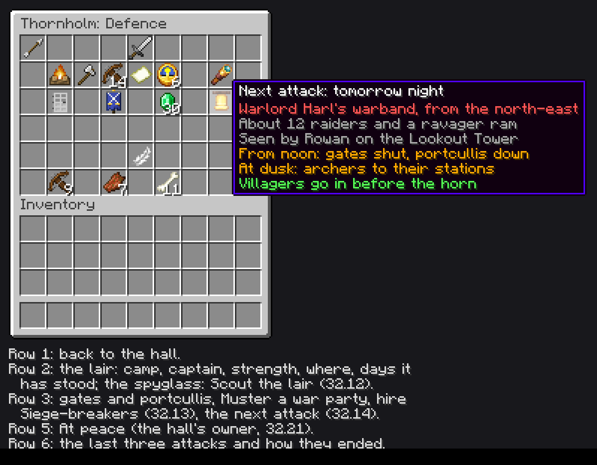

# M32 design note: Threats worth building walls for (1.6)

Written for ROADMAP 32.1 (2026-10-06). The roadmap items 32.2 to 32.21 hold the full specs and their tests; this note
is the overview the owner reviews and the map the lanes build from. Lanes don't wait for the owner's reply; anything
he changes goes back into the items. **Every number here is a starting value**, to be tuned once the scenes are filmed.

**In one line:** raids stop being "some monsters walk in at night". Each land gets its own enemy camped nearby under a
named captain, who lays sieges that walls, gates, towers and archers decide; a watchtower gives a day's warning;
scouts, guards and hired swords strike back at the camp; fire, drought and plague each get a job that answers them;
and every threat has a switch and a peaceful setting.

## What you'll see (the short version)

### The threat ladder

A village meets bigger enemies as it grows. Nothing new comes to a village that hasn't earned it.

| Village | What comes | From where | Item |
|---|---|---|---|
| **8 villagers or more** (any rank) | **Monsters**: zombies, skeletons, spiders at night, as today (15% a night at 8 villagers, +1% a villager, at most 35%; 3 days' rest after a raid) | the village's edge | today, 32.2 |
| **Village rank** | **Bandits**: a bandit camp 80 to 104 blocks out (12% a day), its chief now named ("Chief Harl Ashgrave") and its band a **strength** that raids use up and that grows back (6 at first, +1 a day, at most 10). In swamps and mangrove swamps, a **witch coven** instead (one lair at a time) | the lair | today's camps, 32.3, 32.11 |
| **Town rank** | **The enemy of the village's own land**, under a named captain who stays home: a **pillager warband** (plains, forests, taiga, snow, savanna), **drowned pirates** (any coast), **desert raiders** under a Pharaoh (desert, badlands), **piglins** through a portal (villages with a lit Nether portal or a Nether Gate). Their raids on a walled village are **sieges**: rams at the gates, ladders or sand ramps on the walls | their lair | 32.7 to 32.10 |
| **City rank** | The same enemies, stronger (a second ravager and an evoker for the warband), and the **captain leads the siege himself**: kill him at your walls and his camp breaks | their lair | 32.7 to 32.10 |

One lair stands near a village at a time. While one stands, the village's raids come from it (twice as often, as
bandit camps do today); with none, monsters come from the edge as now. In a warband's lands a Town gets a war camp
three times as often as a bandit camp. The raider tag makes every raider, hoglins and witches included, a foe to the
guards.

### A siege night, minute by minute

A Town of 24 villagers in the plains, ringed by a Palisade with a Gatehouse on the north-east road, a Lookout Tower
with a guard posted by it, and Warlord Harl Ashgrave's war camp (strength 14) 90 blocks to the north-east. Real time
in brackets (a Minecraft day is 20 minutes; an in-game hour is 50 seconds).

| When | What happens |
|---|---|
| **Yesterday, dusk** (18:00) | The hall's **threat clock** rolls the night after this one (32.2): the warband will come. Rowan, the guard on the night watch by the Lookout Tower, sees it: "Smoke on the north-east road: Warlord Harl's warband will strike tomorrow night" in chat to players in the village and to the hall's owner wherever they are online, and in the chronicle (32.14). The guards icon and the Defence page show the next attack and its side. |
| **Today, noon** (06:00 into the day) | The gates of every finished wall and gate build shut and the Gatehouse's **portcullis** drops (iron bars across the gateway), whatever the hour and with or without guards. Players can still open the fence gates by hand. |
| **Dusk** (18:00) | Villagers go in (as before the horn, without waiting for it). The guards take **battle stations** (32.6): archers climb to the free station highest over the north-east side (the Lookout Tower's top, the Gatehouse walkway, the Palisade's fighting step); knights hold the inside of the Gatehouse; medics stand behind them. |
| **19:30 to 22:00** (the hour was rolled with the night) | **The horn.** 12 raiders gather outside the outermost wall on the north-east side (never inside a ring of finished walls): pillagers with crossbows, vindicators, one **ravager ram**. Their number comes out of the camp's strength (14 → 2 left at home). |
| **+0:00 to +0:30** | The siege director (`threat/Sieges`, one per siege, every second) picks the **breach**, the gate nearest the raiders. The ravager walks at it; the rest come behind. |
| **+0:30 to +1:30** | The ram strikes the portcullis every 2 seconds: each blow does 12 of its 150 hit points, cracks show and every blow is heard. Archers on stations shoot from up to 24 blocks (16 on the ground) with a quarter more damage at foes 3 or more blocks below them. Meanwhile pillagers carry **ladders** to the wall nearest them: a rung every half second, up to 10 high. A guard on the walk within 2 blocks of a ladder's top throws it down, and its climbers fall. |
| **+1:30** | The portcullis gives (the bars go; nothing drops). The ram turns on the fence gates behind it (60 hit points each, about 10 seconds). |
| **+1:45 to +4:00** | Through the gate, the knights hold the gateway; the rest is an ordinary fight in the streets, as raids are today. |
| **Dawn** (about 04:00) | Raiders still alive walk back and rejoin the camp; the dead are gone, so after a costly night the camp is weak. Every ladder is taken away. The gates open and the portcullis rises. |
| **The morning after** | A **siege report** in the chronicle (new kind SIEGE): who came, how many fell and to whom, whether the gate held, and the hero (the guard with the most kills). Players who fought in a won siege get Hero of the Village for a day; villagers are 10 happier for a day ("we held"); for 2 days builders mend defence builds before anything else, and put the broken gate back. |

Without a warning source, the village's first sign is the horn, as now: no shut gates at noon, no stations at dusk
(the guards rally at the bell), and What next? says to build a Lookout Tower and post a guard by it.

### The warning timeline

| Source | Warning | Item |
|---|---|---|
| None | the horn | today |
| A guard on the night watch whose post (grindstone) is within 24 blocks of a finished **Lookout Tower** or **Wall Tower** | a day ahead: who and from which side | 32.14 |
| A **Scout** posted the same way | a day ahead, with their number | 32.12, 32.14 |
| The **Seer** (a Legend, M29, already in the mod: `legend/Seer`, power `foretell` with `warning_days` 2) | two days ahead, through `Legends.foretold(level, hall, kind)` | 32.14 |
| Other systems' sources (M35's Lighthouse for pirates) | as they declare | M35 |
| The answering jobs (Well Keeper, Physician) | foretell their own disaster a day ahead, or at the first case | 32.17, 32.18 |

The clock keeps **the next two nights** rolled for every hall (so a two-day source has something to read) and rolls a
new one each dusk. The Seer's dawn foretelling of tonight (today `VillageRaids.rollNight` at dawn, `Seer.tonight`)
reads the clock's night instead of rolling its own, so the Seer and the tower always tell the same story.

### Striking back: a march on a lair

1. **Know where it is.** The Defence page shows the lair roughly ("north-east, about 90 blocks"). Sneak-right-click a
   guard with a **spyglass** and they become a **Scout**. "Scout the lair" on the Defence page sends one out by day:
   they walk (or ride) to within 24 blocks of it, raise the spyglass and come home. The band ignores a scout more than
   8 blocks off. Back home the page shows the exact place, strength and captain, and a **Scouting Report** (a filled map
   with a red X, named for the lair) lands in the chest by the scout's grindstone. Scouts also trail raiders who retreat
   at dawn, so the lair's place becomes known without sending one. A scout not back within a day is lost.
2. **Raise the war party.** "Muster a war party" enlists three in four of the village's guards (up to 12; the rest keep
   the walls) on the **Rally Banner** in your inventory and raises it; they gather by the hall. On the same page, hire
   **Siege-breakers**: five (two crossbows, two knights, a medic) for 30 emeralds (3 less a level of Commerce), who
   stay until the lair falls or two dawns pass.
3. **March.** Walk to the lair with the banner raised; the guards and siege-breakers follow. The band turns out to meet
   you, six at a time from the tents, until its whole strength is spent; at City the captain fights at the front.
4. **Break it.** Kill the captain (or, for a coven, break the Coven Mother's cauldron). The loot chest is yours, the
   chronicle names you and every guard who killed there, guards earn double experience for kills at a lair (this is
   where Masters are made), the village is 10 happier for two days ("the warband is broken"), and no new lair comes
   for 10 days instead of 5. A pirate ship burns and sinks with its chest left on a raft; a piglin outpost's portal goes
   out and its band turns zombified.

### Each disaster and the job that answers it

One disaster at a time per village, 7 days' rest after one. Each shows on the wellbeing icon, in What next?, as a mood
reason, and in the chronicle (new kinds FIRE, DROUGHT, PLAGUE).

| Disaster | When | What it does | The job that answers it | Its house |
|---|---|---|---|---|
| **Village fire** (32.16) | lightning on a finished wooden build in a thunderstorm (1 in 3), a chimney spark (2% a day in a drought), a pirate gunner's burning arrow (1 in 4) | the game's own fire, but it **never spreads to a block the builders didn't place**, so players' builds are safe | **Firewarden**: grindstone + water bucket. Keeps two buckets, runs to the fire, douses it (steam), refills; from Journeyman rings the bell for a bucket brigade of two villagers. With Cobblemon, pastured Water types near the grindstone douse at range. Builders put back what burned. | Fire Station |
| **Drought** (32.17) | desert, savanna, badlands 15% a day; elsewhere 5% a day after 5 days without rain; twice as likely while a desert raiders' lair stands; 3 to 5 days, rain ends it | crops grow at a quarter pace, farmland dries, water cauldrons lose a level a day, villagers 10 less happy ("the wells are low") unless there's a finished Well or Fountain | **Well Keeper**: cauldron + shovel. Carries water to the fields (a bucket wets 9 farmland, which grows at full pace that day); between droughts keeps cauldrons full; foretells the next drought a day ahead. | Well House |
| **Plague** (32.18) | Town and up, 3% a day, twice as likely with more villagers than beds; a coven's hex or a far traveller can start one | illness passes on (1 in 5 a round, within 3 blocks); the ill don't get well by themselves, honey bottles don't cure them, and after two days they stay in bed; ends when no one has been ill for a day | **Physician**: brewing stand + glistering melon slice. Foretells the outbreak at its first case, sends the ill home, treats them with the **Remedy** (cures any illness, hexes too; well for 10 days; a player who drinks one loses poison, wither, hunger and nausea). | Physician's House |
| **Hex** (32.11, the coven's, not a disaster file) | each night a coven stands, 1 to 3 villagers | a cursed illness the nurse can't touch | breaking the coven, or the Remedy | |

### The Defence page



(A mock-up drawn from vanilla's chest screen, font and item art, not a screenshot: Thornholm's Defence page the day
before a warband siege, with the tooltip of the next attack. Icons are placeholders from vanilla; the items pick the
final ones.)

The guards icon on the hall (slot 4, `VillageHallScreen.GUARDS`, which today does nothing when clicked) opens it. It
is a `work/ChoiceMenu` page like the hall's others, back arrow in slot 0.

| Slots | What | Click | Who | Item |
|---|---|---|---|---|
| 10 to 14 | **The lair**: camp (culture's icon), captain (his name; "fights at the front" at City), strength (count = strength; tooltip: at home, out, lost lately), where (roughly, or exact once scouted), days it has stood | | everyone who may open the hall | 32.3 |
| 16 | **Scout the lair** (spyglass) | sends a Scout; greyed with the reason when there's none, or it's night | owner, friends, operators (`VillageProtection.mayBuild`) | 32.12 |
| 19 | **Gates**: open or shut, portcullis up or down, gates broken and waiting for a builder | | everyone | 32.4, 32.14 |
| 21 | **Muster a war party** (Rally Banner) | enlists and raises; without a banner in your inventory, says to craft one | owner, friends, operators | 32.13 |
| 23 | **Siege-breakers** (emerald, count = price) | hires; one contract at a time | anyone who may hire mercenaries today | 32.13 |
| 25 | **Next attack** (bell): when, who, side, size, who saw it; "No warning: build a Lookout Tower and post a guard by it" | | everyone | 32.14 |
| 40 | **At peace** (feather) | toggles | the hall's owner and operators only | 32.21 |
| 46, 48, 50 | **The last three attacks**: day, culture, how many came and fell, whether the gate held, the hero, gold lost | | everyone | 32.3, 32.6 |

With no lair the lair slots show "No camp near" and the page still opens (gates, next attack, history, At peace). The
Village Ledger reaches the page from afar like the rest of the hall.

### The builds to draw (minecraft-architect skill) and the art (minecraft-pixel-art skill)

| What | Item |
|---|---|
| Lairs: **War Camp** (`camp/war_camp`, about 23 x 9 x 19), **Pirate Ship** (`camp/pirate_ship`, about 27 x 20 x 9), **Tomb Camp** (`camp/tomb_camp`), **Blackstone Outpost** (`camp/blackstone_outpost`), **Coven Hut** (`camp/coven_hut`); today's `camp/bandit_camp` stays | 32.7 to 32.11 |
| Houses: **Fire Station**, **Well House**, **Physician's House** | 32.19 |
| Upgrades: **Palisade II**, **Stone Wall II**, **Wall Tower II**, **Gatehouse II** (`<name>_2`, `BlueprintUpgrades`) | 32.20 |
| Outfits and zombie outfits: Firewarden, Well Keeper, Physician; the **Remedy** and the **Scouting Report** (a vanilla filled map with our decoration, no new art) | 32.12, 32.16 to 32.18 |

## Technical detail

### Where it lives

A new core package **`threat/`** (added to `docs/agent/layout.md` by 32.2). Names are proposals; the items may rename
them.

- `threat/Threats`: loader of `raider_cultures/` (through `Platform.onDataReload`), `Threats.pick`,
  `Threats.chanceFactor`, and the **threat clock** (the two nights rolled ahead per hall).
- `threat/Conditions`: the shared `where`/`when` toolbox for cultures and disasters.
- `threat/ThreatData`: the `aliveworkplace_threats` saved data (below).
- `threat/Lairs`: takes over `guard/BanditCamps`' work; `BanditCamps` keeps its public methods (`near`, `all`,
  `round`, `dailyChance`, `site`, `found`, `onDeath`, `forget`) and calls into it, so RaidGameTests, the bandit camp
  tests and every caller stay as they are.
- `threat/Sieges` (director, breach, gate hit points, rams), `threat/Ladders` (ladders and sand ramps, recorded and
  removed), `threat/Stations` (battle stations, read once per blueprint), `threat/SiegeReport`.
- `threat/Tactics`: `ram_gates`, `ladders`, `sand_ramps`, `plunder`, `hex`; the engine skips a tactic it doesn't know.
- `threat/Captains` (names, gear, the City rule), `threat/Scouts`, `threat/WarParty`, `threat/Warnings` (the sources
  list, `Warnings.register`).
- `threat/Disasters` (loader of `disasters/`, the one-at-a-time rule, effects toolbox), `threat/VillageFire`,
  `threat/Drought`, `threat/Plague`.
- Jobs in `work/`: `FirewardenWork`, `WellKeeperWork`, `PhysicianWork`, registered like the other jobs that share a
  vanilla block (the guards' grindstone, 21.1a; the leatherworker's cauldron with the Sifter; the clerics' brewing stand
  with the Nurse and the Undertaker).
- Mixins (in `mixin/`, the only non-core part): fire spread (`FireBlock`'s spread and burn-out, kept to blocks the
  builders placed in a village on fire), and the hook where fire is placed (so fires are noticed, never scanned).

`guard/VillageRaids` keeps `start`, `track`, `active`, `raided`, `raidArea`, `tick`, `raiders`, `rollNight` and
`Night`; `start` picks a culture and spawns its roster instead of today's hard-coded zombie/skeleton/spider and
`BanditCamps.raider`. Today's two raids become the first two files with today's numbers. `VillageRaids.ACTIVE` (an
in-memory map today, lost on a restart) moves into `ThreatData`, so a raid under way survives a restart.

Existing pieces it builds on, unchanged in shape: `guard/Gates` (`gated()`, `shutTime`, `round`: gains the
portcullis and the "shut from noon" rule for a warned or sieged village), `guard/GuardRally` (bell rally, used for the
guards without a station), `guard/RallyBannerItem` (`enlist`, `MAX_GUARDS` 12: the muster uses it),
`guard/Mercenaries` (`hire`, `price`: Siege-breakers is a second contract beside the band of 3 for 12), `guard/Cavalry`
(mounted scouts), `guard/Guards.isFoe` (gains the raider tag), `build/Upkeep` (gains the "defences first" order),
`build/BuildSiteManager.finishedNear` (which builds are finished, for gates, stations and the fire rule),
`people/Sickness` (gains the illness kinds), `legend/Seer` and `legend/Legends.foretold` (the Seer's warning, already
there for M32), `hall/CivicEffects` (`raids`, `banditCamps` effects keep working through `Threats.chanceFactor`),
`research/Research` (a new topic **RAMPARTS**, 1 level, needs FORTIFICATION 1), `hall/Chronicle.Kind` (new SIEGE,
FIRE, DROUGHT, PLAGUE; `Kind.parse` reads an unknown kind as FOUNDED, so a downgrade stays safe).

### Data formats

Both live in `data/aliveworkplace/<folder>/<id>.json`, reload with `/reload`, and a pack can add, change or remove
them. Unknown keys are ignored with a warning in the log; a file that fails to read is skipped with an error naming it,
never a crash. Ours may write ids without the namespace.

#### The conditions toolbox (`threat/Conditions`, 32.2 and 32.15)

Every key is optional; all given must hold.

| Key | Holds when |
|---|---|
| `biomes` | the hall's biome is in one of these tags or ids (`#minecraft:is_forest`, `minecraft:plains`) |
| `coast` | `true`: an ocean or beach biome within 48 blocks of the hall (checked once a day, cached on the clock) |
| `nether_link` | `true`: a lit Nether portal or a finished Nether Gate in the hall's area |
| `min_rank` | the village's rank (`hamlet`, `village`, `town`, `city`; `VillageRanks.Rank`) is at least this |
| `min_villagers` | at least this many villagers (today's `VillageRaids.MIN_VILLAGERS` 8 for monsters) |
| `lair_standing` | a lair of this culture stands near the village (for disasters' `factors`) |
| `weather` | disasters only: `thunder` or `rain` now |
| `dry_days` | disasters only: at least this many days without rain |
| `wood_share` | disasters only: at least this share of the blocks of the village's finished builds is wood (sampled once a day) |
| `crowded` | disasters only: `true` when there are more villagers than beds |

#### `raider_cultures/<id>.json` (32.2): the pillager warband in full (32.7)

```json
{
  "where": { "biomes": ["#minecraft:is_forest", "#minecraft:is_taiga", "#minecraft:is_savanna",
                        "minecraft:plains", "minecraft:meadow", "minecraft:sunflower_plains", "minecraft:cherry_grove",
                        "minecraft:snowy_plains", "minecraft:snowy_taiga", "minecraft:grove", "minecraft:snowy_slopes"],
             "min_rank": "town" },
  "weight": 30,
  "arrival": "lair",
  "hours": "night",
  "roster": [
    { "entity": "minecraft:pillager",  "share": 55, "role": "climber",
      "gear": { "mainhand": "minecraft:crossbow" } },
    { "entity": "minecraft:vindicator", "share": 45, "role": "melee",
      "gear": { "mainhand": "minecraft:iron_axe" } }
  ],
  "extras": [
    { "entity": "minecraft:ravager", "role": "ram",   "count": { "town": 1, "city": 2 } },
    { "entity": "minecraft:evoker",  "role": "ranged", "count": { "city": 1 } }
  ],
  "captain": {
    "entity": "minecraft:vindicator",
    "gear": { "head": "ominous_banner", "chest": "minecraft:iron_chestplate", "legs": "minecraft:iron_leggings",
              "feet": "minecraft:iron_boots", "mainhand": "minecraft:iron_axe" },
    "health": 40,
    "names": "threat.aliveworkplace.pillager_warband.names",
    "title": "threat.aliveworkplace.pillager_warband.title",
    "leads_at": "city"
  },
  "tactics": ["ram_gates", "ladders"],
  "lair": { "structure": "aliveworkplace:camp/war_camp", "strength": 10, "growth": 2, "max": 18, "home_max": 8,
            "loot": "aliveworkplace:chests/war_camp" },
  "messages": "threat.aliveworkplace.pillager_warband",
  "chronicle": "chronicle.aliveworkplace.pillager_warband"
}
```

- `weight`: among the cultures whose `where` fits when a lair is founded. Bandits are 10, so in a warband's lands a Town
  gets a war camp three times as often (32.7).
- `arrival`: `edge` (gather at the village's edge, today's monsters), `lair` (gather on the lair's side, today's
  bandits), `shore` (wade in at the beach nearest the lair), `portal` (step out of the lair's portal).
- `hours`: `night` (flee at dawn, as now) or `until_noon` (desert raiders).
- `roster`: shares add to 100; a raid's size is today's (`3 + villagers / 4` plus up to 4 in iron for a village with
  guards, at most 16), and for a lair culture never more than the lair's strength. `extras` come on top, by the
  village's rank. `role`: `melee`, `ranged`, `ram`, `climber`, `healer`. `gear` per slot: an item id, or
  `ominous_banner`. Gear never drops (drop chance 0, as today's iron).
- `captain.names`: the lang key of a list of 20 (`.1` to `.20` in `en_us.json`); the captain's name is picked once when
  the lair is founded and saved. `title` makes "Warlord" of "Warlord Harl Ashgrave". `leads_at`: the rank from which he
  comes with the siege himself (absent: never).
- `lair`: `strength` at founding, `growth` a day, `max`; `home_max` the band standing at the camp (the rest is "out of
  sight", spawned only when needed). No `lair`: raids come from the edge and nothing is founded.
- `messages` and `chronicle` are key prefixes: `.camp`, `.raid`, `.siege`, `.broken`, `.broken_by`, `.warning`.

Today's two raids as files (32.2, today's numbers): `monsters.json` (`where`: `min_villagers` 8; zombie 50, skeleton
30, spider 20; `arrival` `edge`; no lair, no captain, no tactics) and `bandits.json` (`where`: `min_rank` `village`;
weight 10; pillager 50, vindicator 50; `arrival` `lair`; captain a vindicator in iron with +36 health, today's
`BanditCamps.CHIEF_HEALTH`; lair `camp/bandit_camp`, strength 6, growth 1, max 10, home 8; loot `chests/bandit_camp`).

#### `disasters/<id>.json` (32.15): drought in full (32.17)

```json
{
  "chance": 0.05,
  "factors": [
    { "if": { "biomes": ["#minecraft:is_savanna", "#minecraft:is_badlands", "minecraft:desert"] }, "chance": 0.15 },
    { "if": { "lair_standing": "aliveworkplace:desert_raiders" }, "times": 2 }
  ],
  "requires": [ { "unless": { "biomes": ["#minecraft:is_savanna", "#minecraft:is_badlands", "minecraft:desert"] },
                  "when": { "dry_days": 5 } } ],
  "duration": { "min_days": 3, "max_days": 5, "ends_with_rain": true },
  "effects": [
    { "type": "crop_growth", "factor": 0.25 },
    { "type": "farmland_dries" },
    { "type": "cauldrons_drain", "levels_a_day": 1 },
    { "type": "mood", "amount": -10, "reason": "mood.aliveworkplace.reason.drought",
      "unless_built": ["aliveworkplace:well", "aliveworkplace:fountain"] }
  ],
  "answered_by": "aliveworkplace:well_keeper",
  "foretold_by": ["aliveworkplace:well_keeper", "seer"],
  "foretell_days": 1,
  "messages": "disaster.aliveworkplace.drought",
  "chronicle": "chronicle.aliveworkplace.drought"
}
```

- `when` (absent here: always): the toolbox; `chance` a day (rolled in the hall's first round after dawn); `factors`: a `chance` that replaces
  the base where its `if` holds, or a multiplier `times`; `requires`: extra gates (here: outside the dry lands, only after
  5 days without rain).
- `duration`: days, or until rain, or both. `answered_by`: the job (shown in What next?, and its house suggested by
  32.19). `foretold_by`: jobs, or `seer` (32.14's sources); `foretell_days` how far ahead.
- `effects` (the toolbox): `crop_growth` (`factor`; one check in the crop's random tick against the short list of
  afflicted halls), `farmland_dries`, `cauldrons_drain`, `illness_chance` (`times`), `contagion` (`chance`, `range`),
  `mood` (`amount`, `reason`, `unless_built`), `fires_a_day` (`count`), `job_pace` (`job`, `factor`).

`village_fire.json` (`when`: `wood_share` 0.3; effects `fires_a_day`) and `plague.json` (`min_rank` `town`, chance
0.03, `crowded` doubles it; effects `contagion`, `illness_chance`) follow the same shape.

### Config switches (`config/aliveworkplace.json`, in the Mod Menu screen; new ones ANDed with `Expansions.M32`)

| Switch | Default | Range | Off means | Item |
|---|---|---|---|---|
| `villageRaids` (exists) | true | | no monster raids (`monsters`) | today, 32.2 |
| `banditCamps` (exists) | true | | no bandit camps or bandit raids (`bandits`) | today, 32.3 |
| `raiderCultures` | every culture id → true, written out complete | map | that culture is never picked and founds no lair; a lair already standing leaves at the next dawn | 32.2 |
| `sieges` | true | | every raid is a plain one: no rams, ladders, sand ramps, stations, portcullis | 32.4 |
| `siegeDamage` | **true (owner's question below)** | | gates of finished builds hold against rams, and a village fire burns out where it started without destroying blocks | 32.4, 32.16 |
| `disasters` | every disaster id → true | map | that disaster never starts; one under way ends at once | 32.15 |
| `threatLevel` | 2 | 0 to 3 | 0: no raids, lairs, sieges or disasters; 1: half as often, no sieges, hexes or plague; 3: half again as often, a quarter more raiders | 32.21 |
| `firewardens`, `wellKeepers`, `physicians` | true | | the job isn't taken (villagers who have it keep it but idle) | 32.16 to 32.18 |

`mobGriefing` off also keeps gates standing (32.4) and pirate arrows from lighting roofs (32.8). On Peaceful
difficulty nothing comes. As today, chance-driven threats are off in GameTests unless a test turns them on
(`WorkplaceConfig.apply` sets `VillageRaids.ENABLED` and `BanditCamps.ENABLED` false under `fabric-api.gametest`).
No `configVersion` bump: a missing value takes its default.

**The expansion gate.** `Expansions.M32` (false until 32.21 is done) is added with the switches above in
`Expansions.milestoneOf`. While it's closed: `raiderCultures` holds only `monsters` and `bandits`; lairs behave as
today's bandit camps (no strength limit on raid size, the chief unnamed, the Defence page closed: the guards icon does
nothing, as now); no sieges, disasters, new jobs or At peace. The engine work itself (cultures as data, raids saved
across a restart, the clock) runs under today's two switches with today's numbers, so it ships early without changing
play.

**At peace** (32.21) is a setting on the hall, not in the config: the hall's owner (and operators) set it on the
Defence page, like protection. No raids, lairs or disasters there; a lair already standing leaves at the next dawn (its
band walks off, its blocks go as the pirate ship's do: only the lair's own blocks); the guards icon says "At peace".
M31's threat arcs (the Bandit King) don't start in a village At peace. Operators get `/workplace threat start
<culture> | lair <culture> | disaster <id> | end | clear` at the nearest hall.

### Saved data (every field optional with a default, so a 1.5 world loads unchanged)

**`aliveworkplace_bandit_camps`** (per dimension, `BanditCamps.Data`, **name kept**, 32.3): today it holds `camps`
[{`pos`, `hall`, `chief`, `day`}] and `broken_up` [{`hall`, `day`}]. It becomes the lairs' file; each old camp loads as
a `bandits` lair, every new key with a default:

| Key (on each `camps` entry) | Holds | Default for an old camp |
|---|---|---|
| `pos`, `hall`, `chief`, `day` | as today | (as saved) |
| `culture` | the culture id | `aliveworkplace:bandits` |
| `strength` | the band, raiders out included | the culture's `strength` (6) |
| `grown` | the day strength last grew | `day` |
| `out` | raiders out on a raid now | 0 |
| `name` | index into the captain's name list | picked from the chief's UUID, so it's stable |
| `placement` | the lair's structure, origin and rotation (what to remove when it sinks, burns or leaves) | absent: today's camp, removed as today |
| `known` | the day it was scouted (exact place shown), or -1 | -1 |
| `portal` | the outpost's portal blocks (piglins) | absent |

`broken_up` entries gain `rest` (days, 5 or 10 after a war party) with default 5. M31's broken-camps count is kept in
`aliveworkplace_stories`, not here.

**`aliveworkplace_threats`** (per dimension, new, `threat/ThreatData`, 32.2 onward), empty by default:

| Key | Holds | Default |
|---|---|---|
| `raids` | raids under way: {`hall`, `culture`, `raiders` (count), `began`, `lair` (pos or absent), `captain` (UUID or absent), `siege` {`breach` pos, `gates` [{`pos`, `hp`, `state`}], `ladders` [pos], `ramps` [pos]} or absent, `kills` [{guard UUID, count}], `plunder` [{entity UUID, item stacks}], `players` [UUID who fought]} | empty |
| `clock` | per hall: the two nights rolled ahead [{`day`, `culture`, `angle`, `at`, `size`, `told` (bool), `seenBy` (source id)}] and `coastDay`/`coast` (the cached `coast` check) | empty: a hall without an entry rolls at the next dusk |
| `history` | per hall: the last three attacks [{`day`, `culture`, `captain` name, `came`, `fell`, `gateHeld`, `hero`, `goldLost`}] | empty |
| `scouts` | scouts out: {`scout` UUID, `hall`, `lair`, `left`, `due`} | empty |
| `warParties` | {`hall`, `player`, `guards` [UUID], `breakers` [UUID], `until`} | empty |
| `mend` | per hall: the day until which defence builds are mended first | empty |
| `fires` | village fires burning: {`hall`, `since`, `blocks` (positions burned, for the chronicle count)} | empty |

**The hall** (`VillageHallBlockEntity`, saved with the others; `lastRaidDay` stays as is, default -100):

| Key | Holds | Default | Item |
|---|---|---|---|
| `atPeace` | the village is At peace | false | 32.21 |
| `disaster` | the disaster under way (id) | absent | 32.15 |
| `disasterSince` | the day it began | -1 | 32.15 |
| `disasterEnds` | its last day (absent: until rain) | absent | 32.15 |
| `lastDisasterDay` | the day the last one ended | -100 | 32.15 |

**On villagers** (attachments in `registry/ModAttachments`):

| Attachment | Holds | Default | Item |
|---|---|---|---|
| `illness_kind` | {`kind` (`aliveworkplace:hex`, `aliveworkplace:plague`, M31's `aliveworkplace:grey_cough`), `source` (the coven's lair pos, for hexes), `eased_until`}; beside `ILL_SINCE` and removed with it by `Sickness.recover` (as M31's note designs it; whichever item lands first adds it) | absent: an ordinary illness | 32.11, 32.18 |
| `well_until` | game time the Remedy keeps them well until | absent | 32.18 |
| `plague_seen` | the Physician has seen them (passes it on only at home) | absent | 32.18 |

Not saved: battle stations (read once per blueprint, cached in memory, rebuilt on load), the siege director's paths, the
afflicted-halls list for crop growth (rebuilt from the halls' `disaster` on load), raider roles (on the mobs as entity
tags `aliveworkplace_raider` and `aliveworkplace_role_<role>`, saved with the entity), the Scout kind (the spyglass in
the off hand, as the other guard kinds' items are). A hexed villager whose coven is gone is cured the next time
`Sickness.round` sees them (the `source` lair no longer stands), so villagers in unloaded chunks are never scanned.

### Who may do what

| Action | Who |
|---|---|
| Open the Defence page and read it | anyone who may open the hall |
| Scout the lair, muster a war party | the owner, friends, operators (`VillageProtection.mayBuild`; a hall nobody owns: anyone, as today) |
| Hire Siege-breakers | anyone who may hire mercenaries today |
| Set At peace | the hall's owner and operators only (like protection) |
| `/workplace threat …` | operators |

### Performance budget

- **Everything in the hall's round** (every `VillageNeeds.CHECK_EVERY` = 600 ticks) **or once a day**; the clock rolls
  at dusk, lairs grow at dawn, disasters roll after dawn.
- **One siege director per siege, every 20 ticks, at most 4 path requests a tick.** Gate blocks come from the finished
  builds' blueprints (`BuildSiteManager.finishedNear`), stations are read once per blueprint; nothing scans the area.
- **No area scans for fire or crops**: fires are noticed where fire is placed (a mixin hook), crop growth is one lookup
  against the short list of afflicted halls in the crop's random tick.
- **A lair's band is at most 8 entities at home**; the rest of its strength is a number until it's needed.
- **Target**: the pack benchmark (`PERF=true PLOTS=40`) shows no measurable change in a quiet night; 32.4 adds a
  GameTest that counts path requests in a siege.

### Hooks other milestones use (or that it uses)

| Hook | Shape (proposal) | For |
|---|---|---|
| `Threats.chanceFactor` | `float chanceFactor(ServerLevel level, BlockPos hall)`, with `Threats.addFactor(…)` | M30's Open Gates and Curfew (today `CivicEffects.raids()`), `TreeEffects.raidChance` (29.11), M35's Great Wall |
| `Warnings.register` | a source: `(level, hall, culture) -> days ahead` | M35's Lighthouse (`early_warning`, pirates); the Seer through `Legends.foretold(level, hall, kind)` with kind = culture id path (`pillager_warband`), so `ForetellPower.kinds` can name cultures |
| `Relief.call` (M33) | `Relief.call(level, hall, cause)` | a siege starting calls it, as M33's note asks |
| `TradeGoods.event` (M33) | `aliveworkplace:siege` | raises demand after a siege |
| Lair broken | `Lairs.onBroken` listeners | M31's Bandit King count (`BanditCamps.breakUp` today), M31's bounties (a standing lair's captain is posted as one) |
| Gathering arc | `VillageRaids.gatheringPoint` keeps its signature | M35's Great Wall (raids gather outside its arc; ladders and rams can't touch it) |
| Illness kinds | `people/Illnesses` | shared with M31's Grey Cough |

### Showcase and README

A **"Threats"** group goes into `tools/showcase/scenes.py`'s `GROUPS` (after "Guard") with the first scene; scenes:
`defence_page`, `siege_gate`, `siege_ladders`, `battle_stations`, `warband`, `pirates`, `desert_raiders`, `piglins`,
`coven`, `scouts`, `war_party`, `warning`, `fire`, `drought`, `plague`, `at_peace` (16), and the existing `defences`
scene films the three houses and four upgrades too. A **Threats** README section goes after "Guards" (the cultures by
land and rank, sieges, warnings, fighting back, the disasters and their jobs), and the switches go into "Commands and
gamerules".

### Other decisions taken (not the owner's)

- **Raids come from the standing lair; with none, monsters.** That is today's rule written as data: a culture with a
  `lair` raids only from its lair, and the lair is the culture picked by weight when it's founded.
- **The clock keeps two nights ahead**, so the Seer's two days and the tower's one read the same roll; the Seer stops
  rolling its own night.
- **Gate hit points live in the siege's saved data**, not on the blocks; a gate block that went is a hole in a finished
  build, which `Upkeep` already sees and fills (with "defences first" for two days).
- **"Builder-made" means**: a block at a position of a finished build's blueprint (`BuildSiteManager.finishedNear`) that
  still matches its entry (`MaterialRules.matches`). That is the test for what rams may break and fire may burn; a
  player's own block never passes it, even inside a finished house. Ladders and sand ramps go on any wall, only into
  air, and are always taken away.
- **The Defence page is a `ChoiceMenu` page of the hall**, not a new screen, opened from the guards icon (slot 4).
- **Captains' names are picked once and saved** (an index), so a renamed lang file never renames a living captain.
- **Lairs that leave** (At peace, culture switched off) remove only their own blocks (the lair's placement, blocks
  still matching), the way the pirate ship sinks.

## For the owner to decide

Defaults hold until you say otherwise; lanes build with them.

1. **May threats damage builder-made buildings on your live server?** Rams break the gates of finished walls (fence
   gates, doors, iron bars; nothing else), and fire burns wooden builds the builders made. Never a player's own blocks,
   and the builders always put everything back. **Default: yes** (`siegeDamage` true). The other choice: `siegeDamage`
   false on your server: gates hold however hard they're hit (sieges are decided at the walls by archers and ladders)
   and a village fire burns out where it started without destroying anything.
