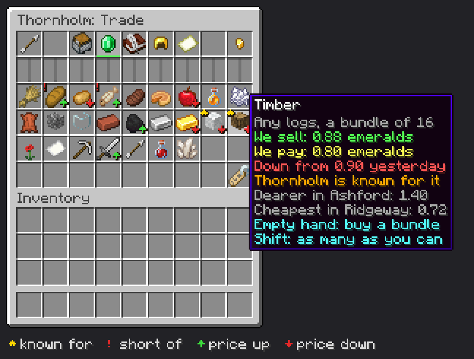

# M33 design note: From village to realm (1.7)

Written for ROADMAP 33.1 (2026-10-05). The roadmap items 33.2 to 33.23 hold the full specs and their tests; this note
is the overview the owner reviews and the map the lanes build from. Lanes don't wait for the owner's reply; anything
he changes goes back into the items.

**In one line:** villages stop being islands. Each one is known for some goods and short of others, prices move with
supply and demand, players and caravans trade at a price board, a City sends settlers to found a sister village, linked
villages become a realm (capital, treasury, shared research, riders who come to help in a raid), and between players
there are trade pacts, alliances, a weekly leaderboard and feuds that turn to war only on a PvP server.

## What you'll see (the short version)

- **A Trade page on the hall.** The minecart in the hall's divider (today's trade routes button) opens a page with a row
  of tabs: **Routes** (today's page, unchanged), **Prices**, **Pacts**, **Realm** and **Colonies**. A tab appears only
  once its item has landed. The Village Ledger reaches it from afar, as it does the rest of the hall.
- **Specialties and prices** (33.2 to 33.4). Once a day every village works out up to 3 goods it's **known for** (from
  its workers, its biome and its Storehouses) and up to 3 it's **short of**. Each of 28 goods (25 without Cobblemon) has
  a price there that moves a third of the way toward supply and demand each dawn. The Prices tab shows them all, with a
  gold star, a red mark and an up or down arrow. The hall's name icon says "Known for: Timber, Wool. Short of: Bread",
  and villagers talk about it ("Our timber sells well in Ashford").
- **Trading at the board** (33.5). Click a good with it in your inventory to sell the village a bundle, or with an empty
  hand to buy one; shift-click does as many as it can. The money comes from and goes to the village's treasury, and the
  goods go into and come out of the Storehouses' chests (which keep 16 of everything back, like caravans).
- **Caravans that trade, and that you can see** (33.6, 33.7). Besides what the other village is waiting for, a caravan
  takes up to 2 more stacks of goods the other village pays well for, and the other treasury pays for them. Near a
  player you see the caravan leave: a carter and two llamas in the village's colours walk out of sight (only a sight:
  the goods still travel safely in the save).
- **Colonies** (33.8 to 33.10). A City buys a **Colony Charter** (32 emeralds) on the Colonies tab and picks a spot
  256 to 1,024 blocks away on its map. Two settlers volunteer, supplies come out of the Storehouses, the bell rings and
  they walk out. Three minutes and a bit later they make camp at the spot: a new hall named from the charter, a Travel
  Post, and the builder at work on a Starter Cottage and Storehouse in the mother village's style. You get a letter.
- **Realms** (33.11 to 33.17, 33.21, 33.22). A Town founds a realm (the Barony of Thornholm) and adds its owner's other
  villages within 2,048 blocks; colonies join by themselves. 2, 3, 5 and 8 villages make a Barony, County, Duchy and
  Kingdom, with fireworks at each rank. Members pay a **levy** (10% by default) into the **realm treasury**, which pays
  for **realm research** (8 topics such as Royal Roads and Granaries), **relief riders** (guards on horseback who ride
  to a member's raid), colonies and **realm edicts** (6, in the capital's Book of Edicts). Members share the capital's
  research levels. A **Royal Hall** raises the treasury's cap, and the **Realm Map** draws the whole realm on a map.
- **Between players** (33.18 to 33.20). Offers go by letter: a **trade pact** (caravans to another player's village pay
  both ways) or an **alliance** (a pact whose riders also help in raids). Every Sunday at 19:00 everyone online hears the
  **weekly leaderboard** (Biggest, Richest, Happiest, Most Legends, Greatest realm). A **feud** ends pacts and makes the
  rival pay 25% more; on a PvP server it can become a **war**, in which the guards on each side fight the other side's
  players, and nothing else (blocks, chests, villagers, the treasury) can be touched.
- **Legends** (33.23, needs M29): the Founder makes colonies cheaper and bigger; the Merchant Prince sees every price in
  caravan range.



(A mock-up drawn from vanilla's chest screen, font and item art, not a screenshot: Thornholm's Trade page on the Prices
tab, 25 goods (a world without Cobblemon), the tooltip of Timber, which Thornholm is known for and whose price fell
since yesterday. Bread and Fish are marked short of.)

### The Trade page, tab by tab

Row 1 is the page's own row: back arrow (slot 0) and the five tabs (slots 4 to 8 as built in 33.4, Routes first where
the routes page's title always was; the open one lit with a green bar under it). The treasury (a gold nugget: what it
holds, its cap, and for the owner a click to collect) comes with 33.5, in a free slot of the row. Row 2 is the
divider. Rows 3 to 6 (36 slots) hold the tab's contents.

| Tab | Icon | Who sees it | What it holds | Item |
|---|---|---|---|---|
| **Routes** | chest minecart | everyone who may open the hall | today's routes page as it is, plus for each partner "Timber x2 for 2.6 emeralds" (what would go today and earn) and a padlock on another player's village without a pact | 33.4, 33.6, 33.18 |
| **Prices** | emerald | everyone, also strangers in a protected village | every good: icon, our price to buy and to sell a bundle, arrow since yesterday, gold star (known for), red mark (short of); tooltip with the dearest and cheapest partner village; click to trade. Slot 53: the "leave us off the leaderboard" toggle (name tag), owner only | 33.4, 33.5, 33.19 |
| **Pacts** | book and quill | owner, friends, operators | offers in and out (Accept, Decline), pacts and alliances in force (End), feuds and wars (Offer peace, Raise to war), the villages of other players within caravan range to offer to | 33.18, 33.20 |
| **Realm** | gold helmet (a crown) | everyone may read; only the capital's owner, friends and operators act | not in a realm: "Found a realm" (Town or better). In one: its title and rank, the arms (click with a banner), the treasury (click with emeralds to give), the levy (0/5/10/20%), the members (crown on the capital; rank, villagers, wellbeing, distance, owner; click to let go), "Add a village", invitations and the capital vote, "Draw the Realm Map" (with an empty map), "Royal Hall plans" (with a Blank Blueprint) | 33.11 to 33.14, 33.21 |
| **Colonies** | filled map | owner, friends, operators | "Buy a Colony Charter" (City, 32 emeralds), the order on the road ("On the road to Newbrook, there in 2 minutes"; Call off until they leave), the colonies founded with their day, the cooldown left, the limit (2 of 3) | 33.8 to 33.10 |

A stranger in a protected village who right-clicks the hall gets the Trade page on Prices and nothing else (33.5).

### The other places it shows

| Where | Today | With M33 |
|---|---|---|
| Hall, name icon (slot 0) | name, rank, edicts | also "Known for: ... Short of: ...", the realm ("in the Barony of Thornholm"), a leaderboard ribbon for a week |
| Hall, routes button (slot 15) | opens the routes page | opens the Trade page on its Routes tab (the old routes page with `villageEconomy` off); its tooltip names the tabs |
| Hall, "What next?" | | suggests founding a realm at Town, a colony at City |
| Village Ledger | the hall from afar | reaches the Trade page too; a stranger's Ledger can't be bound, so nothing changes for strangers |
| Book of Edicts (M30) | village slots | the capital's book gains realm slots (33.22) |
| Research screen | the village's tree | "from the capital" on shared levels; the capital's screen gets a Realm row (33.15) |
| Chronicle | | new lines: colonies founded, realm joined and left, rank ups, relief sent and received, pacts, feuds, wars, leaderboard wins, caravan sales |
| Chat | | the weekly leaderboard; rank-up and relief lines to members' owners |
| Mail | letters | letters for colonies, invitations, offers, pacts ending, feuds, peace, war |
| Commands | | `/workplace leaderboard` (anyone); operators also get `/workplace realm info|disband` and `/workplace prices <hall>` (debugging) |

### The five builds and items to draw

| What | Skill | Item |
|---|---|---|
| **Colony Charter** item: vanilla's map outline, a red wax seal, bound to its hall like the Ledger | pixel art | 33.8 |
| **Colony Camp** (`camp/colony_camp`, about 15 x 6 x 13), five styles | architect | 33.14 |
| **Royal Hall** and **Royal Hall II** (`realm/royal_hall`, about 19 x 16 x 25), five styles | architect | 33.14 |
| 28 good icons: vanilla items where one fits (wheat, bread, logs...); a tag of ours for the several-item goods | (vanilla) | 33.3 |
| Carter: the porter's outfit; llamas with vanilla carpets in the village colour | (existing art) | 33.7 |

## Technical detail

### Where it lives

New core packages `trade/` and `realm/` (names are proposals; the items may rename them):

- `trade/TradeGoods` (loader of `trade_goods/`), `trade/Specialties` (the daily known-for and short-of count),
  `trade/Prices` (**the price engine**: the target, the dawn move, the 2% a bundle nudge, the spread, `Prices.at`),
  `trade/Board` (buying and selling at the board, 33.5), `trade/CaravanTrade` (33.6), `trade/CaravanParty` (the
  visible carter and llamas, 33.7), `trade/TradePage` (the Trade page and its tab row, a screen of its own like the Book
  of Edicts).
- `realm/RealmData` (the `aliveworkplace_realms` saved file), `realm/Realms` (founding, members, ranks, the capital,
  `Realms.members`), `realm/RealmTreasury` (levy, cap, movements, `RealmTreasury.spend`), `realm/RealmResearch` (loader
  of `realm_research/` and the shared levels through `Research.at`), `realm/Relief` (`Relief.call`, the riders),
  `realm/Pacts` (offers, pacts, alliances, feuds, wars), `realm/Leaderboard`, `realm/RealmMap`.
- `colony/ColonyCharterItem`, `colony/Colonies` (the order, volunteers, supplies, the journey) and `colony/Founding`
  (camp, hall, post, settlers, sister route), using `SettlersWagonItem.makeCamp`, `Graves`' way of keeping villagers as
  saved data, `KeepLoaded`'s ticket, `BlueprintStyles`, `Builders.start`/`enqueue` and `Mail.letter`.
- An `Expansions.M33` flag (false until 33.23 is done): every switch below is ANDed with it, like M30's and M34's.

Everything is core (Minecraft and our own packages only). Money goes through `work/Money` (CobbleDollars with the pack
at `Money.DOLLARS_PER_EMERALD`); the treasury through `hall/Treasury`; protection through `hall/VillageProtection` and
`build/Friends`; the guards' foe rule through `guard/Guards.isFoe`; raids through `guard/VillageRaids`, the bandits'
raids and a vanilla raid hook in `platform/`.

### Prices, exactly as the roadmap writes them (33.2, 33.5, 33.6)

All money in **hundredths of an emerald** ("cents"), as `Treasury` keeps it; a bundle is the good's `bundle` count.

```
known for:  2 a making worker (max 6) + 3 hall in a making biome + 1 Storehouses hold >= 2 bundles   (>= 4 counts)
short of:   3 biome wants it + 1 a using worker (max 3) + 2 a worker waits for it + 1 store < 1 bundle   (>= 4)
            top 3 of each, by points then id; a good is never both (the higher score wins, a tie: neither)
supply  = min(5, bundles in Storehouses) + (known for ? 3 : 0)
demand  = (short of ? 3 : 0) + min(3, bundles workers wait for) + (food and store < 16 meals ? 2 : 0) + events
target  = clamp(base × (1 + 0.2 × (demand − supply)), base / 2, base × 2)
at dawn:  price += (target − price) / 3          (rounded to the cent; a new good starts at its target)
we pay  = price;   we sell = price × 1.10 (the spread: 10 points; Common Coin −3 a level; Merchant Prince halves it)
a bundle sold to the village: price × 0.98;  bought from it: price × 1.02  (that day's price; the dawn move continues)
feud:     the board pays 25% less for the rival's goods and charges the rival's players 25% more
```

The mock-up's Timber: known for it with a builder waiting for 2 bundles gives demand − supply = −2, a target of 0.60;
yesterday 0.90, so today 0.80 (we pay) and 0.88 (we sell).

### Data formats

Under `data/<namespace>/`, one file per entry, loaded through `Platform.get().onDataReload` (like `edicts/`, `guilds/`
and `research_trees/`), so data packs and `/reload` work. A malformed file is logged with its name and field and
skipped. `"enabled": false` at the same path switches one of ours off. Texts are text components (`{"translate": ...}`
for ours). Files for Cobblemon carry `"fabric:load_conditions"`, checked through `Platform` as M30's Trainers' Guild is.

**`trade_goods/<good>.json`** (loader `trade/TradeGoods`, 33.2; the 28 files in 33.3; six test goods only in the
gametest datapack):

```json
{
  "name": {"translate": "good.aliveworkplace.timber"},
  "icon": "minecraft:oak_log",
  "items": ["#minecraft:logs"],
  "bundle": 16,
  "base_price": 100,
  "made_by": {
    "jobs": ["aliveworkplace:lumberjack"],
    "biomes": ["#minecraft:is_forest", "#minecraft:is_taiga", "#minecraft:is_jungle", "minecraft:dark_forest"]
  },
  "wanted_in": {
    "biomes": ["#c:is_desert", "#minecraft:is_badlands", "minecraft:snowy_plains", "#minecraft:is_beach"],
    "jobs": ["aliveworkplace:builder", "aliveworkplace:carpenter"]
  },
  "food": false,
  "events": [{"event": "aliveworkplace:raid", "demand": 2, "days": 3}],
  "order": 10,
  "enabled": true
}
```

- `items`: item ids or `#tags`; any of them counts toward the bundle; the first is what the board sells. Several-item
  goods use a tag of ours (`aliveworkplace:trade/roots`, ...).
- `base_price`: hundredths of an emerald a bundle (16 logs for an emerald: 100; Tools, 1 for 2 emeralds: `bundle` 1,
  `base_price` 200).
- `made_by.jobs`, `wanted_in.jobs`: profession ids. `biomes`: biome ids or `#tags` (vanilla and `c:`).
- `food`: counts toward "food while the store is under 16 meals" in demand.
- `events[]`: `event` is one of `aliveworkplace:raid` (a night raid, a bandit raid or a vanilla raid was beaten or
  lost here), `aliveworkplace:illness` (while any villager here is ill), and later `aliveworkplace:siege` (M32); `demand`
  is added for `days` days.
- `order`: where it stands on the board (food first, then building, then crafts, then Cobblemon).

**`realm_research/<topic>.json`** (loader `realm/RealmResearch`, 33.15; the 8 files in 33.16). It is the scholars'
tree's `Topic` (`research/ResearchTree`) as one file, plus emeralds from the realm treasury, so the research screen
and `ScholarWork` read it as they read a tree's topics:

```json
{
  "icon": "minecraft:dirt_path",
  "name": {"translate": "realm_research.aliveworkplace.royal_roads"},
  "description": {"translate": "realm_research.aliveworkplace.royal_roads.desc"},
  "levels": 2,
  "cost": [
    {"minecraft:paper": 16},
    {"minecraft:paper": 16, "minecraft:book": 2}
  ],
  "emeralds": [8, 8],
  "points": 2400,
  "needs": {},
  "effects": [{"type": "aliveworkplace:caravan_speed", "percent": 25}],
  "order": 1,
  "enabled": true
}
```

- `cost`, `points`, `needs`: as a tree topic (the last `cost` entry for every level after it; `needs` names realm topic
  ids and levels: Common Coin `{"royal_roads": 1}`). `emeralds`: per level, from the realm treasury (the last for every
  level after it); a level can't start without them.
- `effects`: per level, from M30's toolbox (`hall/CivicEffects`, `"type"` picks the codec), read realm-wide. New types:

| Type | Fields | Read by | Topic |
|---|---|---|---|
| `caravan_speed` | `percent` | `Caravans.travelTicks` between members | Royal Roads (also Royal Highway) |
| `board_spread` | `points` | `trade/Prices` spread in members | Common Coin |
| `post_noon` | | `Mail`'s parcel round between members' mailboxes | Royal Post |
| `ticket_price` | `percent`, `min_emeralds` | Travel Tickets between members' posts | Ferry Charter |
| `relief_riders` | `extra` | `realm/Relief` band size a village | Levies |
| `colony_cost` | `percent`, `supplies` | `colony/Colonies` | Charters |
| `wellbeing` (exists) | `percent` | `VillageNeeds` | Concord |
| `granary` | `meals` | the realm's dawn round | Granaries |

**Realm edicts** in M30's format (`edicts/<id>.json`, loader `hall/Edicts`), one new field `"scope": "realm"` (absent
means `village`, so M30's eight files load unchanged). A realm edict fills a realm slot in the capital's Book, is in
force in every member, is paid from the realm treasury, and its reform is the capital's quest plus a `count` across the
realm:

```json
{
  "scope": "realm",
  "icon": "minecraft:stone_bricks",
  "name": {"translate": "edict.aliveworkplace.royal_highway"},
  "description": {"translate": "edict.aliveworkplace.royal_highway.desc"},
  "order": 20,
  "boost": [
    {"type": "aliveworkplace:carry", "stacks": 2, "between": "members"},
    {"type": "aliveworkplace:caravan_speed", "percent": 25}
  ],
  "cost": [{"type": "aliveworkplace:realm_upkeep", "emeralds": 1, "per": "route"}],
  "excludes": [],
  "reform": {
    "name": {"translate": "reform.aliveworkplace.paved_highway"},
    "line": {"translate": "reform.aliveworkplace.paved_highway.line"},
    "steps": [{"kind": "bring", "item": "minecraft:stone_bricks", "count": 128, "reward": 5}],
    "count": {"what": "aliveworkplace:caravans_between_members", "times": 12},
    "effects": []
  },
  "enabled": true
}
```

The six (33.22) with their new effect types: Royal Highway (`carry` with `between`, `caravan_speed` / `realm_upkeep`
per route), Common Market (`common_board`, `board_spread` to 0 between members / `levy` +5), Levy of Arms
(`relief_range` everywhere, `relief_riders` ×2 / `realm_upkeep` 2 a member), Realm Festival (`festival_together`,
`festival_mood_days` 3 / `festival_cost` 10 a member from the realm), Crown's Peace (`no_feuds`, `bandit_camps` 0 within
128 / `takings` −10%), Royal Charter (`colony_rank` Town, `colony_cooldown` ×0.5 / `colony_cost` +32 emeralds). Counts
(`reform.count.what`): `caravans_between_members`, `board_trades`, `raids_beaten_with_relief`, `realm_festivals`,
`days_without_raid`, `colonies_at_village_rank`. Slots: Barony and County 1, Duchy 2, Kingdom 3, +1 with Royal Hall II.

### Config switches (`config/aliveworkplace.json`, all in the Mod Menu screen; ANDed with `Expansions.M33`)

| Switch | Default | Range | Off means | Item |
|---|---|---|---|---|
| `villageEconomy` | true | | no known-for, short-of or prices worked out; no Prices tab; caravans carry only wants, as today | 33.2 |
| `visibleCaravans` | true | | no carter or llamas; goods travel as before | 33.7 |
| `colonies` | true | | no Colonies tab or charters; an order on the road arrives anyway, so nobody is lost | 33.8 |
| `colonyRank` | `city` | `hamlet`, `village`, `town`, `city` | the rank a village needs to buy a charter | 33.8 |
| `colonyCooldownDays` | 7 | 0 to 60 | days between colonies | 33.8 |
| `coloniesPerVillage` | 3 | 0 to 16 | colonies a village may found | 33.8 |
| `realms` | true | | no Realm tab; realms stay saved and come back; no levy, shared research, relief or realm edicts | 33.11 |
| `realmMaxMembers` | 12 | 2 to 32 | villages a realm may hold | 33.11 |
| `realmRelief` | true | | no riders | 33.17 |
| `tradePacts` | true | | routes to another owner's village need no pact (as before 1.7), cargo free | 33.18 |
| `alliances` | true | | no alliances offered; existing ones act as pacts | 33.18 |
| `feuds` | true | | no feuds; existing ones end quietly | 33.20 |
| `feudWars` | true | | no wars even with PvP on | 33.20 |
| `weeklyLeaderboard` | true | | no announcement; `/workplace leaderboard` still works | 33.19 |
| `leaderboardDay` | `sunday` | a weekday | the day it's announced | 33.19 |
| `leaderboardHour` | 19 | 0 to 23 | the hour, server time | 33.19 |

As with today's switches, features that depend on chance are off in GameTests unless a test turns them on. No
`configVersion` bump: a missing value takes its default.

### Saved data (every field optional with an empty default, so a 1.6 world loads unchanged)

**New keys on `Caravans.Data`'s village entries** (`aliveworkplace_caravans`, per dimension, the `villages` list), added
to `Caravans.Village` with defaults; an entry saved by 1.6 has none of them and loads with empty lists until the next
round:

| Key | Holds | Default |
|---|---|---|
| `knownFor` | up to 3 good ids | empty |
| `shortOf` | up to 3 good ids | empty |
| `prices` | list of {`good`, `cents` today, `yesterday`, `nudge` (today's 2% steps, reset at dawn)} | empty (a good without a price shows its base) |
| `priceDay` | the day prices last moved | -1 |
| `demand` | list of {`good`, `amount`, `until` day} from events | empty |
| `colour` | the carpet colour when there's no Village Banner (picked once from the hall's position) | absent |

A village that isn't loaded keeps its last prices and lists, so the boards of its partners still read them.

**New server-wide saved file `aliveworkplace_realms`** (`realm/RealmData`, kept in the overworld's data storage so it
is one file for the server; villages are named by dimension and hall position, as a `GlobalPos`):

| Key | Holds | Default |
|---|---|---|
| `realms` | list of {`id` (UUID), `name` (component or absent: from the capital), `capital`, `members` [{`hall`, `joined` day}], `arms` (banner codecs), `rank`, `levy` (percent), `treasury` (cents), `movements` (last 20: {`day`, `cents`, `reason`}), `research` (topic levels, current topic, points), `edicts` and `reforms` (M30's shapes), `royalHall` (level and position), `vote` (candidate, ballots, ends)} | empty |
| `offers` | list of {`kind` (`invite`, `pact`, `alliance`, `peace`, `capital`), `from`, `to`, `made`, `lapses` (game time)} | empty |
| `pacts` | list of {`a`, `b`, `alliance`, `giftsA`, `giftsB`, `since`, `endsAt` (an alliance's notice, or absent)} | empty |
| `feuds` | list of {`by`, `on` (a village or a realm id), `since`, `war` (absent, or {`starts`, `ends`}), `lostA`, `lostB`} | empty |
| `colonies` | list of orders {`mother`, `spot`, `name`, `settlers` (saved villagers, as graves keep them), `supplies` (item stacks), `state` (`gathering`, `waiting`, `leaving`, `on_road`), `leaves`, `arrives`, `cost` (cents, for a refund)} and founded colonies {`mother`, `hall`, `day`} | empty |
| `cooldowns` | per mother: last colony day, colonies founded | empty |
| `week` | {`start` (real time, ms), `lastAnnounced`, `villages` [{`hall`, `villagers`, `earned` cents, `wellbeingSum`, `rounds`, `legends`}], `leftOff` (halls), `ribbons` [{`hall`, `category`, `until`}]} | empty |
| `relief` | riders in the field [{`entity` UUID, `home`, `to`, `until`}], so a restart can take them away | empty |
| `pactsMigrated` | routes to other owners' villages made pacts once (33.18) | false |

Not saved: the carter and llamas (tagged and removed on load, like the ferry's ride boats), the effects in force
(summed per hall from edicts, reforms and realm research on change and load, as M30 does), shared research levels (the
higher of own and capital, worked out on read), and the leaderboard order (worked out from `week`).

New chronicle kinds: `COLONY` (filled map), `REALM` (gold helmet), `RELIEF` (iron horse armour), `PACT` (book and
quill), `FEUD` (iron sword), `TRADE` (emerald), `RIBBON` (gold ingot). `Chronicle.Kind.parse` reads an unknown kind as
FOUNDED, so a downgrade stays safe.

### Who may do what

One new check, `VillageProtection.mayRule(level, hall, player)`: **the hall's owner, their friends
(`Friends.mayDirect`) and operators (permission level 2), in every village, protected or not.** Unlike `mayBuild`, a hall
nobody owns grants it to no one: realm, pact, feud and colony actions need an owner ("This hall has no owner yet: protect
it or draw its City Plan to claim it").

| Action | Who |
|---|---|
| Open the Prices tab, read the prices, trade at the board | anyone (strangers in a protected village too, and only that page) |
| Give to the realm treasury | anyone |
| Collect the village treasury | `mayRule` (33.5; a hall nobody owns stays open to all) |
| Buy a charter, choose its spot, send or call off settlers | `mayRule` on the mother hall |
| Found a realm, add one's own villages, invite, set the levy, arms, name, research, realm edicts, let a member go, take from the realm treasury | `mayRule` on the **capital** |
| Leave a realm, accept an invitation, put the village forward as capital, vote | `mayRule` on **that member** |
| Offer, accept, decline and end pacts and alliances; declare a feud, offer or accept peace, raise to war; leave the village off the leaderboard | `mayRule` on that village |
| Read the Realm tab, the members, the treasury's movements, the Realm Map | anyone who may open the hall |

A refused click says who may ("Only Jesse and their friends can found a realm from Thornholm."). Operators' commands stay
for admins.

### Performance budget

- **Everything in the hall's round** (`VillageHallBlockEntity`, every `VillageNeeds.CHECK_EVERY` = 600 ticks) **or once a
  day.** The daily work (known-for, short-of, prices, the levy, the leaderboard sample) runs in the first round after
  dawn, one village per round per dimension at most, so ten villages spread over ten rounds. No per-tick work outside
  the visible party, the riders and a colony's camp minute.
- **No area scans.** Workers and the census come from the round's existing `VillageHalls.Census`; Storehouse stock
  from `Caravans.storehouse` (a POI lookup, as caravans do now), counted once a day; biome is one lookup at the hall.
- **Realms and pacts are saved data**, read without loading the other villages: a member's prices, wellbeing and
  villagers are its last-known values on `Caravans.Data` and `week`. The realm treasury never needs the capital loaded.
- **Visible caravans only within 96 blocks of a player**, one party per village, gone after 2 minutes. Relief riders: 6
  at most a raid. A colony's arrival loads its chunks for a minute only.
- **The Charter and Realm Map** draw only chunks the server already has loaded, as vanilla maps do; the rest is
  parchment. Drawn once, when the map is made, never refreshed per tick.
- **Target**: the pack benchmark (`PERF=true PLOTS=40`) shows no measurable change to the mod's share of the tick;
  33.7 and 33.17 each add a GameTest that counts entities spawned.

### Hooks other milestones use

| Hook | Signature (proposal) | For | Fallback until then |
|---|---|---|---|
| `Relief.call` | `Relief.call(ServerLevel level, BlockPos hall, Component cause)` | M32's sieges call it when a siege starts; our raids call it too | none needed: without a realm it does nothing |
| `RealmTreasury.spend` | `boolean spend(MinecraftServer server, UUID realm, long cents, Component reason)` (false if short; logged in the movements) | M35's Wonders' plans (32 emeralds), realm edicts, relief, colonies | M35 pays from the village treasury, then the player |
| `Realms.members` | `List<GlobalPos> members(MinecraftServer server, GlobalPos hall)` (its realm's halls, itself first; just itself if none) | M35's Wonders' realm-wide powers and chronicles | M35 uses caravan partners |
| `Realms.of` | `Optional<UUID> of(MinecraftServer server, GlobalPos hall)` | anything asking "is this village in a realm?" | |
| Price engine | `Prices.at(ServerLevel level, BlockPos hall, ResourceLocation good)` (cents a bundle); `Prices.nudge(level, hall, good, bundles)`; `Prices.board(level, hall)` | M29's Merchant Prince (33.23: all prices in range, best partner, half spread); replaces 29.17's caravan pay | 29.17's caravan pay stays while `villageEconomy` is off |
| Colonies | `Colonies.found(ServerLevel level, BlockPos mother, BlockPos spot, int settlers, double cooldownFactor)`, `Colonies.rankNeeded(level, hall)` | M29's Founder (four settlers, half the wait, Town rank, the statue at the camp); retires the Founder's Wagon when `colonies` is on | the Founder's Wagon (29.23) |
| Trade goods events | `TradeGoods.event(level, hall, ResourceLocation event)` | M32's sieges (`aliveworkplace:siege`), M34's luxuries if they become goods | |
| Leaderboard categories | `Leaderboard.register(id, Function<…, Long>)` | M34 (Noble households), M35 (Wonders) may add a line | |

### Showcase and README

A **"Realm"** group goes into `tools/showcase/scenes.py`'s `GROUPS` (after "Village Hall") with the first scene, and
each visible item adds its scene there and in the harness: `price_board`, `board_trade`, `caravan_trade`, `caravan`,
`colony_charter`, `colony_departure`, `colony`, `realm`, `realm_invite`, `realm_treasury`, `realm_builds`,
`realm_research`, `relief`, `pacts`, `leaderboard`, `feud`, `realm_map`, `realm_edicts`, `founder_colony`,
`merchant_prince_board` (20 scenes).

A **"From village to realm"** README section goes after "Legends", started by 33.4 with "Specialties and prices", and
each item adds its paragraph: Trading at the board, Caravans that trade, Colonies, Realms, The realm treasury, Shared
research, Relief in a raid, Pacts and alliances, The weekly leaderboard, Feuds and war, The Realm Map, Realm edicts. The
config switches go into "Commands and gamerules" with the rest.

### Other decisions taken (not the owner's)

- **The Trade page is a screen of its own** with its own tab row (row 1), opened from the routes button (slot 15) and
  the Ledger, not five of `HallPages`' nine page-row tabs: the page row stays free for other milestones. Tests go
  through `VillageHallScreen.forTest` and a `TradePage.forTest`, as the Book does. `hall_pages` reaches Routes as a tab.
- **Realm actions need an owned hall** (`mayRule`, above): a realm is something players own, so a hall nobody owns
  can't found, join or feud.
- **`aliveworkplace_realms` lives in the overworld's data storage** with villages as `GlobalPos`, so a realm (one
  dimension) and pacts (any) read one file; `Caravans.Data` stays per dimension as now.
- **The levy and the leaderboard's earnings hook into `Treasury.round`**: the levy is taken before the rest goes in;
  "earned" counts takings, board trades and caravan sales, never deposits or gifts.
- **Pre-1.7 routes to another owner's village become pacts once**, when the world first loads with `tradePacts` on
  (`pactsMigrated`), with gifts on for the sender, so cargo that went free stays free until an owner turns gifts off.
- **The treasury change of 33.5 waits for the M33 flag**: until 1.7 is released, anyone may still collect in an open
  village, as today.
- **Good ids**: ours may be written without the namespace (`timber`); the board, saves and tests use the full id.
  A good whose file is gone stays in saved lists, shows nowhere and is dropped at the next daily count.
- **Rounding**: prices are kept and shown in cents ("0.88 emeralds"); with CobbleDollars, cents × `DOLLARS_PER_EMERALD`
  / 100. Trades of a fraction of an emerald with emeralds as money settle in whole emeralds against the treasury's cents
  (the player is paid down, charged up, to the next whole emerald; the difference stays with the village).
- **Wars never move money or blocks**: the only change in a war is `Guards.isFoe` and the player-hurts-guard rule, both
  inside the warring villages. With PvP off, the war button stays and says why.

## For the owner to decide

Defaults hold until you say otherwise; lanes build with them.

1. **The leaderboard runs on a real week**: every Sunday at 19:00 server time (`leaderboardDay`, `leaderboardHour`),
   whether or not anyone played. The other choice is every 7 in-game days (which stops when the server is empty).
2. **No tribute in wars**: when a war ends, no treasury changes hands; both chronicles record the guards each side lost.
   The other choice: the loser pays the winner a share of its treasury.
3. **Collecting the treasury becomes owner-only** (33.5): the owner, their friends and operators, in every village, once
   strangers can trade at the board. A hall nobody owns stays open to all. This takes away something anyone could do in
   an open village until now; the changelog will say so.
4. **The colony rank is City** (`colonyRank`), and a charter costs 32 emeralds. Say if colonies should come sooner (Town)
   for a smaller server.
